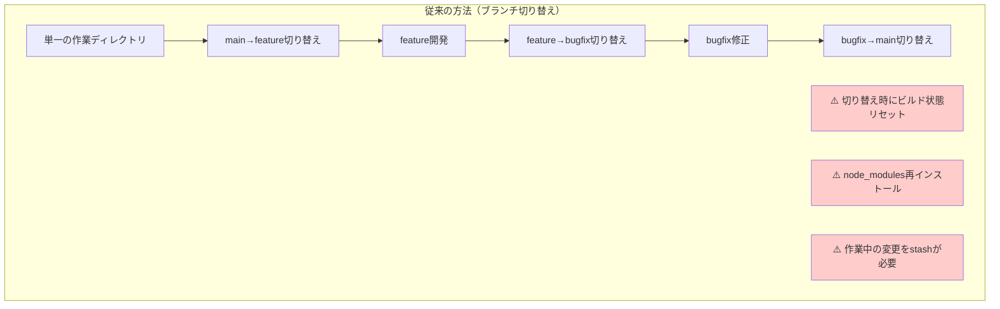
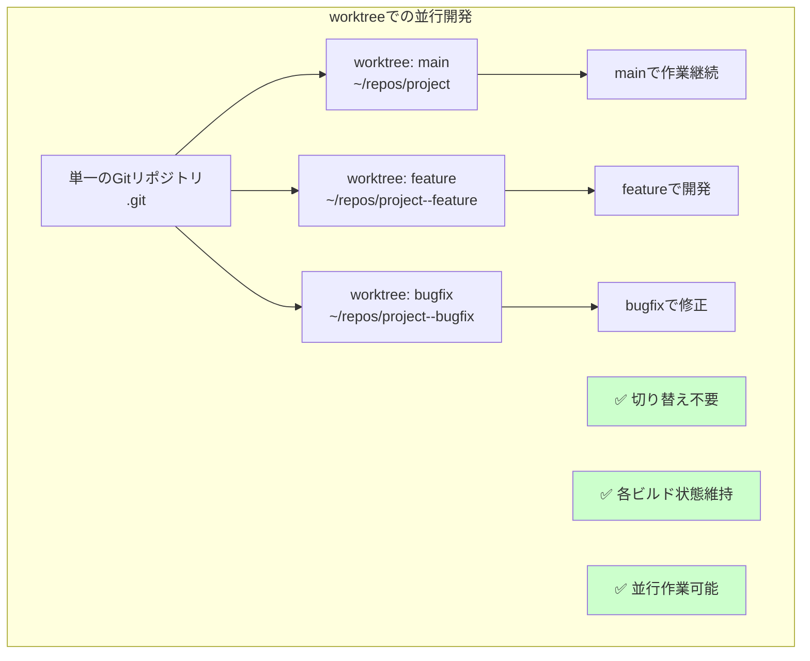
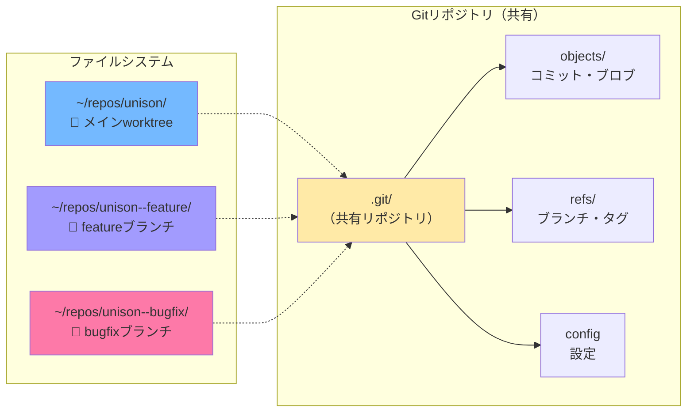
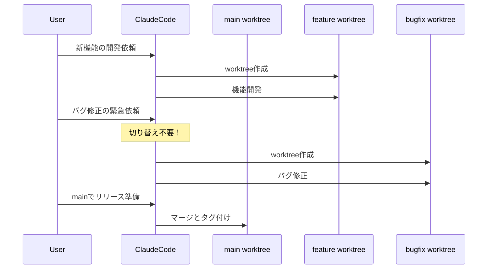
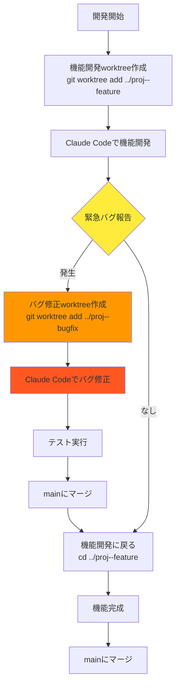
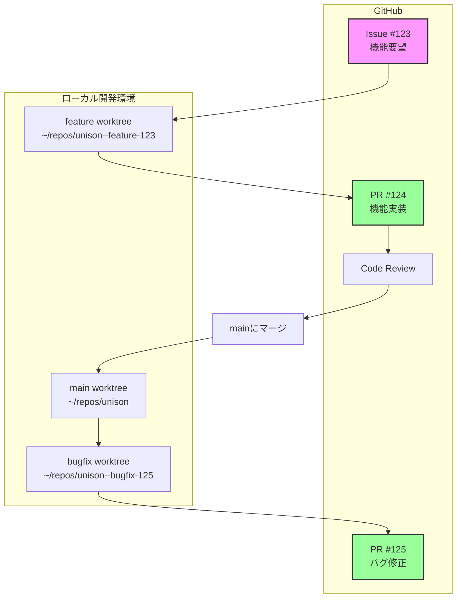
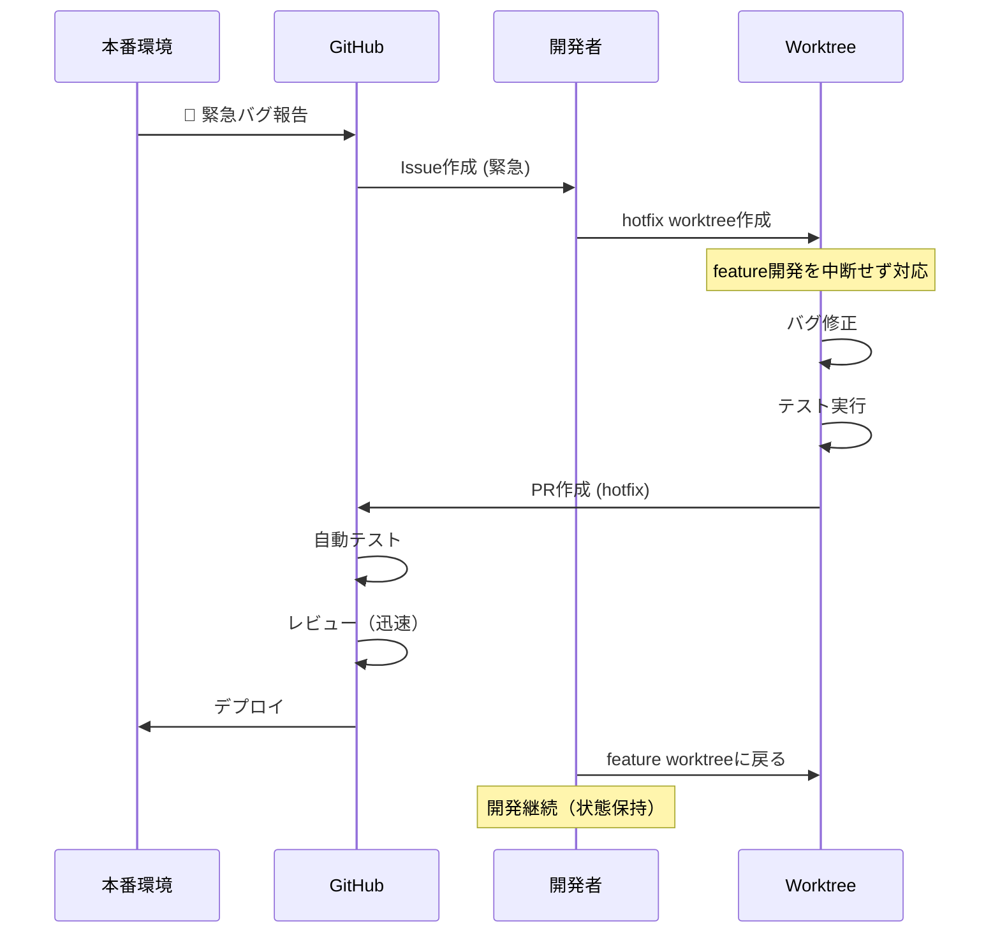
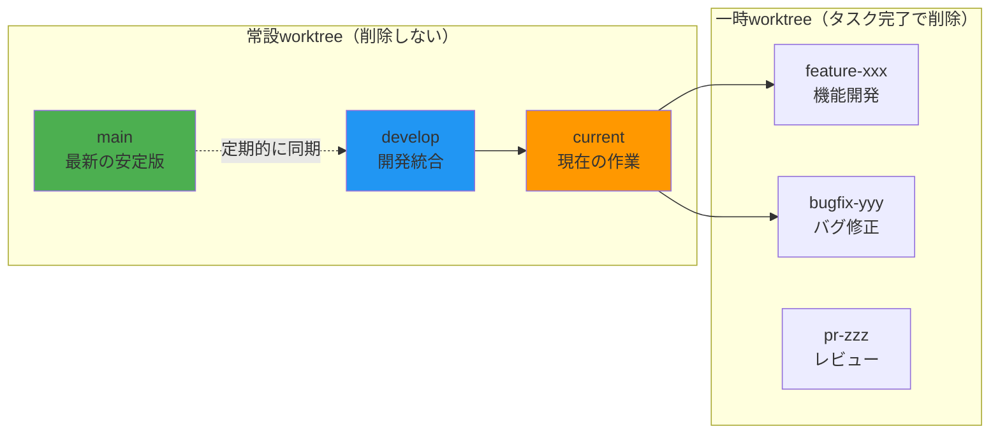
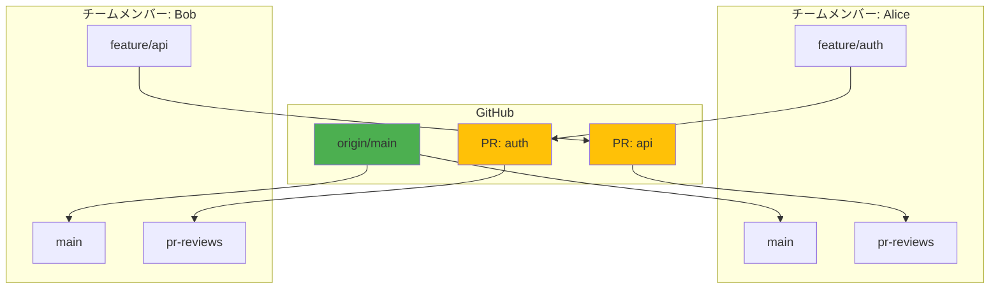

# Git Worktree 並行開発ガイド

**Git worktreeを使った効率的な並行開発の完全ガイド**

## 📌 概要

git worktreeは、**1つのリポジトリから複数の作業ディレクトリを作成**できる機能です。
各worktreeは独立したブランチで作業でき、**切り替えなしに並行開発**が可能になります。

## 🤔 なぜworktreeを使うのか？

### 従来の問題



### worktreeでの解決



## 🎯 基本的な仕組み

### ディレクトリ構造



**ポイント**:
- 全worktreeが**同じ.gitディレクトリを共有**
- コミット履歴、設定、リモート情報を共有
- 各worktreeは独立した作業ディレクトリ

## 🛠️ 基本コマンド

### 1. worktreeの作成

```bash
# 新しいブランチで作成
git worktree add ../project--feature feature/new-feature

# 既存ブランチで作成
git worktree add ../project--bugfix bugfix/issue-123

# 新しいブランチを作成しつつworktreeも作成
git worktree add -b feature/experiment ../project--experiment
```

### 2. worktreeの確認

```bash
# worktree一覧表示
git worktree list

# 出力例：
# /Users/makoto/repos/unison            ec17e44 [main]
# /Users/makoto/repos/unison--feature   51f946c [feature/development]
# /Users/makoto/repos/unison--bugfix    0b53407 [bugfix/issue-123]
```

### 3. worktreeの削除

```bash
# 通常の削除
git worktree remove /path/to/worktree

# 強制削除（変更がある場合）
git worktree remove --force /path/to/worktree

# 削除済みworktreeのクリーンアップ
git worktree prune
```

## 📚 Claude Codeとの併用パターン

### パターン1: タスク別worktree



### パターン2: 実験的開発

```bash
# 実験用worktreeを作成
git worktree add -b experiment/ai-integration ../unison--experiment

# Claude Codeで実験的な実装
cd ../unison--experiment
# AIを使った新機能の試作

# 成功したらmainにマージ
git checkout main
git merge experiment/ai-integration

# 失敗したら単にworktreeを削除
git worktree remove ../unison--experiment
```

## 🎮 実践的な開発フロー

### フロー1: 機能開発とバグ修正の並行



### フロー2: 複数タスクの管理

```bash
# 朝：3つのタスクを受け取る
# Task A: UIの改善
# Task B: APIの最適化
# Task C: ドキュメント更新

# 各タスク用のworktreeを作成
git worktree add -b ui/improve ../unison--ui
git worktree add -b api/optimize ../unison--api
git worktree add -b docs/update ../unison--docs

# Claude Codeで並行作業
# Terminal 1
cd ../unison--ui
# UIの改善作業

# Terminal 2（別ウィンドウ）
cd ../unison--api
# APIの最適化

# Terminal 3（別ウィンドウ）
cd ../unison--docs
# ドキュメント更新
```

## 💡 ベストプラクティス

### 1. 命名規則

```bash
# プロジェクト名--ブランチ種別
~/repos/unison--feature     # 機能開発
~/repos/unison--bugfix      # バグ修正
~/repos/unison--experiment  # 実験
~/repos/unison--release     # リリース準備
```

### 2. worktree管理スクリプト

```bash
#!/bin/bash
# ~/.local/bin/git-wt

case "$1" in
  "new")
    # 新しいworktree作成
    BRANCH=$2
    TYPE=${3:-feature}
    git worktree add -b "$TYPE/$BRANCH" "../$(basename $(pwd))--$BRANCH"
    cd "../$(basename $(pwd))--$BRANCH"
    ;;
  "clean")
    # 不要なworktreeを削除
    git worktree prune
    git worktree list | grep -v "bare" | while read -r line; do
      path=$(echo $line | awk '{print $1}')
      if [ ! -d "$path" ]; then
        git worktree remove "$path"
      fi
    done
    ;;
  "list")
    # 見やすく表示
    git worktree list | column -t
    ;;
esac
```

### 3. VSCodeでの活用

```json
// .vscode/settings.json
{
  "git.worktrees": [
    {
      "path": "../unison--feature",
      "name": "Feature Development"
    },
    {
      "path": "../unison--bugfix",
      "name": "Bug Fixes"
    }
  ]
}
```

## ⚠️ 注意点とトラブルシューティング

### 問題1: ブランチが使用中

```bash
# エラー: fatal: 'feature/xyz' is already checked out at '/path/to/worktree'

# 解決法1: 別の名前でブランチ作成
git worktree add -b feature/xyz-2 ../project--feature2

# 解決法2: 既存worktreeを削除してから
git worktree remove /path/to/existing/worktree
git worktree add ../project--feature feature/xyz
```

### 問題2: 変更がある状態での削除

```bash
# エラー: fatal: '/path' contains modified or untracked files

# 解決法1: 変更を確認してコミット
cd /path/to/worktree
git status
git add .
git commit -m "Save changes"
git worktree remove /path/to/worktree

# 解決法2: 強制削除（変更を破棄）
git worktree remove --force /path/to/worktree
```

### 問題3: worktreeディレクトリが見つからない

```bash
# worktreeのパスが変更された場合
git worktree repair

# 不要なエントリをクリーンアップ
git worktree prune
```

## 🎯 Claude Codeでの実践例

### 例1: 機能開発中の緊急修正

```bash
# 1. 現在feature開発中
cd ~/repos/unison--feature
# Claude Codeで新機能開発中...

# 2. 緊急のバグ報告！
# 新しいターミナルタブを開く
git worktree add -b hotfix/critical ../unison--hotfix
cd ../unison--hotfix

# 3. Claude Codeでバグ修正
# "Critical bugを修正して"

# 4. テストして問題なければmainにマージ
git checkout main
git merge hotfix/critical
git push

# 5. feature開発に戻る（状態は保持されている）
cd ../unison--feature
# 開発継続
```

### 例2: 複数のPR対応

```bash
# 複数のPRレビュー依頼が来た場合

# PR #123のレビュー用
git worktree add ../unison--pr123 origin/pr/123

# PR #124のレビュー用
git worktree add ../unison--pr124 origin/pr/124

# 各PRを個別に確認・テスト
cd ../unison--pr123
npm test

cd ../unison--pr124
cargo test

# レビュー完了後
git worktree remove ../unison--pr123
git worktree remove ../unison--pr124
```

## 📊 worktree vs その他の方法

| 方法 | メリット | デメリット | 使用場面 |
|------|--------|-----------|----------|
| **git worktree** | ・切り替え不要<br>・ビルド状態維持<br>・並行作業可能 | ・ディスク容量使用<br>・初期設定が必要 | 複数タスクの並行作業 |
| **git stash** | ・シンプル<br>・容量節約 | ・切り替え必要<br>・コンフリクトリスク | 一時的な切り替え |
| **git clone** | ・完全に独立<br>・シンプル | ・履歴が分離<br>・同期が面倒 | 完全に独立した作業 |
| **ブランチ切り替え** | ・標準的<br>・容量節約 | ・ビルド再実行<br>・作業中断 | 単一タスク |

## 🚀 今すぐ試してみよう

```bash
# 1. 実験用worktreeを作成
git worktree add -b experiment/test ../$(basename $(pwd))--experiment

# 2. 移動して確認
cd ../$(basename $(pwd))--experiment
pwd
git status

# 3. Claude Codeで何か作業
echo "# Experiment" > EXPERIMENT.md
git add EXPERIMENT.md
git commit -m "実験的な変更"

# 4. 元のディレクトリに戻る
cd -

# 5. worktree一覧確認
git worktree list

# 6. 不要になったら削除
git worktree remove ../$(basename $(pwd))--experiment
```

## 🌟 GitHub連携での実践的な開発フロー

### 推奨: PR駆動開発フロー



### ワークフロー1: Issue駆動開発

```bash
#!/bin/bash
# Issue番号から自動的にworktreeを作成するスクリプト

function git-issue-wt() {
    ISSUE_NUMBER=$1
    ISSUE_TITLE=$2

    # ブランチ名を生成（例: feature/123-add-auth）
    BRANCH_NAME="feature/${ISSUE_NUMBER}-${ISSUE_TITLE}"
    WORKTREE_DIR="../$(basename $(pwd))--issue-${ISSUE_NUMBER}"

    # worktree作成
    git worktree add -b "$BRANCH_NAME" "$WORKTREE_DIR"
    cd "$WORKTREE_DIR"

    # 最初のコミット（Issue番号を含む）
    echo "# Issue #${ISSUE_NUMBER}: ${ISSUE_TITLE}" > .github/ISSUE_${ISSUE_NUMBER}.md
    git add .
    git commit -m "feat: Issue #${ISSUE_NUMBER}の作業開始"

    # upstream設定とPRドラフト作成
    git push -u origin "$BRANCH_NAME"
    gh pr create --draft --title "WIP: ${ISSUE_TITLE} (#${ISSUE_NUMBER})" \
                 --body "Closes #${ISSUE_NUMBER}"
}

# 使用例
git-issue-wt 123 "add-authentication"
```

### ワークフロー2: 複数PR並行レビュー

```bash
# 朝のルーティン：レビュー待ちPRを全てworktreeで開く

#!/bin/bash
# ~/bin/morning-reviews.sh

echo "📋 レビュー待ちPRを取得中..."

# 自分にアサインされたPRを取得
gh pr list --assignee @me --json number,headRefName,title | \
jq -r '.[] | "\(.number) \(.headRefName) \(.title)"' | \
while read -r pr_number branch_name title; do
    worktree_dir="../$(basename $(pwd))--pr-${pr_number}"

    if [ ! -d "$worktree_dir" ]; then
        echo "🔧 PR #${pr_number} のworktreeを作成: ${title}"
        git fetch origin "pull/${pr_number}/head:pr-${pr_number}"
        git worktree add "$worktree_dir" "pr-${pr_number}"
    else
        echo "✅ PR #${pr_number} のworktree既存"
    fi
done

# worktree一覧を表示
echo -e "\n📁 現在のworktree:"
git worktree list | column -t
```

### ワークフロー3: ホットフィックス対応



```bash
# ホットフィックス用関数
function hotfix() {
    ISSUE=$1
    DESCRIPTION=$2

    # mainから最新を取得
    git fetch origin main

    # hotfix worktree作成
    WORKTREE="../$(basename $(pwd))--hotfix-${ISSUE}"
    git worktree add -b "hotfix/${ISSUE}" "$WORKTREE" origin/main

    cd "$WORKTREE"

    # PR作成（緊急ラベル付き）
    git commit --allow-empty -m "hotfix: #${ISSUE} ${DESCRIPTION}"
    git push -u origin "hotfix/${ISSUE}"
    gh pr create --label "urgent,hotfix" \
                 --title "🚨 Hotfix: ${DESCRIPTION} (#${ISSUE})" \
                 --body "## 緊急修正\n\nCloses #${ISSUE}\n\n### 影響範囲\n- [ ] 本番環境\n- [ ] ステージング環境"
}
```

## 🎯 おすすめの開発パターン

### パターンA: 3-worktree戦略



```bash
# 初期セットアップ
git worktree add ../project--develop develop
git worktree add ../project--current -b feature/current

# 日常の開発
cd ../project--current
# ここで主に作業

# 完了したら統合
cd ../project--develop
git merge feature/current
```

### パターンB: レビュー専用worktree

```bash
# レビュー専用ディレクトリを維持
mkdir -p ~/reviews/$(basename $(pwd))

# PR専用worktreeを作成する関数
review-pr() {
    PR_NUMBER=$1
    REVIEW_DIR="$HOME/reviews/$(basename $(pwd))/pr-${PR_NUMBER}"

    # PR情報を取得
    PR_INFO=$(gh pr view "$PR_NUMBER" --json headRefName,headRepository)
    BRANCH=$(echo "$PR_INFO" | jq -r '.headRefName')

    # worktree作成
    git fetch origin "pull/${PR_NUMBER}/head:pr-${PR_NUMBER}"
    git worktree add "$REVIEW_DIR" "pr-${PR_NUMBER}"

    cd "$REVIEW_DIR"

    # レビュー用の準備
    echo "=== PR #${PR_NUMBER} Review ===" > REVIEW_NOTES.md
    echo "Branch: ${BRANCH}" >> REVIEW_NOTES.md
    echo "Date: $(date)" >> REVIEW_NOTES.md
    echo "" >> REVIEW_NOTES.md
    echo "## チェックリスト" >> REVIEW_NOTES.md
    echo "- [ ] コードスタイル" >> REVIEW_NOTES.md
    echo "- [ ] テスト" >> REVIEW_NOTES.md
    echo "- [ ] ドキュメント" >> REVIEW_NOTES.md
    echo "- [ ] パフォーマンス" >> REVIEW_NOTES.md

    # エディタで開く
    code .
}
```

### パターンC: チーム開発フロー



## 🚀 スムーズな並行開発のベストプラクティス

### 1. 自動化スクリプトの準備

```bash
# ~/.gitconfig に追加
[alias]
    # worktree作成のショートカット
    wt-new = "!f() { git worktree add -b $1 ../${PWD##*/}--${1//\\//-}; }; f"
    wt-pr = "!f() { git fetch origin pull/$1/head:pr-$1 && git worktree add ../$(basename $(pwd))--pr-$1 pr-$1; }; f"
    wt-clean = "worktree prune"
    wt-list = "worktree list"

    # PR作成と同時にworktree
    pr-start = "!f() { git wt-new $1 && cd ../${PWD##*/}--${1//\\//-} && git push -u origin $1 && gh pr create --draft; }; f"
```

### 2. Claude Codeとの連携テクニック

```bash
# .claude/worktree-context.md を作成
cat > .claude/worktree-context.md << 'EOF'
# 現在のWorktree構成

## アクティブなworktree
- main: 本番リリース用
- develop: 統合テスト用
- feature/oauth: OAuth実装中 (PR #234)
- bugfix/memory-leak: メモリリーク修正中 (PR #235)

## 作業ルール
1. 新機能は必ず feature/ ブランチ
2. バグ修正は bugfix/ ブランチ
3. 緊急対応は hotfix/ ブランチ
4. 各PRには必ずテストを含める

## 現在の優先順位
1. 🔴 hotfix/security-patch (最優先)
2. 🟡 bugfix/memory-leak
3. 🟢 feature/oauth
EOF
```

### 3. 毎朝のルーティン

```bash
#!/bin/bash
# ~/bin/morning-routine.sh

echo "☀️ Good morning! Setting up your development environment..."

# 1. mainを最新化
cd ~/repos/unison
git checkout main
git pull origin main

# 2. 不要なworktreeをクリーンアップ
echo "🧹 Cleaning up old worktrees..."
git worktree prune

# 3. アクティブなPRをチェック
echo "📋 Active PRs:"
gh pr list --author @me --state open

# 4. レビュー待ちをチェック
echo "👀 Reviews needed:"
gh pr list --reviewer @me --state open

# 5. 今日のタスクをworktreeで準備
echo "🎯 Today's tasks:"
gh issue list --assignee @me --label "in-progress"

# 6. worktree状態を表示
echo "📁 Current worktrees:"
git worktree list | while read -r line; do
    path=$(echo $line | awk '{print $1}')
    branch=$(echo $line | awk '{print $3}' | tr -d '[]')
    if [ -d "$path" ]; then
        cd "$path"
        status=$(git status --porcelain | wc -l)
        if [ $status -gt 0 ]; then
            echo "  🔴 $branch - $status uncommitted changes"
        else
            echo "  🟢 $branch - clean"
        fi
    fi
done
```

### 4. PR完了後の自動クリーンアップ

```bash
# GitHub Actions (.github/workflows/cleanup-worktree.yml)
name: Notify Worktree Cleanup
on:
  pull_request:
    types: [closed]

jobs:
  notify:
    runs-on: ubuntu-latest
    steps:
      - uses: actions/github-script@v6
        with:
          script: |
            const pr = context.payload.pull_request;
            if (pr.merged) {
              await github.rest.issues.createComment({
                ...context.repo,
                issue_number: pr.number,
                body: `
                  ✅ PR merged! Don't forget to clean up your local worktree:
                  \`\`\`bash
                  git worktree remove ../$(basename $(pwd))--${pr.head.ref}
                  git branch -d ${pr.head.ref}
                  \`\`\`
                `
              });
            }
```

### 5. VSCode統合設定

```json
// .vscode/settings.json
{
  "git.worktrees": [
    {
      "path": "../unison--develop",
      "name": "🔧 Develop"
    },
    {
      "path": "../unison--feature",
      "name": "✨ Current Feature"
    },
    {
      "path": "../unison--reviews",
      "name": "👀 Reviews"
    }
  ],

  // worktree別のタスク
  "tasks": {
    "version": "2.0.0",
    "tasks": [
      {
        "label": "Switch to Feature",
        "type": "shell",
        "command": "cd ../unison--feature && code ."
      },
      {
        "label": "Create PR Worktree",
        "type": "shell",
        "command": "git wt-pr ${input:prNumber}"
      }
    ]
  }
}
```

## 📚 関連リンク

- [Git公式: git-worktree](https://git-scm.com/docs/git-worktree)
- [GitHub CLI (gh)](https://cli.github.com/)
- [worktree管理ガイド](../.claude/worktree-guide.md)
- [GitHub Flow](https://docs.github.com/en/get-started/quickstart/github-flow)

---

**まとめ**: git worktreeを使えば、**ブランチ切り替えなしに複数のタスクを並行して進められます**。
GitHub連携と自動化により、チーム開発でも効率的な開発フローを実現しましょう！