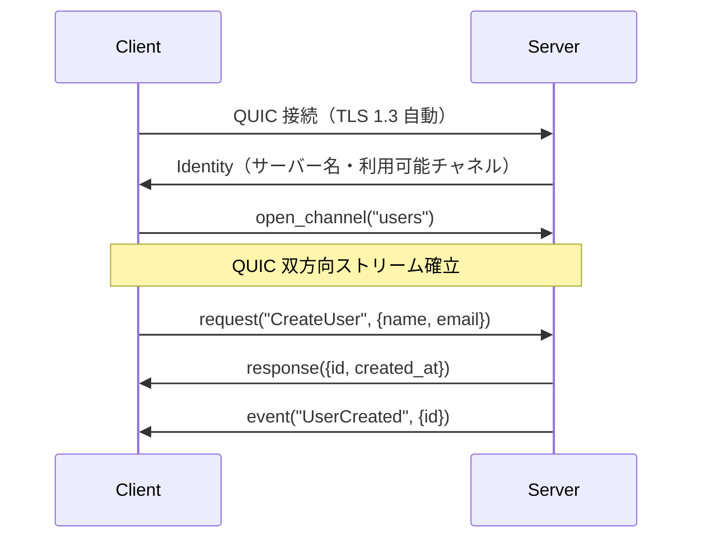

# Unison Protocol

KDL スキーマベースの型安全な QUIC 通信フレームワーク。

[](https://crates.io/crates/unison)
[](https://github.com/chronista-club/unison/actions)
[](LICENSE)

```toml
[dependencies]
unison = "^0.3"
tokio = { version = "1.40", features = ["full"] }
```

---

## 接続すると何が起こるか

クライアントがサーバーに接続し、チャネルを開いてやり取りするまでの流れ。



1. クライアントが QUIC で接続する。TLS 1.3 証明書は開発時は自動生成される
2. サーバーが Identity を返す（サーバー名、バージョン、利用可能なチャネル一覧）
3. クライアントがチャネルを開くと QUIC 双方向ストリームが確立される
4. 以降、そのチャネル上で Request/Response、Event push、Raw bytes を自由にやり取りする

全通信がチャネル経由。RPC という概念はなく、`UnisonChannel` に統一されている。

---

## サーバーを書く

```rust
use unison::{ProtocolServer, NetworkError};
use unison::network::UnisonChannel;
use serde_json::json;

#[tokio::main]
async fn main() -> Result<(), Box<dyn std::error::Error>> {
    let server = ProtocolServer::with_identity(
        "my-server", "1.0.0", "com.example.myservice",
    );

    // チャネルハンドラーの登録
    server.register_channel("users", |_ctx, stream| async move {
        let channel = UnisonChannel::new(stream);
        loop {
            match channel.recv().await {
                Ok(msg) => {
                    channel.send_response(msg.id, &msg.method, json!({"id": "1"})).await?;
                }
                Err(_) => break,
            }
        }
        Ok(())
    }).await;

    // バックグラウンドで起動（グレースフルシャットダウン対応）
    let handle = server.spawn_listen("[::1]:8080").await?;
    println!("サーバー起動: {}", handle.local_addr());

    // handle.shutdown().await? で停止
    Ok(())
}
```

## クライアントを書く

```rust
use unison::ProtocolClient;
use serde_json::json;

#[tokio::main]
async fn main() -> Result<(), Box<dyn std::error::Error>> {
    let client = ProtocolClient::new_default()?;
    client.connect("[::1]:8080").await?;

    // チャネルを開いて Request/Response
    let users = client.open_channel("users").await?;
    let response = users.request("CreateUser", json!({
        "name": "Alice",
        "email": "alice@example.com"
    })).await?;
    println!("作成されたユーザー: {}", response);

    // イベント受信
    let events = client.open_channel("events").await?;
    while let Ok(event) = events.recv().await {
        println!("イベント: {:?}", event);
    }

    Ok(())
}
```

---

## UnisonChannel

1つのチャネルで3種類の通信パターンをサポートする。

```
Client                              Server
  |                                    |
  |-- open_channel("users") ---------> |  (QUIC bidi stream)
  |                                    |
  |<-- UnisonChannel ----------------->|  UnisonChannel
  |    .request()    -> Protocol frame  |    .recv()
  |    .send_event() -> Protocol frame  |    .send_response()
  |    .send_raw()   -> Raw frame      |    .send_raw()
  |    .recv()       <- Protocol frame  |    .recv_raw()
  |    .recv_raw()   <- Raw frame      |
```

```rust
// Request/Response
let res = channel.request("CreateUser", payload).await?;
channel.send_response(id, method, payload).await?;

// Event push（一方向）
channel.send_event("UserCreated", payload).await?;

// Raw bytes（rkyv/zstd をバイパス、オーディオ等に）
channel.send_raw(&pcm_data).await?;
let data = channel.recv_raw().await?;
```

フレームの先頭 1 バイトで Protocol frame (`0x00`, rkyv + zstd) と Raw frame (`0x01`, 生バイト) を区別する。2KB 以上のペイロードは自動で zstd 圧縮される。

---

## 接続イベント

```rust
let mut events = server.subscribe_connection_events();
tokio::spawn(async move {
    while let Ok(event) = events.recv().await {
        match event {
            ConnectionEvent::Connected { remote_addr, context } => {
                println!("接続: {}", remote_addr);
            }
            ConnectionEvent::Disconnected { remote_addr } => {
                println!("切断: {}", remote_addr);
            }
        }
    }
});
```

## KDL スキーマ

プロトコルを KDL で定義すると、Rust / TypeScript のコードを自動生成できる。

```kdl
protocol "my-service" version="1.0.0" {
    namespace "com.example.myservice"

    channel "users" from="client" lifetime="persistent" {
        request "CreateUser" {
            field "name" type="string" required=#true
            field "email" type="string" required=#true

            returns "UserCreated" {
                field "id" type="string" required=#true
                field "created_at" type="timestamp" required=#true
            }
        }
    }
}
```

---

## ワークスペースクレート

| クレート | 説明 |
|---------|------|
| [`unison-protocol`](crates/unison-protocol) | コアライブラリ。crates.io では `unison` として公開。KDL スキーマ、QUIC、チャネル、パケット |
| [`unison-agent`](crates/unison-agent) | [Claude Agent SDK](https://crates.io/crates/claude-agent-sdk) 統合。AgentClient、InteractiveClient、MCP ツール公開 |

### unison-agent の例

```bash
cargo run -p unison-agent --example simple_query        # 単発クエリ
cargo run -p unison-agent --example interactive_chat    # マルチターン会話
```

---

## 開発

```bash
git clone https://github.com/chronista-club/unison
cd unison
cargo build

# テスト
RUSTFLAGS="-C symbol-mangling-version=v0" cargo test --tests --workspace -- --skip packet
```

IPv6 専用設計。アドレスは `[::1]:port` を使う。

## ドキュメント

- [コアコンセプト](spec/01-core-concept/SPEC.md) — Everything is a Channel
- [Unified Channel Protocol](spec/02-unified-channel/SPEC.md) — KDL スキーマ、コード生成
- [チャネルガイド](guides/channel-guide.md) — 実践ガイド

## ライセンス

MIT License - [LICENSE](LICENSE)
