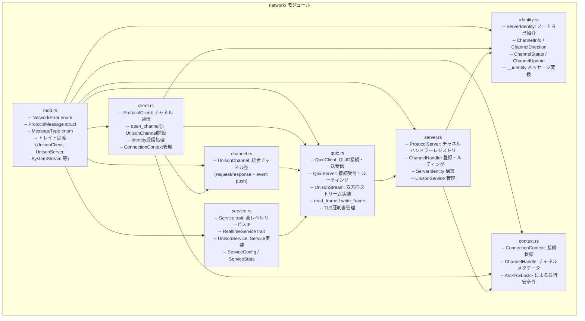
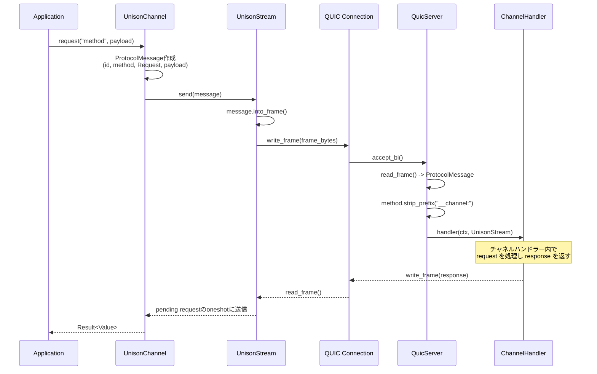
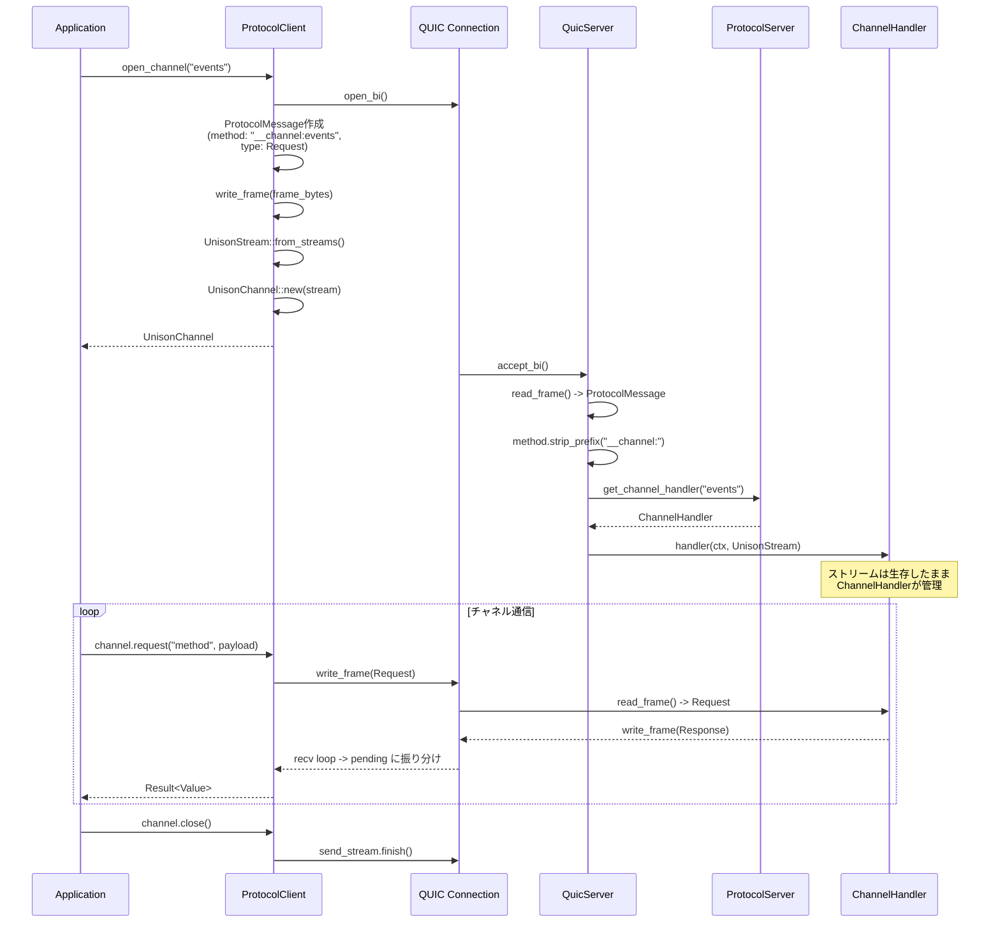
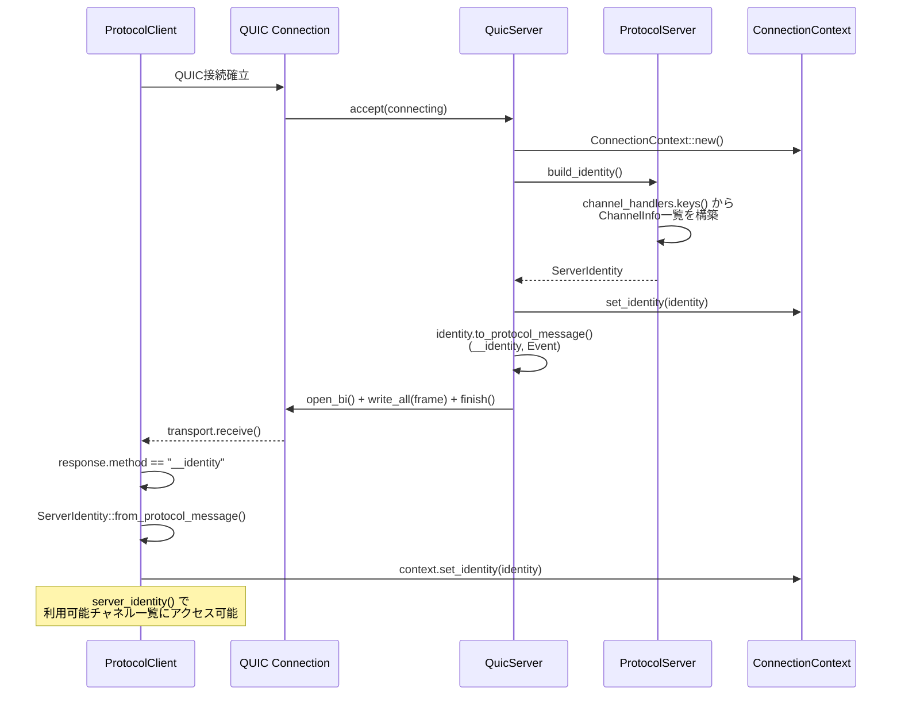
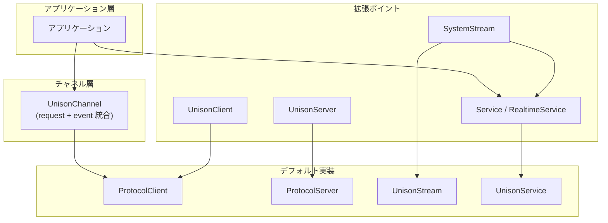

# Unison Protocol アーキテクチャ設計

**バージョン**: 0.2.0-draft
**最終更新**: 2026-02-16
**ステータス**: Draft

---

## 目次

1. [概要](#1-概要)
2. [ワークスペース構成](#2-ワークスペース構成)
3. [unison-protocol モジュール構成](#3-unison-protocol-モジュール構成)
4. [データフロー](#4-データフロー)
5. [エラーハンドリング](#5-エラーハンドリング)
6. [拡張ポイント](#6-拡張ポイント)

---

## 1. 概要

Unison ProtocolはCargoワークスペースとして構成され、プロトコル定義・パーサー・コード生成・ネットワーク通信を一つのクレートに統合している。KDLスキーマからの型安全なコード生成と、QUICベースのChannel指向通信を提供する。

---

## 2. ワークスペース構成

```
unison/
  Cargo.toml              -- ワークスペースルート (edition = 2024, rust-version = 1.93)
  schemas/                 -- KDLプロトコル定義
    creo_sync.kdl          -- 実用スキーマ例（5チャネル）
  crates/
    unison-protocol/       -- コアクレート（パーサー、コード生成、ネットワーク）
    unison-network/        -- ネットワーク層（将来拡張用）
    unison-cli/            -- CLIツール
    unison-agent/          -- エージェント実装
```

### ワークスペース共通設定

| 設定 | 値 |
|------|-----|
| edition | 2024 |
| rust-version | 1.93 |
| version | 0.1.0-alpha3 |
| resolver | 2 |

### 主要依存クレート

| 用途 | クレート |
|------|---------|
| シリアライゼーション | serde, serde_json, rkyv |
| QUIC | quinn 0.11, rustls 0.23 |
| 圧縮 | zstd |
| 非同期ランタイム | tokio |
| KDLパース | kdl, unison-kdl |
| コード生成 | proc-macro2, quote, syn |
| CGP | cgp 0.4.2 |
| エラーハンドリング | thiserror, anyhow, miette |

---

## 3. unison-protocol モジュール構成

### 3.1 トップレベルモジュール

```
crates/unison-protocol/src/
  lib.rs                   -- エントリポイント、UnisonProtocol構造体
  prelude.rs               -- よく使用される型のreexport
  core/
    mod.rs                 -- コア型定義
  parser/
    mod.rs                 -- SchemaParserエントリポイント
    schema.rs              -- ParsedSchema、スキーマ構造
    types.rs               -- TypeRegistry、型定義
  codegen/
    mod.rs                 -- CodeGeneratorトレイト
    rust.rs                -- RustGenerator
    typescript.rs          -- TypeScriptGenerator
  packet/
    mod.rs                 -- UnisonPacket、UnisonPacketBuilder、UnisonPacketView
    header.rs              -- UnisonPacketHeader (48 bytes)、PacketType
    flags.rs               -- PacketFlags ビットフラグ
    payload.rs             -- Payloadable trait、各種ペイロード型
    config.rs              -- PacketConfig、CompressionConfig
    serialization.rs       -- PacketSerializer / PacketDeserializer
  context/
    mod.rs                 -- CGPベースコンテキスト
    adapter.rs             -- コンテキストアダプター
    handlers.rs            -- ハンドラー実装
  network/
    mod.rs                 -- NetworkError、ProtocolMessage、MessageType、トレイト群
    quic.rs                -- QuicClient、QuicServer、UnisonStream
    server.rs              -- ProtocolServer（チャネルハンドラー管理）
    client.rs              -- ProtocolClient（チャネル開設・通信）
    channel.rs             -- UnisonChannel、StreamSender/Receiver
    identity.rs            -- ServerIdentity、ChannelInfo、ChannelUpdate
    context.rs             -- ConnectionContext（接続状態管理）
    service.rs             -- Service trait、UnisonService、RealtimeService
```

### 3.2 network/ 配下の責務



### 3.3 packet/ 配下の責務

| ファイル | 責務 |
|---------|------|
| `mod.rs` | `UnisonPacket<T>` -- ジェネリックフレーム構造体。`Bytes`で生データ保持、遅延デシリアライズ |
| `header.rs` | `UnisonPacketHeader` -- 48バイト固定長ヘッダー。version, packet_type, flags, lengths, IDs |
| `flags.rs` | `PacketFlags` -- ビットフラグ（COMPRESSED, PRIORITY_HIGH, REQUIRES_ACK等） |
| `payload.rs` | `Payloadable` trait + ペイロード型: `StringPayload`, `BytesPayload`, `JsonPayload`, `RkyvPayload<T>`, `EmptyPayload` |
| `config.rs` | `PacketConfig` -- 最大ペイロードサイズ、圧縮設定 |
| `serialization.rs` | `PacketSerializer` / `PacketDeserializer` -- rkyv + zstd のシリアライズ/デシリアライズ |

---

## 4. データフロー

### 4.1 Request/Response フロー（UnisonChannel経由）



### 4.2 Channelフロー（開設〜通信）



### 4.3 Identityフロー



---

## 5. エラーハンドリング

### 5.1 NetworkError enum

`NetworkError` はネットワーク層の全エラーを統一的に表現する。

```rust
pub enum NetworkError {
    Connection(String),         // 接続エラー（切断、タイムアウト等）
    Protocol(String),           // プロトコルレベルのエラー（不正メッセージ等）
    Serialization(serde_json::Error),  // JSONシリアライゼーションエラー
    FrameSerialization(SerializationError), // rkyv/zstdフレームエラー
    Quic(String),               // QUICトランスポートエラー
    Timeout,                    // タイムアウト
    HandlerNotFound { method: String }, // 未登録メソッド呼び出し
    NotConnected,               // 未接続状態でのオペレーション
    UnsupportedTransport(String), // 非サポートトランスポート
}
```

### 5.2 エラー発生箇所

| エラー種別 | 発生箇所 | 原因 |
|-----------|---------|------|
| `Connection` | QuicClient, UnisonStream | 接続断、ストリーム非アクティブ |
| `Protocol` | ProtocolClient, QuicServer | メッセージパースエラー、不正な応答 |
| `Serialization` | ProtocolMessage | JSONシリアライゼーション/デシリアライゼーション |
| `FrameSerialization` | UnisonPacket | rkyv/zstdエラー、バージョン不互換 |
| `Quic` | QuicClient, QuicServer, UnisonStream | QUICストリーム操作エラー |
| `Timeout` | RealtimeService | 受信タイムアウト |
| `HandlerNotFound` | ProtocolServer | 未登録メソッドの呼び出し |
| `NotConnected` | ProtocolClient | 接続前のチャネル/RPC操作 |

---

## 6. 拡張ポイント

### 6.1 Trait一覧

以下のトレイトにより、カスタム実装の差し込みが可能である。

#### クライアント側

| Trait | 責務 | 主要メソッド |
|-------|------|------------|
| `UnisonClient` | 接続管理 | `connect()`, `disconnect()`, `is_connected()` |

> **Note**: 旧 `ProtocolClientTrait`, `UnisonClientExt` は Unified Channel 統合により削除済み。

#### サーバー側

| Trait | 責務 | 主要メソッド |
|-------|------|------------|
| `UnisonServer` | サーバーライフサイクル | `listen()`, `stop()`, `is_running()` |

> **Note**: 旧 `ProtocolServerTrait`, `UnisonServerExt` は Unified Channel 統合により削除済み。ハンドラー登録は `ProtocolServer::register_channel()` メソッドで行う。

#### チャネル・ストリーム・サービス

| Trait / 型 | 責務 | 主要メソッド |
|------------|------|------------|
| `UnisonChannel` | 統合チャネル（request/response + event） | `request()`, `send_event()`, `recv()`, `close()` |
| `SystemStream` | 双方向ストリームI/O | `send()`, `receive()`, `is_active()`, `close()`, `get_handle()` |
| `Service` | 高レベルサービスIF | `service_type()`, `service_name()`, `handle_request()`, `shutdown()` |
| `RealtimeService` | リアルタイム通信拡張 | `send_realtime()`, `receive_with_timeout()`, `get_performance_stats()` |

### 6.2 拡張パターン



カスタム実装の例:
- `SystemStream` を実装して、QUIC以外のトランスポート上でストリームを動作させる
- `Service` を実装して、ドメイン固有のサービスロジックを提供する
- `UnisonChannel` をベースに、チャネルハンドラーでドメイン固有のプロトコルを構築する

---

**設計バージョン**: 0.2.0-draft
**最終更新**: 2026-02-16
**ステータス**: Draft
