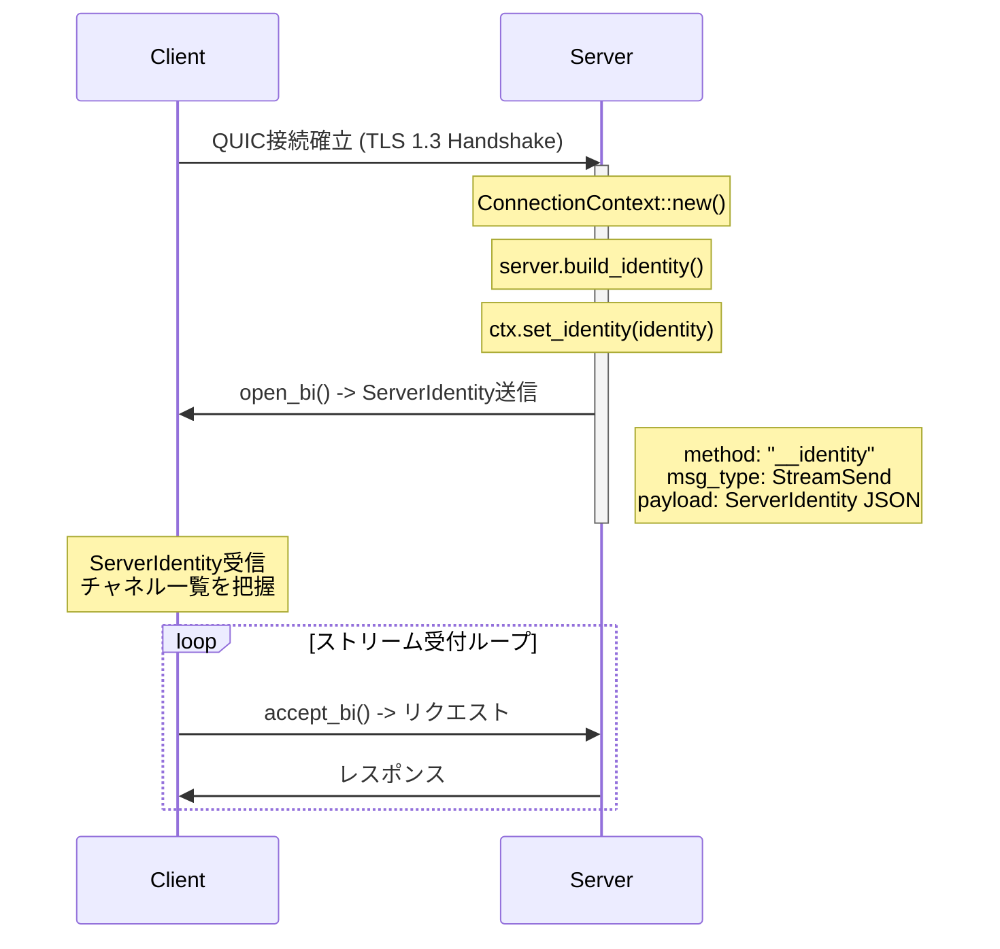
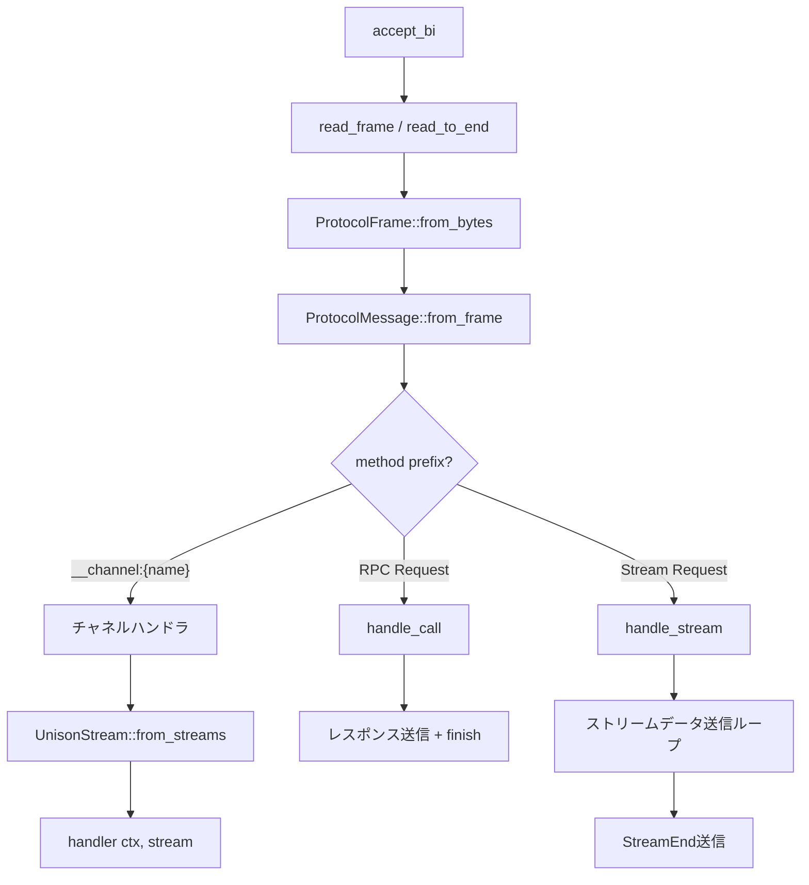
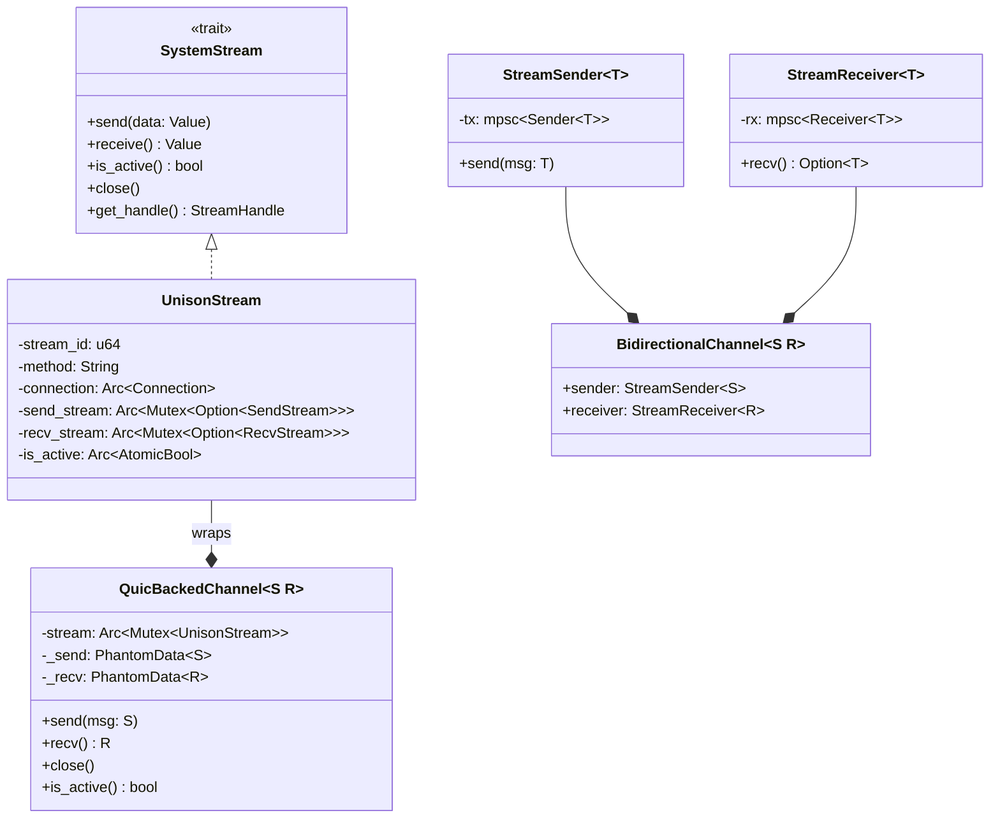
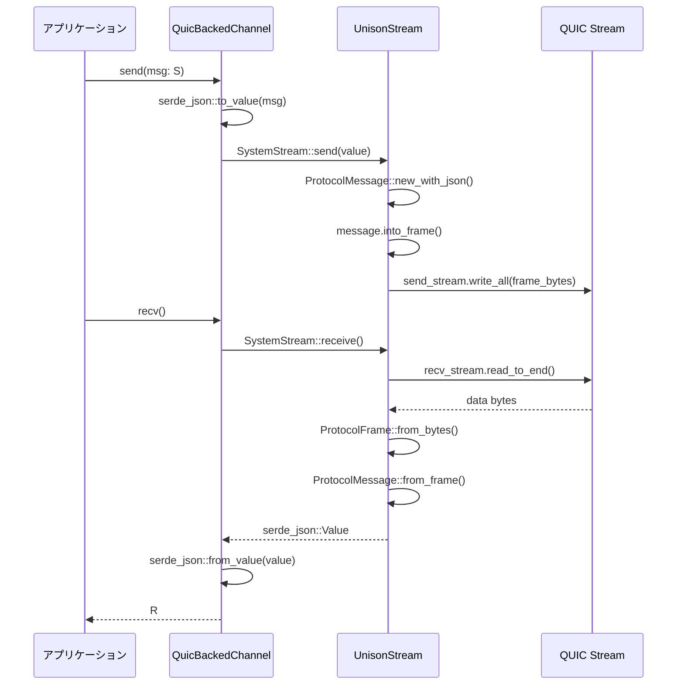
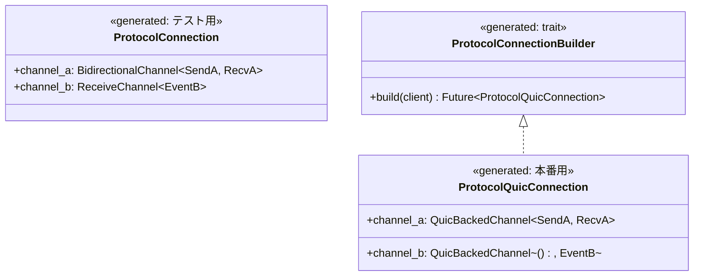

# QUIC Runtime 統合

## 1. 概要

本ドキュメントでは、Unison ProtocolにおけるQUIC Runtime統合の設計を記述する。QUICトランスポート層は以下の要素で構成される:

- **ConnectionContext**: 接続ごとの状態管理（identity、チャネル追跡）
- **Identity Handshake**: 接続直後のサーバー自己紹介プロトコル
- **チャネルルーティング**: `__channel:` プレフィックスによるRPCとチャネルの多重化
- **Length-Prefixed Framing**: 4バイトBE長プレフィックスによるフレーム境界
- **QuicBackedChannel\<S, R\>**: 型安全なQUICストリームラッパー
- **コード生成統合**: `{Protocol}QuicConnection` 構造体の自動生成

全体のアーキテクチャ層における位置付け:

```
Application Layer
    |
Service Layer   --- QuicBackedChannel<S, R> (型安全チャネル)
    |
Protocol Layer  --- ProtocolMessage / ProtocolFrame
    |
Transport Layer --- UnisonStream / read_frame / write_frame
    |
Network Layer   --- quinn::Connection (QUIC/TLS 1.3)
```

## 2. ConnectionContext

**ファイル**: `crates/unison-protocol/src/network/context.rs`

ConnectionContextは、QUIC接続ごとの状態を管理する構造体である。各接続に対して一意のUUID、Identity情報、アクティブチャネルの追跡を提供する。

### 構造体定義

```rust
pub struct ConnectionContext {
    /// 接続の一意識別子
    pub connection_id: Uuid,
    /// サーバーから受信したIdentity情報
    identity: Arc<RwLock<Option<ServerIdentity>>>,
    /// アクティブなチャネルのマップ（チャネル名 -> ハンドル）
    channels: Arc<RwLock<HashMap<String, ChannelHandle>>>,
}

pub struct ChannelHandle {
    pub channel_name: String,
    pub stream_id: u64,
    pub direction: ChannelDirection,
}

pub enum ChannelDirection {
    Send,
    Receive,
    Bidirectional,
}
```

### ライフサイクル

```mermaid
stateDiagram-v2
    [*] --> Created: ConnectionContext::new()
    Created --> IdentityReceived: set_identity()
    IdentityReceived --> Active: register_channel()
    Active --> Active: register_channel() / remove_channel()
    Active --> Closing: 接続クローズ
    IdentityReceived --> Closing: 接続クローズ
    Closing --> [*]
```

### 設計判断

- **Arc\<RwLock\<\>\> による並行保護**: 1つのQUIC接続に対して複数のストリームハンドラが並行動作するため、identity と channels を個別にロック管理する。これにより、チャネル登録がidentity参照をブロックしない。
- **UUID による接続識別**: `Uuid::new_v4()` で生成される128ビットの一意識別子。接続ログやデバッグ時のトレーサビリティに使用する。

## 3. Identity Handshake

**ファイル**: `crates/unison-protocol/src/network/identity.rs`

QUICサーバーは接続を受け入れた直後に、サーバー自身の情報をクライアントに通知する。これにより、クライアントは接続先の能力（提供チャネル一覧、バージョン）を動的に把握できる。

### ServerIdentity 構造体

```rust
pub struct ServerIdentity {
    pub name: String,           // サーバー名（例: "unison"）
    pub version: String,        // バージョン（例: "0.1.0"）
    pub namespace: String,      // ネームスペース（例: "default"）
    pub channels: Vec<ChannelInfo>, // 利用可能なチャネル一覧
    pub metadata: serde_json::Value, // 拡張メタデータ
}

pub struct ChannelInfo {
    pub name: String,
    pub direction: ChannelDirection,  // ServerToClient / ClientToServer / Bidirectional
    pub lifetime: String,             // "persistent" / "transient"
    pub status: ChannelStatus,        // Available / Busy / Unavailable
}
```

### シーケンス図



### build_identity の動作

`ProtocolServer::build_identity()` は、登録済みのチャネルハンドラから動的に `ServerIdentity` を構築する:

```rust
pub async fn build_identity(&self) -> ServerIdentity {
    let mut identity = ServerIdentity::new(
        &self.server_name,
        &self.server_version,
        &self.server_namespace,
    );
    let handlers = self.channel_handlers.read().await;
    for channel_name in handlers.keys() {
        identity.add_channel(ChannelInfo {
            name: channel_name.clone(),
            direction: ChannelDirection::Bidirectional,
            lifetime: "persistent".to_string(),
            status: ChannelStatus::Available,
        });
    }
    identity
}
```

### ChannelUpdate（リアルタイム通知）

接続中にチャネルの追加・削除・状態変更が発生した場合、`ChannelUpdate` を通じてクライアントに通知する:

```rust
#[serde(tag = "type", content = "channel")]
pub enum ChannelUpdate {
    Added(ChannelInfo),
    Removed(String),
    StatusChanged { name: String, status: ChannelStatus },
}
```

## 4. チャネルルーティング

**ファイル**: `crates/unison-protocol/src/network/quic.rs` (`handle_connection` 関数内)

QUIC接続上では、通常のRPC（Request/Response）とチャネル（永続ストリーム）が同一の双方向ストリームを共有する。ルーティングは `ProtocolMessage.method` フィールドのプレフィックスで判別する。

### ルーティング規則

| プレフィックス | 種別 | 処理 |
|---|---|---|
| `__channel:{name}` | チャネル | `get_channel_handler` で対応ハンドラに委譲 |
| `__identity` | Identity | ServerIdentity の送信 |
| (その他) | RPC | `handle_call` / `handle_stream` でメソッド名解決 |

### フロー図



### チャネルハンドラとRPCの違い

- **RPC**: ストリームを開いて1リクエスト送信 → 1レスポンス受信 → `finish()` でクローズ。ストリームは短命。
- **チャネル**: ストリームを開いた後、`UnisonStream` として生かしたままハンドラに引き渡す。ハンドラ内で `send` / `receive` を繰り返す永続ストリーム。

## 5. Length-Prefixed Framing

**ファイル**: `crates/unison-protocol/src/network/quic.rs`

QUICストリーム上でのメッセージ境界を明確にするため、Length-Prefixed Framing を採用する。

### read_frame

```rust
pub async fn read_frame(recv: &mut RecvStream) -> Result<bytes::Bytes> {
    // 1. 4バイトのBigEndian長を読む
    let mut len_buf = [0u8; 4];
    recv.read_exact(&mut len_buf).await?;
    let len = u32::from_be_bytes(len_buf) as usize;

    // 2. サイズ上限チェック (MAX_MESSAGE_SIZE = 8MB)
    if len > MAX_MESSAGE_SIZE {
        return Err(anyhow!("Frame too large: {} bytes", len));
    }

    // 3. データ本体を読む
    let mut data = vec![0u8; len];
    recv.read_exact(&mut data).await?;
    Ok(bytes::Bytes::from(data))
}
```

### write_frame

```rust
pub async fn write_frame(send: &mut SendStream, data: &[u8]) -> Result<()> {
    let len = (data.len() as u32).to_be_bytes();
    send.write_all(&len).await?;
    send.write_all(data).await?;
    Ok(())
}
```

### フレームフォーマット

```
+-------------------+-------------------+
| Length (4 bytes)   | Data (N bytes)    |
| Big-Endian u32     | ProtocolFrame     |
+-------------------+-------------------+
```

- **最大サイズ**: `MAX_MESSAGE_SIZE = 8 * 1024 * 1024` (8MB)
- **Data部**: `ProtocolFrame`（= `UnisonPacket<RkyvPayload<ProtocolMessage>>`）のバイト列

### 後方互換: read_to_end フォールバック

サーバー側の `handle_connection` では、`read_frame` が失敗した場合に `read_to_end` にフォールバックする。これにより、Length-Prefixed Framing に対応していない旧クライアントとの互換性を維持する:

```rust
let request_result = match read_frame(&mut recv_stream).await {
    Ok(frame_bytes) => ProtocolFrame::from_bytes(&frame_bytes)
        .and_then(|frame| ProtocolMessage::from_frame(&frame)),
    Err(_) => {
        // read_to_end にフォールバック（旧クライアント互換）
        match recv_stream.read_to_end(MAX_MESSAGE_SIZE).await {
            Ok(data) => {
                let frame_bytes = bytes::Bytes::from(data);
                ProtocolFrame::from_bytes(&frame_bytes)
                    .and_then(|frame| ProtocolMessage::from_frame(&frame))
            }
            Err(e) => { /* エラー処理 */ }
        }
    }
};
```

## 6. QuicBackedChannel\<S, R\>

**ファイル**: `crates/unison-protocol/src/network/channel.rs`

`QuicBackedChannel<S, R>` は、QUICストリーム上で動作する型安全な双方向チャネルである。`UnisonStream` をラップし、`PhantomData` + `Serialize` / `DeserializeOwned` の型パラメータで送受信メッセージの型安全性を保証する。

### 構造体定義

```rust
pub struct QuicBackedChannel<S, R> {
    stream: Arc<Mutex<UnisonStream>>,
    _send: PhantomData<S>,
    _recv: PhantomData<R>,
}

impl<S, R> QuicBackedChannel<S, R>
where
    S: Serialize + Send,
    R: DeserializeOwned + Send,
{
    pub fn new(stream: UnisonStream) -> Self;
    pub async fn send(&self, msg: S) -> Result<(), NetworkError>;
    pub async fn recv(&self) -> Result<R, NetworkError>;
    pub async fn close(&self) -> Result<(), NetworkError>;
    pub fn is_active(&self) -> bool;
}
```

### チャネルの型ファミリー

プロトコルが提供するチャネルの種類に応じて、異なるラッパー型が用意されている:



### インメモリ vs QUIC

| 型 | 用途 | トランスポート |
|---|---|---|
| `StreamSender<T>` / `StreamReceiver<T>` | テスト、プロセス内通信 | mpsc チャネル |
| `BidirectionalChannel<S, R>` | テスト、プロセス内通信 | mpsc チャネル |
| `QuicBackedChannel<S, R>` | 本番通信 | QUIC双方向ストリーム |

### send / recv の内部動作



## 7. コード生成統合

**ファイル**: `crates/unison-protocol/src/codegen/rust.rs`

KDLスキーマで定義されたプロトコルのチャネルから、Rust構造体とBuilderトレイトが自動生成される。

### 生成される構造体



### generate_connection_struct

`RustGenerator::generate_connection_struct()` は、プロトコル定義内の全チャネルをフィールドとして持つ2つの構造体を生成する:

1. **`{Protocol}Connection`** -- インメモリチャネル版（テスト用）
2. **`{Protocol}QuicConnection`** -- QUICストリーム版（本番用）

```rust
fn generate_connection_struct(&self, protocol: &Protocol) -> TokenStream {
    let struct_name = format_ident!("{}Connection", protocol.name.to_case(Case::Pascal));
    let quic_struct_name = format_ident!("{}QuicConnection", protocol.name.to_case(Case::Pascal));
    let builder_name = format_ident!("{}ConnectionBuilder", protocol.name.to_case(Case::Pascal));
    // ...
}
```

### channel_quic_field_type のマッピング

`channel_quic_field_type()` は、チャネルの `send` / `recv` メッセージ定義の有無に基づいてフィールド型を決定する:

| send | recv | 生成される型 |
|---|---|---|
| あり | あり | `QuicBackedChannel<SendType, RecvType>` |
| あり | なし | `QuicBackedChannel<(), SendType>` |
| なし | あり | `QuicBackedChannel<RecvType, ()>` |
| なし | なし | `()` |

### channel_field_type のマッピング（インメモリ版）

インメモリチャネル版では、チャネルの `from`（発信元）と `lifetime`（永続性）も考慮する:

| send | recv | from | lifetime | 生成される型 |
|---|---|---|---|---|
| あり | なし | Server | - | `ReceiveChannel<SendType>` |
| あり | あり | - | Transient | `RequestChannel<SendType, RecvType>` |
| あり | あり | - | Persistent | `BidirectionalChannel<SendType, RecvType>` |

### ConnectionBuilder トレイト

自動生成される `{Protocol}ConnectionBuilder` トレイトは、`ProtocolClient` から全チャネルを一括で開設する `build()` メソッドを提供する:

```rust
pub trait {Protocol}ConnectionBuilder {
    fn build(
        client: &crate::network::client::ProtocolClient,
    ) -> impl std::future::Future<Output = Result<{Protocol}QuicConnection>> + Send;
}
```

`build()` の実装では、各チャネルに対して `client.open_channel(channel_name)` を呼び出し、`QuicBackedChannel` を構築する。

## 関連ドキュメント

- [アーキテクチャ](./architecture.md) -- システム全体のレイヤー構成
- [パケット設計](./packet.md) -- UnisonPacket / ProtocolFrame のバイナリフォーマット
- [プロトコル仕様](../spec/PROTOCOL_SPEC.md) -- KDLスキーマとメッセージ種別
