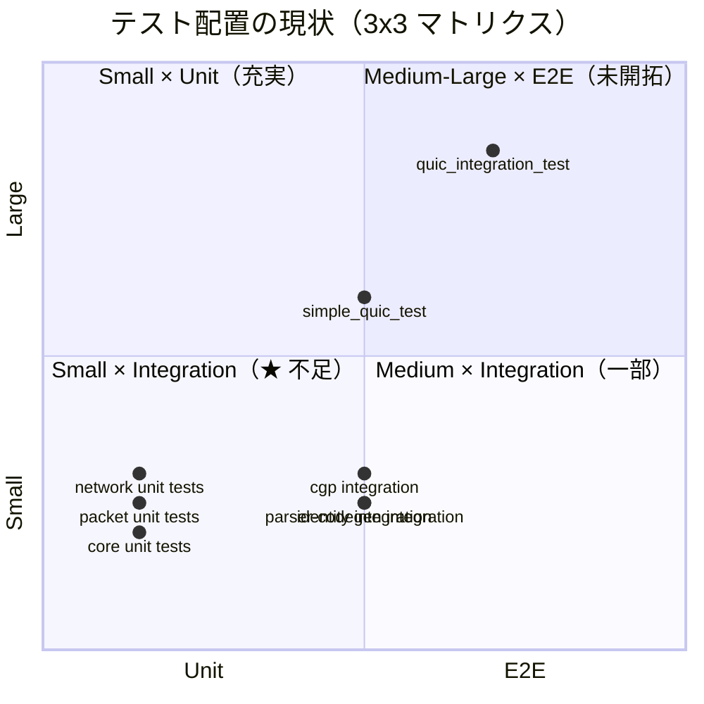

# テスト戦略

## 1. テスト哲学

### t-wada 3x3 マトリクス

テストを **サイズ**（実行コスト）と **スコープ**（検証範囲）の 2 軸で分類する。

| | Unit | Integration | E2E |
|---|---|---|---|
| **Small** | 単一関数・構造体の検証。外部依存なし、インメモリのみ | 複数モジュールを結合。Mock/Fake で外部依存を置換 | — |
| **Medium** | — | ネットワーク・ファイルI/O を含む結合テスト | 複数プロセス間の結合 |
| **Large** | — | — | 実環境に近い構成での検証 |

### 核心原則: 「サイズを上げずにスコープを広げる」

- Small x Unit で個々の部品を固める（現状の packet テスト群）
- **Small x Integration** で複数モジュールの結合を Mock/Fake で検証する（最優先で拡充）
- Medium 以上はコストが高いため、投資対効果を吟味して最小限に留める

### Rust の型システム = 静的解析層

Testing Trophy の最下層（Static Analysis）は Rust コンパイラが自然にカバーする:

- 型チェック・借用チェック → Null 参照・データ競合の排除
- `clippy` → コードスメル・パターン違反の検出
- 型による不正状態の排除（`enum` + exhaustive match）

この強固な静的解析層があるからこそ、テストは **ロジックの正しさ** と **モジュール間の結合** に集中できる。

## 2. 現状分析

### モジュール別テスト分布

| モジュール | ユニットテスト数 | Small統合テスト数 | Medium統合テスト数 | 合計 |
|-----------|:---:|:---:|:---:|:---:|
| `packet/` (mod, header, serialization, config, flags, payload) | 36 | 0 | 0 | 36 |
| `core/` | 4 | 0 | 0 | 4 |
| `lib.rs` | 4 | 0 | 0 | 4 |
| `network/` (server, context) | 5 | 6 | 0 | 11 |
| `parser/` + `codegen/` | 0 | 10 | 0 | 10 |
| `context/` (CGP) | 0 | 6 | 0 | 6 |
| Identity | 0 | 6 | 0 | 6 |
| QUIC transport | 0 | 7 | 6 | 13 |
| Error paths | 0 | 6 | 0 | 6 |
| **合計** | **49** | **41** | **6** | **96** |

### 3x3 マトリクスでの配置図



**テキスト配置図:**

```
              Unit          Integration       E2E
         ┌──────────────┬───────────────┬──────────┐
 Large   │              │               │ quic_    │
         │              │               │ integra- │
         │              │               │ tion*    │
         ├──────────────┼───────────────┼──────────┤
 Medium  │              │ simple_quic   │          │
         │              │               │          │
         ├──────────────┼───────────────┼──────────┤
 Small   │ packet (36)  │ ★ ここが不足  │          │
         │ core (4)     │ parser/cg (5) │          │
         │ network (5)  │ identity (2)  │          │
         │ lib (4)      │ cgp (1)       │          │
         └──────────────┴───────────────┴──────────┘

 * #[ignore] で CI スキップ中
```

### ギャップ分析

**最大のギャップ: Small x Integration**

- `network/` モジュール（`server.rs`, `channel.rs`, `client.rs`）の結合テストが存在しない
- `context/handlers.rs` のハンドラーディスパッチテストが不足
- `codegen/` の Rust/TypeScript 生成の正常系は検証されているが、エラーパスが未テスト
- `ProtocolMessage` の構築・パース・ルーティングの結合テストがない

## 3. 目標

| 指標 | 目標値 | 根拠 |
|------|--------|------|
| サイズ比率 | Small 80% / Medium 15% / Large 5% | Google Testing Blog 推奨比率 |
| `cargo test` 実行時間 | < 30 秒（Small のみ） | 開発中のフィードバック速度 |
| CI 全体 | < 10 分 | PR マージまでの待ち時間 |
| Flaky 率 | 0%（1% 超でエンジニアの信頼が崩壊） | t-wada「テストの信頼性」原則 |

## 4. モジュール別テスト方針

### packet/ → Small x Unit（現状維持）

- 36 テストで十分にカバー済み
- ヘッダー・ペイロード・シリアライゼーション・フラグ・設定の各層を個別検証
- 追加は必要に応じて（新フィールド追加時など）

### parser/ + codegen/ → Small x Integration（拡充）

- 現状: KDL パース → コード生成の正常系パスのみ
- 拡充: 不正スキーマのエラーハンドリング、エッジケース
- channel 構文（`request`/`returns`/`event`）の結合テスト

### network/ → Small x Integration（最優先新規）

- `ProtocolMessage` の構築・シリアライズ・デシリアライズ
- `ProtocolServer` のチャネル登録・ハンドラーディスパッチ
- `ConnectionContext` のライフサイクル管理
- Mock Transport を使い、QUIC に依存しない Small テスト

### context/handlers/ → Small x Integration（拡充）

- CGP コンテキストのハンドラー登録・メッセージルーティング
- `HandlerRegistry` の検索・実行フロー
- エラーハンドリング（未登録ハンドラーへのディスパッチ等）

### QUIC transport → Medium x Integration

- `simple_quic_test.rs` の拡充
- 証明書生成・TLS 設定の検証
- 接続・切断のライフサイクル
- `#[ignore]` で通常の `cargo test` からは除外

### E2E → Large x E2E（最後）

- `quic_integration_test.rs` を整備
- 実際の QUIC サーバー/クライアント間通信
- CI では専用ジョブで実行

## 5. テストインフラ

### テストヘルパー関数

`tests/common/mod.rs` に共通ヘルパーを集約:

```rust
// ProtocolMessage 生成ヘルパー
pub fn make_request(channel: &str, method: &str, payload: Value) -> ProtocolMessage { ... }
pub fn make_response(request_id: &str, payload: Value) -> ProtocolMessage { ... }
pub fn make_event(channel: &str, event: &str, data: Value) -> ProtocolMessage { ... }

// MockTransport
pub struct MockTransport { ... }

// テスト用 ServerIdentity
pub fn test_identity() -> ServerIdentity { ... }
```

### 命名規則

```
test_{scope}_{module}_{scenario}

例:
test_unit_packet_header_roundtrip
test_integration_server_channel_registration
test_integration_codegen_error_invalid_schema
test_e2e_quic_ping_pong
```

### ファイル構成

```
tests/
├── common/
│   └── mod.rs                    # 共通ヘルパー
├── test_protocol_message.rs      # ProtocolMessage 結合テスト
├── test_server_handlers.rs       # サーバーハンドラー結合テスト
├── test_identity_flow.rs         # Identity フロー結合テスト（既存統合）
├── test_handler_dispatch.rs      # ハンドラーディスパッチ結合テスト
├── test_codegen_channel.rs       # codegen 結合テスト（既存）
├── test_e2e_channel.rs           # E2E codegen テスト（既存）
├── test_creo_sync.rs             # creo_sync スキーマテスト（既存）
├── test_kdl.rs                   # KDL パーステスト（既存）
├── test_identity.rs              # Identity シリアライゼーション（既存）
├── test_identity_quic.rs         # Identity QUIC フロー（既存）
├── cgp_integration_test.rs       # CGP 統合テスト（既存）
├── simple_quic_test.rs           # QUIC 簡易テスト（既存）
└── quic_integration_test.rs      # QUIC 統合テスト（既存、#[ignore]）
```

## 6. 偽陽性・偽陰性対策

### 偽陽性（False Positive）: テストが壊れたが実装は正しい

- **内部実装に依存しないテスト設計**: private フィールドの値ではなく、公開 API の振る舞いを検証する
- **文字列マッチングの回避**: コード生成テストで `contains("exact string")` に頼りすぎない → 構造的な検証を併用
- **テスト同士の独立性**: 共有状態を持たない。各テストは独立して実行可能

### 偽陰性（False Negative）: テストが通るが実装にバグがある

- **エラーパステスト**: 正常系だけでなく、異常入力・境界値を必ずテスト
- **proptest 検討**: パケットのシリアライゼーション等、入力空間が広い箇所にはプロパティベーステストが有効
- **カバレッジ計測**: `cargo-tarpaulin` で定期的に未カバー行を可視化

## 7. CI 統合

### テスト実行の分離

```yaml
# Small テスト（常時実行、PR ブロッキング）
- name: Small Tests
  run: RUSTFLAGS="-C symbol-mangling-version=v0" cargo test --tests --workspace -- --skip packet

# Clippy（常時実行、PR ブロッキング）
- name: Clippy
  run: cargo clippy --lib --workspace -- -D warnings

# Medium テスト（CI のみ、#[ignore] を含む）
- name: Medium Tests
  run: cargo test --tests --workspace -- --ignored

# Large テスト（ナイトリー or リリース前）
- name: E2E Tests
  run: cargo test --tests --workspace -- --ignored e2e
```

### テスト分類のアノテーション

```rust
// Small テスト: アノテーション不要（デフォルト）
#[test]
fn test_unit_packet_roundtrip() { ... }

// Medium テスト: #[ignore] + コメント
#[test]
#[ignore = "Medium: requires QUIC runtime"]
fn test_quic_connection_lifecycle() { ... }

// Large テスト: #[ignore] + "e2e" プレフィックス
#[test]
#[ignore = "Large: E2E test"]
fn test_e2e_full_protocol_flow() { ... }
```

## 8. 優先ロードマップ

### Phase 1: テスト基盤 + Small x Integration テスト（本 PR）

1. `tests/common/mod.rs` — 共通ヘルパー（`ProtocolMessage` 生成、`MockTransport`）
2. `tests/test_protocol_message.rs` — ProtocolMessage 構築・ルーティングの結合テスト
3. `tests/test_server_handlers.rs` — サーバーハンドラー登録・ディスパッチの結合テスト
4. `tests/test_handler_dispatch.rs` — CGP ハンドラーディスパッチの結合テスト
5. 本設計文書 `design/test-strategy.md`

### Phase 2: Medium x Integration（QUIC transport）✅

`test_medium_quic_lifecycle.rs` に 6 テスト追加:

- サーバー bind + shutdown ライフサイクル
- クライアント connect → is_connected → disconnect
- Identity ハンドシェイク（チャネル情報含む）
- チャネル経由 Request/Response
- 連続リクエスト（10 件）
- サーバーシャットダウン時のクライアント切断検知

すべて `#[ignore = "Medium: requires QUIC runtime"]` 付き。
`cargo test -- --ignored` で実行。

### Phase 3: Large x E2E

- `quic_integration_test.rs` の整備
- 実サーバー/クライアント間の完全なプロトコルフロー検証
- ナイトリー CI ジョブでの定期実行
