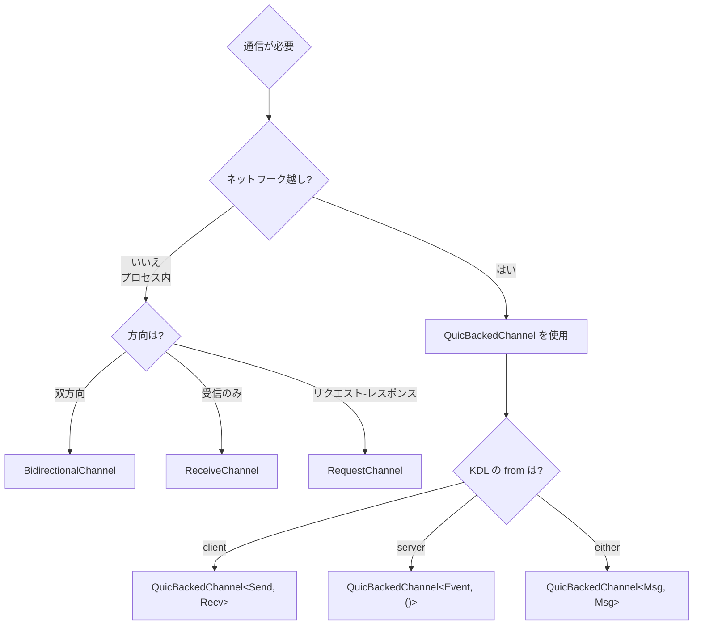

# チャネルガイド

Unison Protocol の Stream Channel を使ったリアルタイム通信の実践ガイド。

---

## 1. はじめに

Stream Channel は Unison Protocol の Stream-First API における中核的な通信プリミティブである。各チャネルは独立した QUIC ストリームにマッピングされ、Head-of-Line Blocking を回避しながら型安全なメッセージ送受信を実現する。

このガイドでは、KDL スキーマによるチャネル定義からサーバー・クライアントの実装まで、実践的な手順を解説する。

### 前提知識

- Rust の async/await 基礎
- Unison Protocol の基本概念（[spec/01](../spec/01-core-concept/SPEC.md) 参照）

---

## 2. クイックスタート

### 2.1 KDL スキーマでチャネル定義

まず、KDL スキーマファイルでチャネルを定義する。

```kdl
// schemas/my_protocol.kdl
protocol "my-protocol" version="1.0.0" {
    namespace "com.example.myprotocol"

    channel "notifications" from="server" lifetime="persistent" {
        send "Notification" {
            field "title" type="string" required=#true
            field "body" type="string" required=#true
            field "level" type="string"
        }
    }

    channel "commands" from="client" lifetime="persistent" {
        send "Command" {
            field "action" type="string" required=#true
            field "params" type="json"
        }
        recv "CommandResult" {
            field "success" type="bool" required=#true
            field "data" type="json"
        }
    }
}
```

**属性の意味**:

| 属性 | 値 | 説明 |
|------|-----|------|
| `from` | `"server"` | サーバーが送信を開始する一方向チャネル |
| `from` | `"client"` | クライアントが送信を開始する |
| `from` | `"either"` | 双方が送信可能 |
| `lifetime` | `"persistent"` | 接続中ずっと維持 |
| `lifetime` | `"transient"` | リクエスト単位で開閉 |

### 2.2 サーバー: register_channel

サーバー側では `register_channel` メソッドでチャネルハンドラーを登録する。

```rust
use unison::{ProtocolServer, NetworkError};
use unison::network::context::ConnectionContext;
use unison::network::quic::UnisonStream;
use std::sync::Arc;

#[tokio::main]
async fn main() -> Result<(), Box<dyn std::error::Error>> {
    // Identity 情報付きでサーバーを作成
    let server = ProtocolServer::with_identity(
        "my-server",
        "1.0.0",
        "com.example.myprotocol",
    );

    // "notifications" チャネルのハンドラーを登録
    server.register_channel("notifications", |ctx, stream| async move {
        // QuicBackedChannel でラップして型安全に送信
        let channel = QuicBackedChannel::<Notification, ()>::new(stream);

        // イベントループ: 通知を配信
        loop {
            let notification = Notification {
                title: "新着".to_string(),
                body: "新しいデータが到着しました".to_string(),
                level: Some("info".to_string()),
            };
            channel.send(notification).await?;
            tokio::time::sleep(Duration::from_secs(5)).await;
        }
    }).await;

    // サーバー起動（IPv6）
    server.listen("[::1]:8080").await?;
    Ok(())
}
```

**ハンドラーのシグネチャ**:

```rust
pub async fn register_channel<F, Fut>(&self, name: &str, handler: F)
where
    F: Fn(Arc<ConnectionContext>, UnisonStream) -> Fut
        + Send + Sync + 'static,
    Fut: Future<Output = Result<(), NetworkError>> + Send + 'static;
```

- `ConnectionContext`: 接続ごとの状態（Identity 情報、アクティブチャネル）
- `UnisonStream`: QUIC ストリームのラッパー

### 2.3 クライアント: open_channel

クライアント側では `open_channel` メソッドでチャネルを開く。

```rust
use unison::ProtocolClient;
use unison::network::channel::QuicBackedChannel;

#[tokio::main]
async fn main() -> Result<(), Box<dyn std::error::Error>> {
    let mut client = ProtocolClient::new_default()?;

    // サーバーに接続（Identity Handshake が自動実行される）
    client.connect("[::1]:8080").await?;

    // サーバーの Identity を確認
    if let Some(identity) = client.server_identity().await {
        println!("接続先: {} v{}", identity.name, identity.version);
        for ch in &identity.channels {
            println!("  チャネル: {} ({:?})", ch.name, ch.status);
        }
    }

    // "notifications" チャネルを開く
    let notifications: QuicBackedChannel<(), Notification> =
        client.open_channel("notifications").await?;

    // 通知を受信
    loop {
        match notifications.recv().await {
            Ok(notif) => println!("[{}] {}", notif.title, notif.body),
            Err(e) => {
                eprintln!("受信エラー: {}", e);
                break;
            }
        }
    }

    Ok(())
}
```

**open_channel のシグネチャ**:

```rust
pub async fn open_channel<S, R>(
    &self,
    channel_name: &str,
) -> Result<QuicBackedChannel<S, R>, NetworkError>
where
    S: Serialize + Send,
    R: DeserializeOwned + Send;
```

### 2.4 送受信

`QuicBackedChannel` の API はシンプルな `send` / `recv` の 2 つ。

```rust
// 送信（型 S のメッセージを送信）
channel.send(message).await?;

// 受信（型 R のメッセージを受信）
let message = channel.recv().await?;

// チャネルを閉じる
channel.close().await?;

// アクティブ状態の確認
if channel.is_active() {
    // ...
}
```

内部では `serde_json` によるシリアライゼーション/デシリアライゼーションが自動的に行われる。型パラメータ `S` と `R` が不正な場合、コンパイル時にエラーとなる。

---

## 3. チャネル型の選び方

以下のフローチャートに従って適切なチャネル型を選択する。



### 選択基準まとめ

| ユースケース | 推奨型 | KDL `from` | KDL `lifetime` |
|------------|--------|-----------|---------------|
| サーバーからのイベント配信 | `QuicBackedChannel<T, ()>` | `"server"` | `"persistent"` |
| クライアントからのコマンド送信 | `QuicBackedChannel<Cmd, Res>` | `"client"` | `"persistent"` |
| 双方向メッセージング | `QuicBackedChannel<Msg, Msg>` | `"either"` | `"persistent"` |
| 短命なクエリ | `QuicBackedChannel<Req, Res>` | `"client"` | `"transient"` |
| プロセス内双方向 | `BidirectionalChannel<S, R>` | -- | -- |
| プロセス内受信専用 | `ReceiveChannel<T>` | -- | -- |
| プロセス内 RPC | `RequestChannel<Req, Res>` | -- | -- |

---

## 4. 高度な使用法

### 4.1 ConnectionBuilder パターン

複数チャネルを一括で開設する場合、`connect_with_channels` メソッドを使用する。

```rust
let mut client = ProtocolClient::new_default()?;

// 接続 + Identity 受信 + チャネル名予約を一括で実行
let opened = client.connect_with_channels(
    "[::1]:8080",
    &["control", "events", "messaging"],
).await?;

println!("開設されたチャネル: {:?}", opened);

// 個別のチャネルを型付きで開く
let control: QuicBackedChannel<Subscribe, Ack> =
    client.open_channel("control").await?;
let events: QuicBackedChannel<(), MemoryEvent> =
    client.open_channel("events").await?;
```

### 4.2 Identity の活用

接続後にサーバーの Identity を参照して、利用可能なチャネルを動的に判断できる。

```rust
// Identity Handshake は connect() 時に自動実行される
client.connect("[::1]:8080").await?;

// サーバー情報を取得
let identity = client.server_identity().await
    .expect("Identity が取得できません");

println!("サーバー: {} v{}", identity.name, identity.version);
println!("名前空間: {}", identity.namespace);

// 利用可能なチャネルを確認
for channel in &identity.channels {
    match channel.status {
        ChannelStatus::Available => {
            println!("  [利用可能] {} ({:?})", channel.name, channel.direction);
        }
        ChannelStatus::Busy => {
            println!("  [処理中] {}", channel.name);
        }
        ChannelStatus::Unavailable => {
            println!("  [利用不可] {}", channel.name);
        }
    }
}
```

### 4.3 ConnectionContext

サーバー側のチャネルハンドラーでは `ConnectionContext` を使って接続状態を管理できる。

```rust
server.register_channel("messaging", |ctx, stream| async move {
    // 接続 ID の確認
    println!("接続ID: {}", ctx.connection_id);

    // 他のアクティブチャネルを確認
    let channels = ctx.channel_names().await;
    println!("アクティブチャネル: {:?}", channels);

    // Identity 情報へのアクセス
    if let Some(identity) = ctx.identity().await {
        println!("サーバー: {}", identity.name);
    }

    // チャネルの登録
    ctx.register_channel(ChannelHandle {
        channel_name: "messaging".to_string(),
        stream_id: 1,
        direction: ChannelDirection::Bidirectional,
    }).await;

    // メッセージ処理ループ
    let channel = QuicBackedChannel::<CCMessage, CCMessage>::new(stream);
    loop {
        let msg = channel.recv().await?;
        // メッセージ処理 ...
        channel.send(response).await?;
    }
}).await;
```

### 4.4 エラーハンドリング

チャネル操作で発生しうるエラー:

| エラー | 原因 | 対処 |
|--------|------|------|
| `NetworkError::NotConnected` | QUIC 接続が確立されていない | `connect()` を先に呼ぶ |
| `NetworkError::Quic(...)` | ストリーム開設失敗 | 接続状態を確認し再試行 |
| `NetworkError::Protocol(...)` | シリアライゼーション失敗 | メッセージ型が正しいか確認 |
| `NetworkError::HandlerNotFound` | チャネルハンドラー未登録 | サーバー側で `register_channel` を確認 |

```rust
match client.open_channel::<Query, QueryResult>("query").await {
    Ok(channel) => {
        // チャネル使用
    }
    Err(NetworkError::NotConnected) => {
        // 再接続
        client.connect("[::1]:8080").await?;
    }
    Err(e) => {
        eprintln!("チャネル開設エラー: {}", e);
    }
}
```

---

## 関連ドキュメント

- [spec/03: Stream Channel 仕様](../spec/03-stream-channels/SPEC.md) - チャネルの正式仕様
- [spec/02: RPC プロトコル仕様](../spec/02-protocol-rpc/SPEC.md) - KDL スキーマとコード生成
- [spec/01: コアネットワーク仕様](../spec/01-core-concept/SPEC.md) - QUIC トランスポート
- [Quinn API ガイド](quinn-stream-api.md) - 低レベル QUIC 操作

---

**最終更新**: 2026-02-16
