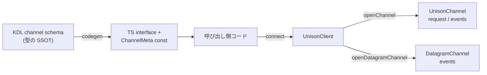
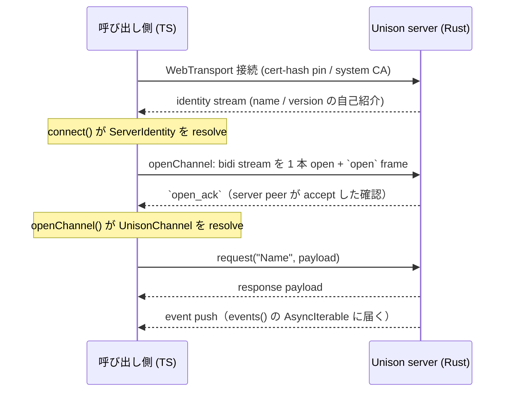

# 統合オンボーディングガイド — Unison を呼び出し側に組み込む

> **対象読者**: Unison を dogfood の呼び出し側として採用しようとしているプロジェクトリード
> （想定第一読者: Vantage Point プロジェクトリード）。
>
> **このドキュメントのゴール**: この 1 枚を読めば、自分の TypeScript / ブラウザ
> プロジェクトに Unison 統合の実装を **着手できる**。メンタルモデル → 動作フロー →
> 自プロジェクトでの書き方まで、追加のドキュメント探索なしで通す。
>
> これは機能リファレンスではない（それは [`quickstart.md`](quickstart.md) /
> [`typescript-sdk.md`](typescript-sdk.md) / [`migration.md`](migration.md) にある）。
> 「呼び出し側はここから始める」ためのドキュメント。

---

## 1. これは何か — 5 分で掴むメンタルモデル

Unison は **KDL スキーマ駆動の QUIC プロトコルフレームワーク**。「サーバの schema を
書けば、クライアントは型安全にそれを subscribe / request できる」を最小コストで実現する。

設計の核は **非対称（asymmetric）** にある:

- **太い Rust サーバ** — TLS・accept loop・接続管理・channel 多重化の複雑さを
  Rust crate `club-unison`（lib 名 `unison`）に閉じ込める。
- **細い polyglot クライアント** — 各言語の薄い SDK。TypeScript SDK は
  `@chronista-club/unison-client`（npm、`1.0.0-rc.1`）。ブラウザ / Node から
  WebTransport で直結する。

呼び出し側がやることは「サーバが公開した channel に接続して使う」だけ。

通信は全て **channel** を経由する（旧 RPC は廃止済み）。channel は 2 系統:

| channel 種別 | SDK 型 | backend | 用途 |
|---|---|---|---|
| stream channel | `UnisonChannel` | `stream`（default） | request/response + サーバ push event。順序保証 + reliable |
| datagram channel | `DatagramChannel` | `datagram` | broadcast event のみ。unordered / unreliable、高頻度データ向け |

判断指針: **確実に届けたい / 双方向なら stream、落ちても良い高頻度ストリームなら datagram**。
VP dashboard なら 60Hz の metric は datagram、agent status のような取りこぼし不可の
イベントは stream。

---

## 2. 動作フロー

KDL channel schema を書く → TS 型を生成（または手書き）→ `connect()` →
`openChannel` / `openDatagramChannel` → `request()` / `events()`。



接続が立つまでの高レベルな流れ:



ポイント:

- `connect()` は WebTransport 接続を確立し、サーバが接続直後に送る
  **identity stream** を待ってから resolve する（`awaitIdentity` で制御可能）。
- `openChannel()` は bidi stream を 1 本開き、`open` → `open_ack` の handshake を
  経てから resolve する。サーバがその channel を accept しないと timeout で reject する。
- `openDatagramChannel()` は共有 datagram path 上の仮想 channel。handshake はなく
  同期的に返る。
- ライブラリは **auto-reconnect しない**。`client.events()` で `disconnected` を
  監視し、再接続は呼び出し側の責務。

---

## 3. 統合手順 — 呼び出し側プロジェクトで着手する

### ① SDK をインストール

```bash
!npm install @chronista-club/unison-client@1.0.0-rc.1
```

### ② KDL channel schema を書く

channel 定義を KDL で書く。これが**型の SSOT**。VP dashboard 用の例:

```kdl
// schemas/vp-dashboard.kdl
protocol "vp-dashboard" version="1.0.0" {
    namespace "club.chronista.vp"

    // metric の datagram broadcast (= 60Hz 想定、高頻度なので datagram)
    channel "metric" from="server" lifetime="persistent" backend="datagram" channel_id=1 {
        event "MetricUpdate" {
            field "name" type="string" required=#true
            field "value" type="number" required=#true
            field "unit" type="string"
        }
    }

    // agent status (= less frequent、取りこぼし不可なので stream)
    channel "agent_status" from="server" lifetime="persistent" {
        event "AgentEvent" {
            field "agent_id" type="string" required=#true
            field "status" type="string" required=#true
            field "details" type="json"
        }
    }

    // dashboard control (= client → server、request/response)
    channel "control" from="client" lifetime="persistent" {
        request "SubscribeMetric" {
            field "names" type="array"
            returns "Subscribed" {
                field "ok" type="bool"
            }
        }
    }
}
```

主要属性（詳細は [`quickstart.md` §2](quickstart.md)）:

| 属性 | 値 | 意味 |
|---|---|---|
| `from` | `"server"` / `"client"` / `"either"` | どちらが送信を開始するか |
| `lifetime` | `"persistent"` / `"transient"` | 接続中維持 / リクエスト単位で開閉 |
| `backend` | `"stream"`（default）/ `"datagram"` | トランスポート種別 |
| `channel_id` | 正整数 | `backend="datagram"` 時のみ必須（demux 用 varint prefix） |

スキーマの妥当性は CLI で検証する:

```bash
!cargo run -p unison-cli -- schema-lint schemas/vp-dashboard.kdl
```

### ③ TS 型を生成する

Unison は **KDL スキーマが型の SSOT**。Rust 側の `TypeScriptGenerator` がスキーマから
TS コードを生成する（codegen は Rust API。専用 CLI サブコマンドはまだ無い）:

```rust
use unison::codegen::{CodeGenerator, TypeScriptGenerator};
use unison::parser::SchemaParser;

let schema = SchemaParser::new().parse(&kdl_src)?;
let generator = TypeScriptGenerator::new();
generator.generate_to_file(&schema, &type_registry, "generated/vp-protocol.ts")?;
```

生成物は channel ごとに以下を吐く:

- event / request payload の `interface`
- 型を運ぶ `<Channel>ChannelEventTypes` / `<Channel>ChannelRequestTypes`
- `as const` の `ChannelMeta`（`__types` phantom carrier 込み — これにより
  `events()` / `request()` が生成 interface に型 narrow される）

> **rc 段階の制約**: v1.0 の codegen は **stream channel まで**。datagram channel の
> TS codegen は v1.x deferred のため、datagram の `ChannelMeta` は当面**手書き**する。
> 手書きの形は [`vp-dashboard.ts` example](../clients/typescript/examples/vp-dashboard.ts)
> がそのまま範になる（`as const satisfies DatagramChannelMeta` + `__types`）。

### ④ 呼び出し側コードを書く

`connect` → channel open → request / events の流れ。`vp-dashboard.ts` example の
PART A がそのまま「呼び出し側が書きたいコード」の範。具体例は §4。

### ⑤ サーバ側と cert-hash pinning

接続先の Unison server（Rust）が必要。dev では同梱の echo サーバ example が最短:

```bash
!cargo run -p club-unison --example webtransport_echo_server -- 127.0.0.1:4439
```

起動すると stdout に 2 行を印字する（呼び出し側が parse する契約）:

```text
CERT_HASH=<64 hex chars>
READY addr=https://127.0.0.1:4439
```

`CERT_HASH` は **leaf 証明書の SHA-256 hex hash**。dev サーバは自己署名証明書なので、
呼び出し側はこの値で証明書を pin する（`connect()` の `trust`、§5 参照）。
本番の公開サーバは CA 署名証明書 + `trust: "system"`。

---

## 4. VP use case の具体例

VP dashboard が `metric`（datagram）/ `agent_status`（stream event）/ `control`
（stream request/response）の 3 channel を subscribe する形。design `typescript-client-api.md`
§2 のシナリオを実コードに落としたもの。動くフルセット（mock server harness 込み）は
[`clients/typescript/examples/vp-dashboard.ts`](../clients/typescript/examples/vp-dashboard.ts)
（`npm run example` で実行可能）。

```typescript
import { connect } from "@chronista-club/unison-client";
// codegen 出力（datagram meta は手書き、§3③ 参照）
import {
  MetricChannelMeta, type MetricUpdate,
  AgentStatusChannelMeta,
  ControlChannelMeta,
} from "./generated/vp-protocol.js";

const dashboardStore = new Map<string, number>();

async function runDashboard(): Promise<void> {
  // --- 接続 ---（本番は transport を省略 = WebTransport default）
  const client = await connect({
    url: "https://vp.chronista.local:8080",
    trust: "system", // dev 自己署名なら { certHash: "<CERT_HASH>" }
  });

  // サーバ identity（connect 時の handshake で受信済み）
  const identity = client.serverIdentity();
  if (identity !== undefined) {
    console.log(`[identity] connected to ${identity.name} v${identity.version}`);
  }

  // 接続 lifecycle を監視（自前 reconnect の起点。library は auto-reconnect しない）
  void (async () => {
    for await (const ev of client.events()) {
      if (ev.type === "connected") console.log(`[conn] ${ev.remoteAddr}`);
      else if (ev.type === "disconnected") console.warn(`[conn] lost: ${ev.reason}`);
    }
  })();

  // --- control channel: subscribe を request/response で要求 ---
  const control = await client.openChannel(ControlChannelMeta);
  const subscribed = await control.request("SubscribeMetric", {
    names: ["cpu", "memory", "build_progress"],
  });
  // subscribed は Subscribed 型に narrow（meta.__types 経由）、.ok が typed
  console.log(`[control] SubscribeMetric -> ok=${subscribed.ok}`);

  // --- datagram metric channel: 60Hz の steady stream を subscribe ---
  const metricChan = client.openDatagramChannel(MetricChannelMeta);
  const metricLoop = (async () => {
    for await (const update of metricChan.events()) {
      // update は MetricUpdate 型に narrow（手動 cast 不要）
      dashboardStore.set(update.name, update.value);
    }
  })();

  // --- agent status channel: stream で reliable な event subscribe ---
  const agentChan = await client.openChannel(AgentStatusChannelMeta);
  const agentLoop = (async () => {
    for await (const ev of agentChan.events()) {
      console.log(`[agent] ${ev.agent_id} -> ${ev.status}`);
    }
  })();

  // --- cleanup（break / close で iterator が閉じ channel teardown へ cascade）---
  await metricChan.close();
  await agentChan.close();
  await control.close();
  await client.disconnect("dashboard closed");
  await Promise.all([metricLoop, agentLoop]);
}
```

API の要点:

- `connect(opts)` → `UnisonClient` を返す。`opts` は `url` 必須、`trust` /
  `codec` / `awaitIdentity` / `identityTimeoutMs` は任意。
- `client.openChannel(meta)` → `Promise<UnisonChannel>`（handshake を待つので async）。
- `client.openDatagramChannel(meta)` → `DatagramChannel`（同期、handshake なし）。
- `channel.request(name, payload)` → response を await。`name` は schema の request 名に narrow。
- `channel.events()` → `AsyncIterableIterator`。`for await` で server push を受ける。
- `channel.sendEvent(name, payload)` → client → server の event 送信（応答なし）。
- `client.disconnect(reason?)` → 接続を閉じ配下 channel を tear down。

---

## 5. rc 段階の正直な前提

`1.0.0-rc.1` は実用可能だが、過大広告はしない。採用判断のために前提を明示する:

- **codec は JSON で運用**。`connect()` の `codec` default は `JsonCodec`。
  `ProtoCodec` も export されているが、KDL → proto descriptor の自動 codegen は
  **v1.x deferred**。rc では JSON codec 一本で問題ない。
- **datagram channel の TS codegen は未対応**。datagram の `ChannelMeta` は手書きする
  （§3③、`vp-dashboard.ts` が範）。stream channel の codegen は v1.0 で動く。
- **ブラウザは Chromium 系のみ公式サポート**（Chrome / Edge / Opera 95+、native
  WebTransport）。Safari 18+ は stream が実装中、Firefox は flag 必要。
- **Node から使うには polyfill が要る**。Node に native WebTransport は無いので
  `@fails-components/webtransport` を `globalThis.WebTransport` に注入する
  （E2E test がこの方式）。Node native QUIC adapter は v1.x deferred。
- **dev サーバは cert-hash pinning**。`trust: { certHash: "<64 hex>" }` を使う。
  cert pinning は **loopback host 限定**（`localhost` / `127.0.0.1` / `[::1]`）の
  hard gate がある。非 loopback への pinning は例外を投げる。本番公開サーバは
  CA 署名証明書 + `trust: "system"`。
- **auto-reconnect なし**。`client.events()` の `disconnected` を見て呼び出し側で再接続する。

---

## 6. 詰まったら / 深掘り

| 知りたいこと | 参照先 |
|---|---|
| end-to-end の動かし方（echo サーバ + TS client の疎通） | [`quickstart.md`](quickstart.md) |
| TS SDK の API リファレンス（各 API の詳細） | [`typescript-sdk.md`](typescript-sdk.md) |
| v1.0 までの破壊的変更と移行手順 | [`migration.md`](migration.md) |
| Rust 側 channel API（サーバ実装） | [`channel-guide.md`](channel-guide.md) |
| 動くフル example（mock server harness 込み） | [`clients/typescript/examples/vp-dashboard.ts`](../clients/typescript/examples/vp-dashboard.ts) |
| TS client SDK の設計契約・VP use case | [`design/typescript-client-api.md`](../design/typescript-client-api.md) |
| プロトコル仕様 | [`spec/02-unified-channel/SPEC.md`](../spec/02-unified-channel/SPEC.md) |

開発 CLI（`unison-cli`、サーバなしで疎通を進める）:

```bash
# KDL schema を検証
!cargo run -p unison-cli -- schema-lint schemas/vp-dashboard.kdl
# KDL schema から stub server を起動（実バックエンド不要）
!cargo run -p unison-cli -- mock --schema schemas/vp-dashboard.kdl --addr '[::1]:7878'
# サーバへ疎通 + RTT 計測
!cargo run -p unison-cli -- ping 'quic://[::1]:7878'
# channel traffic を覗く packet inspector
!cargo run -p unison-cli -- sniff 'quic://[::1]:7878' --channel metric
```

---

**最終更新**: 2026-05-17（v1.0.0-rc.1）
