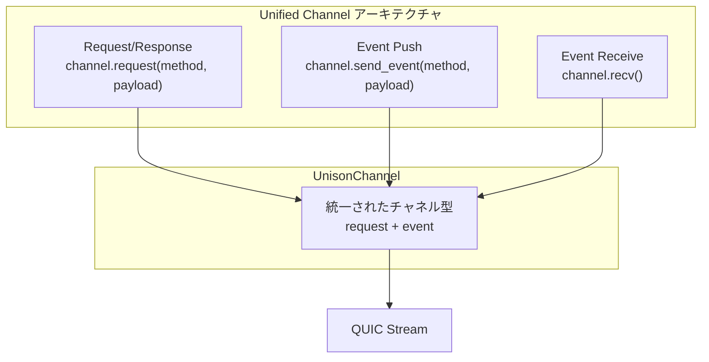
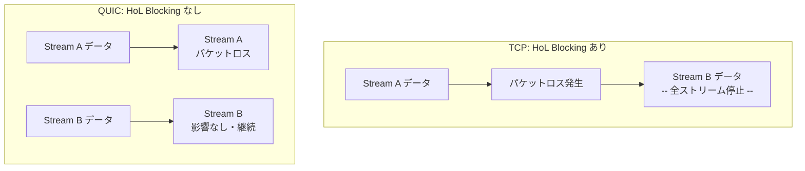
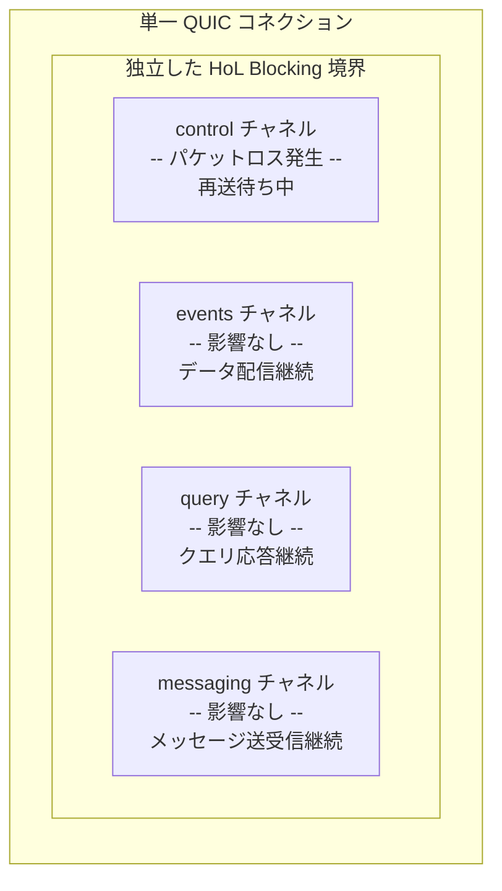
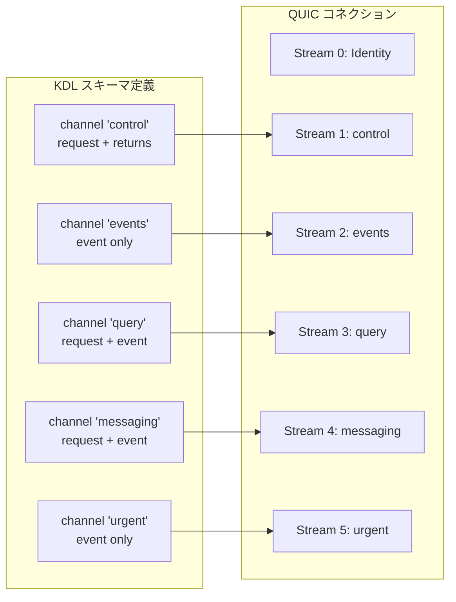
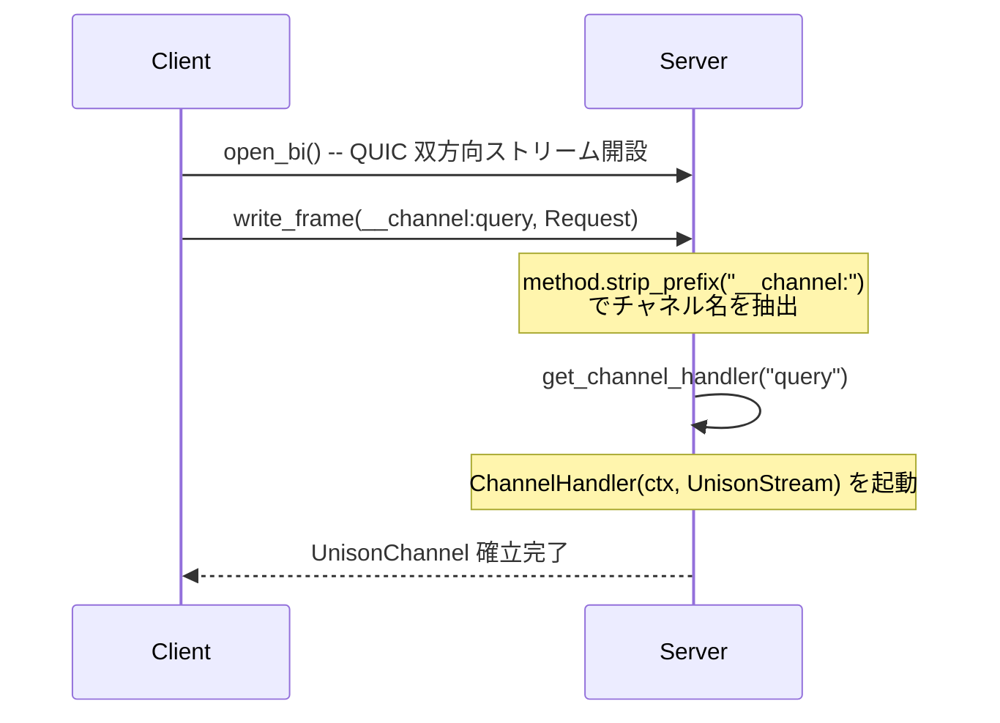
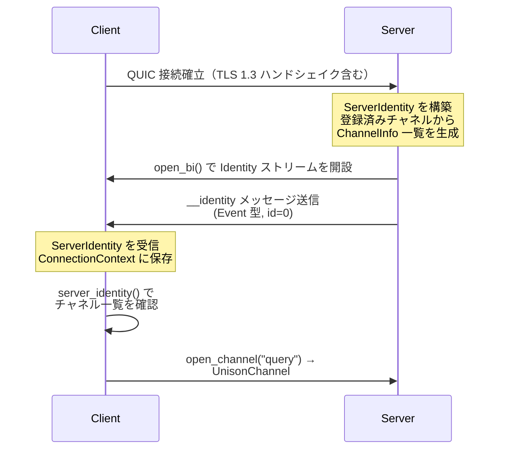
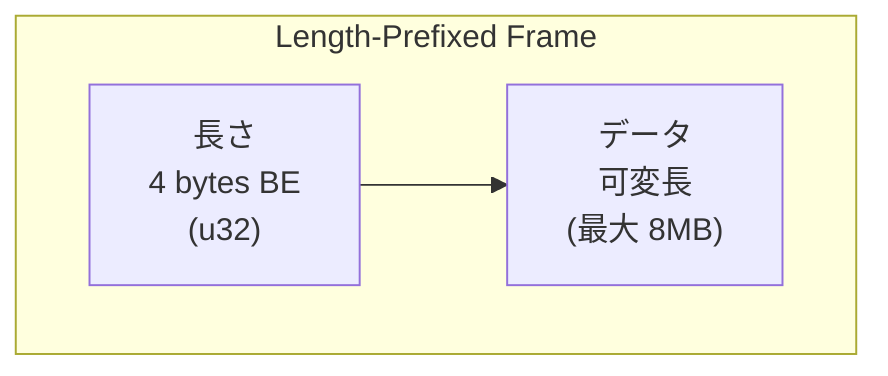
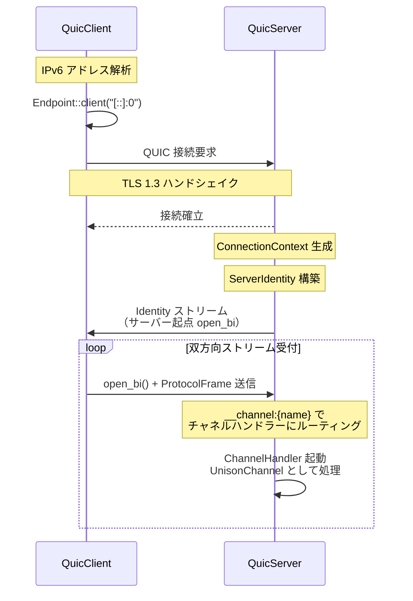
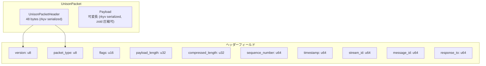

# spec/01: Unison Protocol - コアコンセプト仕様

**バージョン**: 0.3.0-draft
**最終更新**: 2026-02-16
**ステータス**: Draft

---

## 目次

1. [概要](#1-概要)
2. [設計思想 - Everything is a Channel](#2-設計思想---everything-is-a-channel)
3. [通信モデル - 1 Channel = 1 QUIC Stream](#3-通信モデル---1-channel--1-quic-stream)
4. [UnisonChannel](#4-unisonchannelチャネル統合型)
5. [Identity - ServerIdentity によるノード認証](#5-identity---serveridentityによるノード認証)
6. [QUIC 通信](#6-quic通信)
7. [パケットフォーマット - UnisonPacket](#7-パケットフォーマット---unisonpacket)
8. [セキュリティ - TLS 1.3](#8-セキュリティ---tls-13)
9. [今後の拡張](#9-今後の拡張)
10. [関連ドキュメント](#10-関連ドキュメント)

---

## 1. 概要

Unison Protocol は、KDL ベースの型安全な通信フレームワークである。
QUIC トランスポート上で**チャネル指向**の通信を実現し、各チャネルが独立した QUIC ストリームにマッピングされることで、Head-of-Line (HoL) Blocking を排除する。

### 1.1 主要な特徴

| 特徴 | 説明 |
|------|------|
| **Everything is a Channel** | Request/Response、Event Push を統一的にチャネルで扱う |
| **Channel 指向** | 各チャネルが独立した QUIC ストリームに 1:1 マッピング |
| **型安全** | KDL スキーマから Rust/TypeScript コードを自動生成 |
| **Identity** | 接続時に ServerIdentity を交換し、利用可能なチャネルを動的に通知 |
| **ゼロコピーフレーム** | rkyv + zstd 圧縮による効率的なバイナリフォーマット |

### 1.2 読者対象

- Unison Protocol の実装者
- KDL スキーマを用いたアプリケーション開発者
- プロトコル設計を理解したい開発者

---

## 2. 設計思想 - Everything is a Channel

### 2.1 設計目標

Unison Protocol の基本思想は、あらゆる通信パターンを**チャネル**として統一的に表現することである。



| 通信パターン | チャネル上の表現 | QUIC 上の実体 |
|-------------|----------------|-------------|
| Request/Response | `channel.request()` | 単一チャネル内のメッセージ ID ベース相関 |
| Event Push | `channel.send_event()` | 一方向メッセージ（応答不要） |
| Event Receive | `channel.recv()` | Event キューからの取得 |

### 2.2 なぜ QUIC を採用したか

QUIC の最大の利点は、**単一コネクション内の複数ストリームが独立した HoL Blocking 境界を持つ**ことである。



これにより、control チャネルでパケットロスが発生しても、events チャネルは独立して動作し続ける。

### 2.3 チャネル分離と HoL Blocking



**設計方針**:
- **チャネル間 HoL Blocking は排除**: 用途ごとにチャネルを分け、QUIC ストリームで隔離
- **チャネル内 HoL Blocking は許容**: 1 チャネル内ではシンプルさ優先で多重化

#### 従来技術との比較

| 技術 | 接続数 | HoL Blocking | 0-RTT 再接続 | 暗号化 |
|------|--------|-------------|------------|--------|
| TCP + TLS | 複数必要 | あり（全ストリーム影響） | なし | 別途実装 |
| WebSocket | 1つ | あり（単一ストリーム） | なし | TLS 上で動作 |
| **QUIC** | **1つ** | **なし（ストリーム単位）** | **あり** | **TLS 1.3 組み込み** |

---

## 3. 通信モデル - 1 Channel = 1 QUIC Stream

### 3.1 チャネルとストリームのマッピング

KDL スキーマで定義された各チャネルが、QUIC の独立した双方向ストリームにマッピングされる。



### 3.2 チャネルルーティング

クライアントがチャネルを開く際、`__channel:{name}` メソッドプレフィックスでルーティングされる。



### 3.3 実用例: creo_sync プロトコル

5 つのチャネルが 3 つのプレーン（Control / Data / Messaging）に分かれている。

| チャネル | 方向 | ライフタイム | パターン | 役割 |
|---------|------|------------|---------|------|
| `control` | client → server | persistent | request/returns | サブスクリプション管理 |
| `events` | server → client | persistent | event | リアルタイムイベント配信 |
| `query` | client → server | persistent | request + event | クエリ実行と結果取得 |
| `messaging` | 双方向 | persistent | request + event | メッセージング |
| `urgent` | server → client | transient | event | 緊急アラート通知 |

---

## 4. UnisonChannel（チャネル統合型）

### 4.1 概要

`UnisonChannel` は Unison Protocol の唯一のチャネル型であり、Request/Response と Event の両パターンをサポートする。

```rust
pub struct UnisonChannel {
    stream: Arc<Mutex<UnisonStream>>,
    pending: Arc<Mutex<HashMap<u64, oneshot::Sender<ProtocolMessage>>>>,
    event_rx: mpsc::Receiver<ProtocolMessage>,
    recv_task: JoinHandle<()>,
}
```

### 4.2 API

```rust
impl UnisonChannel {
    /// Request/Response（メッセージ ID で紐付け）
    pub async fn request(&self, method: &str, payload: Value) -> Result<Value, NetworkError>;

    /// 一方向送信（応答不要）
    pub async fn send_event(&self, method: &str, payload: Value) -> Result<(), NetworkError>;

    /// イベント受信（サーバーからのプッシュ）
    pub async fn recv(&mut self) -> Result<ProtocolMessage, NetworkError>;

    /// チャネルを閉じる
    pub async fn close(&mut self) -> Result<(), NetworkError>;
}
```

### 4.3 使用例

```rust
// チャネルを開く
let mut query = client.open_channel("query").await?;

// Request/Response
let result = query.request("Query", json!({
    "method": "search",
    "params": {"keyword": "rust"}
})).await?;

// Event 受信
let event = query.recv().await?;
println!("Received: {:?}", event);

// Event 送信（サーバー側）
channel.send_event("MemoryEvent", json!({
    "event_type": "created",
    "memory_id": "abc-123"
})).await?;
```

---

## 5. Identity - ServerIdentity によるノード認証

### 5.1 ServerIdentity 構造

接続確立直後、サーバーは `ServerIdentity` をクライアントに送信する。

```rust
pub struct ServerIdentity {
    pub name: String,          // サーバー名（例: "creo-sync"）
    pub version: String,       // バージョン（例: "2.0.0"）
    pub namespace: String,     // 名前空間（例: "club.chronista.sync"）
    pub channels: Vec<ChannelInfo>,  // 利用可能なチャネル一覧
    pub metadata: serde_json::Value, // 追加メタデータ
}
```

### 5.2 Identity ハンドシェイクシーケンス



### 5.3 ConnectionContext

各接続に対して `ConnectionContext` が生成され、Identity 情報とアクティブなチャネルを管理する。

```rust
pub struct ConnectionContext {
    pub connection_id: Uuid,
    identity: Arc<RwLock<Option<ServerIdentity>>>,
    channels: Arc<RwLock<HashMap<String, ChannelHandle>>>,
}
```

---

## 6. QUIC 通信

### 6.1 トランスポート設定

| パラメータ | 値 | 説明 |
|-----------|-----|------|
| `max_idle_timeout` | 60 秒 | アイドル接続のタイムアウト |
| `keep_alive_interval` | 10 秒 | キープアライブ間隔 |
| `max_concurrent_bidi_streams` | 1000 | 最大同時双方向ストリーム数 |
| `initial_rtt` | 100ms | 初期 RTT 推定値 |
| 最大フレームサイズ | 8MB | `MAX_MESSAGE_SIZE` 定数 |

### 6.2 Length-Prefixed フレーミング

QUIC ストリーム上のメッセージは、4 バイト Big-Endian 長 + データのフレーム形式で送受信される。



### 6.3 接続フロー



---

## 7. パケットフォーマット - UnisonPacket

### 7.1 UnisonPacket 構造

rkyv（ゼロコピーシリアライゼーション）ベースのバイナリフレームフォーマット。



### 7.2 ProtocolMessage

```rust
pub struct ProtocolMessage {
    pub id: u64,             // メッセージ ID
    pub method: String,      // メソッド名 (例: "Query", "__channel:events")
    pub msg_type: MessageType, // メッセージ種別
    pub payload: String,     // JSON ペイロード
}
```

### 7.3 MessageType

| MessageType | 用途 |
|------------|------|
| `Request` | 応答を期待するメッセージ |
| `Response` | Request に対する応答 |
| `Event` | 一方向プッシュ（応答不要） |
| `Error` | エラー |

### 7.4 自動圧縮

ペイロードが 2KB 以上の場合、zstd Level 1 で自動圧縮される。

---

## 8. セキュリティ - TLS 1.3

### 8.1 暗号化

| 項目 | 説明 |
|------|------|
| プロトコル | TLS 1.3 (QUIC 内蔵) |
| 前方秘匿性 | あり |
| 0-RTT | サポート |
| クライアント認証 | なし（現在の実装） |

### 8.2 証明書管理

1. **外部ファイル**: `assets/certs/cert.pem` + `private_key.der`
2. **埋め込みアセット**: rust-embed によるバイナリ埋め込み
3. **自己署名証明書**: rcgen による自動生成（フォールバック）

### 8.3 現在の制約

- クライアント側は証明書検証をスキップしている（`SkipServerVerification`）
- 本番環境では適切な証明書検証の実装が必要

---

## 9. 今後の拡張

初期構想では、Agent/Hub/Root の 3 層ネットワークアーキテクチャと mDNS ディスカバリー、IPv6 ULA アドレッシングを計画していた。現在は 1 対 1 の Client-Server 通信（Unified Channel）に注力しており、3 層アーキテクチャは将来の拡張として位置づけられる。

拡張ロードマップ:
- **短期**: NAT traversal、証明書検証の本番対応
- **中期**: Hub 層の導入（複数 Agent 集約）、mDNS ディスカバリー
- **長期**: Root 層によるグローバルネットワーク管理

---

## 10. 関連ドキュメント

### 仕様書

- [spec/02: Unified Channel プロトコル](../02-protocol-rpc/SPEC.md) -- KDL スキーマとメッセージフロー
- [spec/03: チャネル仕様](../03-stream-channels/SPEC.md) -- UnisonChannel 仕様

### 設計ドキュメント

- [アーキテクチャ設計](../../design/architecture.md) -- モジュール構成とデータフロー
- [パケット実装仕様](../../design/packet.md) -- UnisonPacket 実装詳細

### 実装ガイド

- [チャネルガイド](../../guides/channel-guide.md) -- チャネルの使い方
- [Quinn API ガイド](../../guides/quinn-stream-api.md) -- QUIC 実装の使い方

### 実装

- [unison-protocol](../../crates/unison-protocol/) -- コアプロトコル実装
- [unison-network](../../crates/unison-network/) -- ネットワーク層実装

---

**仕様バージョン**: 0.3.0-draft
**最終更新**: 2026-02-16
**ステータス**: Draft
