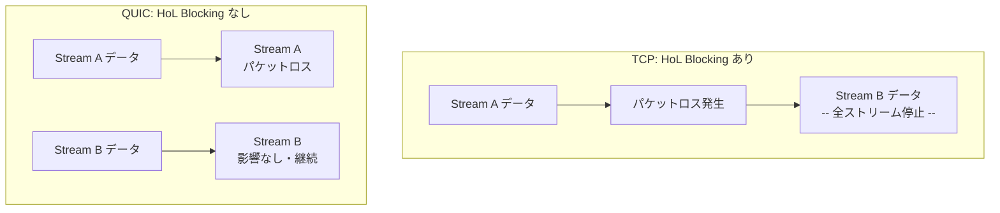
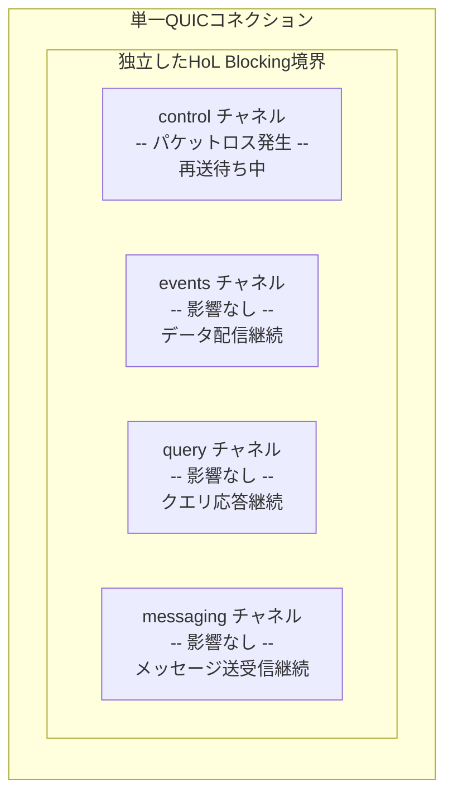
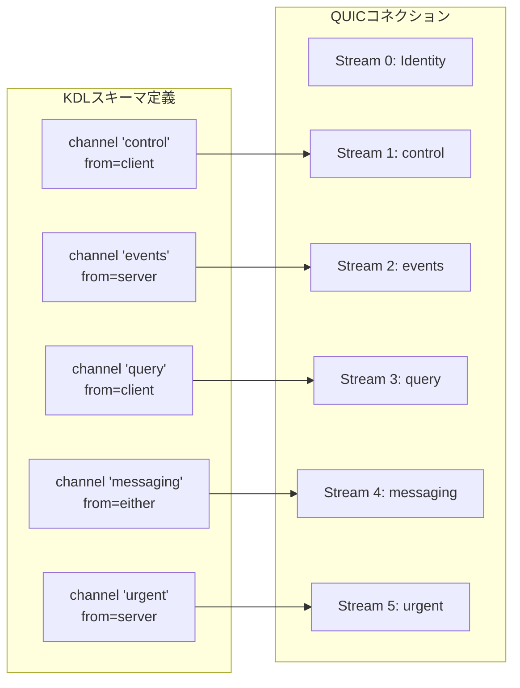
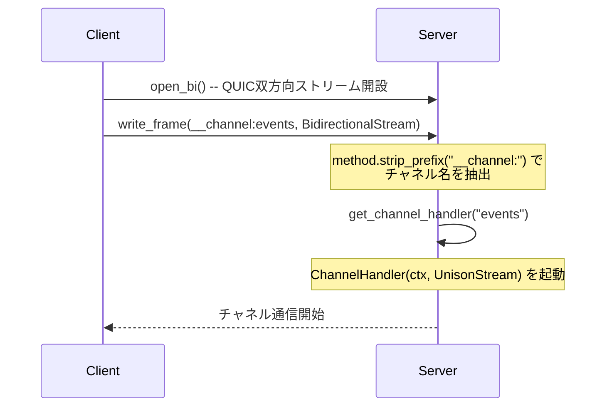
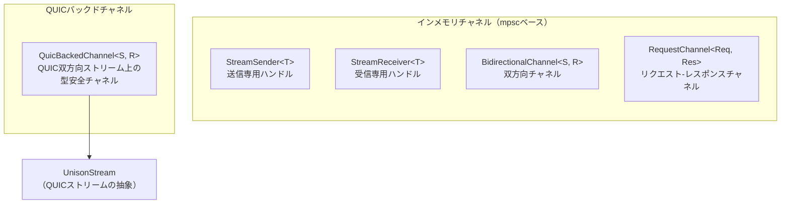
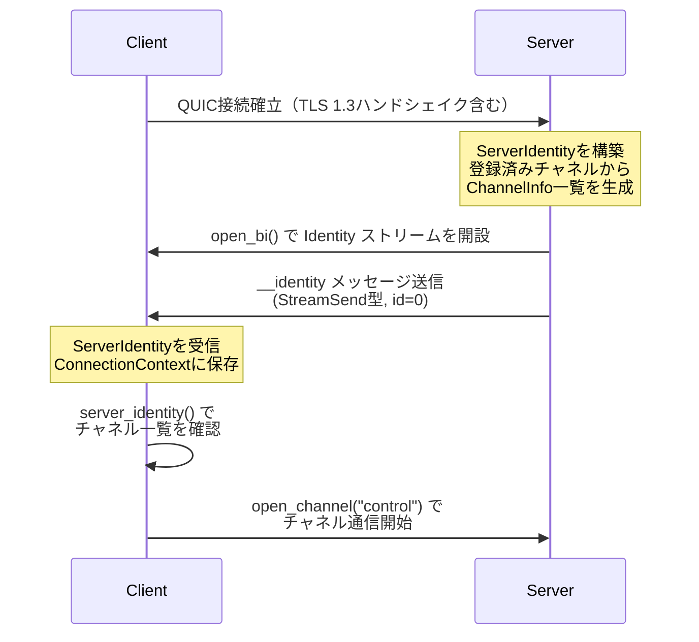
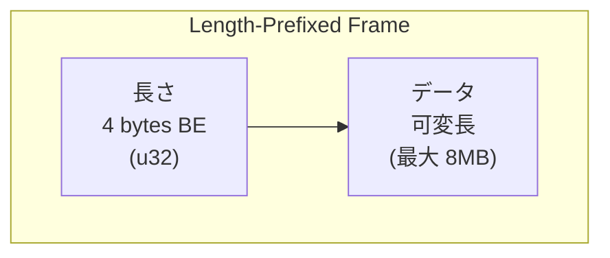
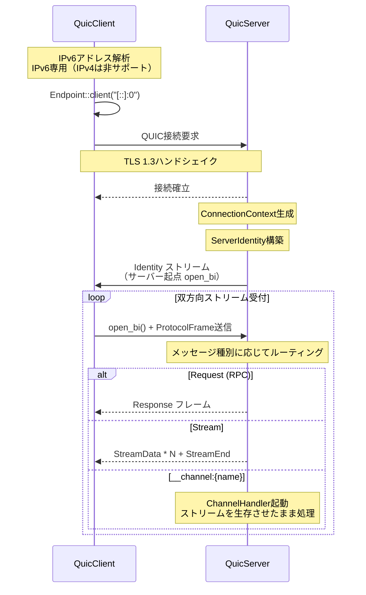
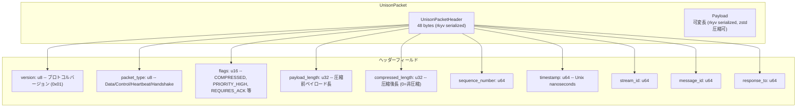
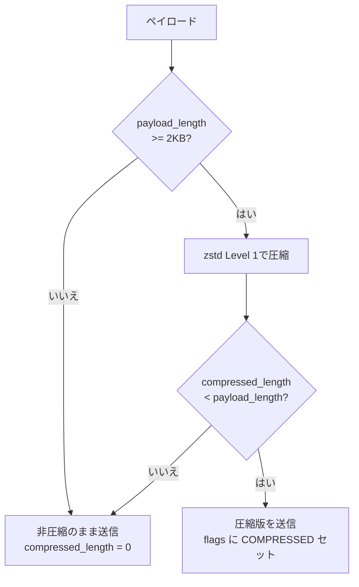

# spec/01: Unison Protocol - コアコンセプト仕様

**バージョン**: 0.2.0-draft
**最終更新**: 2026-02-16
**ステータス**: Draft

---

## 目次

1. [概要](#1-概要)
2. [設計思想 - Everything is a Stream](#2-設計思想---everything-is-a-stream)
3. [通信モデル - 1 Channel = 1 QUIC Stream](#3-通信モデル---1-channel--1-quic-stream)
4. [Channel型](#4-channel型)
5. [Identity - ServerIdentityによるノード認証](#5-identity---serveridentityによるノード認証)
6. [QUIC通信](#6-quic通信)
7. [パケットフォーマット - UnisonPacket](#7-パケットフォーマット---unisonpacket)
8. [セキュリティ - TLS 1.3](#8-セキュリティ---tls-13)
9. [今後の拡張](#9-今後の拡張)
10. [関連ドキュメント](#10-関連ドキュメント)

---

## 1. 概要

Unison Protocolは、KDLベースの型安全な通信フレームワークである。
QUICトランスポート上で**チャネル指向**の通信を実現し、各チャネルが独立したQUICストリームにマッピングされることで、Head-of-Line (HoL) Blockingを排除する。

### 1.1 主要な特徴

| 特徴 | 説明 |
|------|------|
| **Everything is a Stream** | RPC、イベント配信、双方向通信を統一的にストリームとして扱う |
| **Channel指向** | 各チャネルが独立したQUICストリームに1:1マッピング |
| **型安全** | KDLスキーマからRust/TypeScriptコードを自動生成 |
| **Identity** | 接続時にServerIdentityを交換し、利用可能なチャネルを動的に通知 |
| **ゼロコピーフレーム** | rkyv + zstd圧縮による効率的なバイナリフォーマット |

### 1.2 読者対象

- Unison Protocolの実装者
- KDLスキーマを用いたアプリケーション開発者
- プロトコル設計を理解したい開発者

---

## 2. 設計思想 - Everything is a Stream

### 2.1 設計目標

Unison Protocolの基本思想は、あらゆる通信パターンを**ストリーム**として統一的に表現することである。

| 通信パターン | Unison上の表現 | QUIC上の実体 |
|-------------|---------------|-------------|
| RPC (Request/Response) | `Request` Channel | 短命の双方向ストリーム |
| イベント配信 (Push) | `Receive` Channel | サーバー起点の単方向ストリーム |
| 双方向リアルタイム通信 | `Bidirectional` Channel | 長寿命の双方向ストリーム |

### 2.2 なぜQUICを採用したか

QUICの最大の利点は、**単一コネクション内の複数ストリームが独立したHoL Blocking境界を持つ**ことである。



これにより、制御チャネル（control）でパケットロスが発生しても、データチャネル（events）は独立して動作し続ける。



#### 従来技術との比較

| 技術 | 接続数 | HoL Blocking | 0-RTT再接続 | 暗号化 |
|------|--------|-------------|------------|--------|
| TCP + TLS | 複数必要 | あり（全ストリーム影響） | なし | 別途実装 |
| WebSocket | 1つ | あり（単一ストリーム） | なし | TLS上で動作 |
| **QUIC** | **1つ** | **なし（ストリーム単位）** | **あり** | **TLS 1.3組み込み** |

---

## 3. 通信モデル - 1 Channel = 1 QUIC Stream

### 3.1 チャネルとストリームのマッピング

Unison Protocolでは、KDLスキーマで定義された各チャネルが、QUICの独立した双方向ストリームにマッピングされる。



### 3.2 チャネルルーティング

クライアントがチャネルを開く際、`__channel:{name}` メソッドプレフィックスでルーティングされる。



### 3.3 実用例: creo_sync プロトコル

以下は、5つのチャネルを定義する実際のKDLスキーマである。

```kdl
protocol "creo-sync" version="1.0.0" {
    namespace "club.chronista.sync"

    // === Control Plane ===
    channel "control" from="client" lifetime="persistent" {
        send "Subscribe" {
            field "category" type="string"
            field "tags" type="string"
        }
        recv "Ack" {
            field "status" type="string"
            field "channel_ref" type="string"
        }
    }

    // === Data Plane ===
    channel "events" from="server" lifetime="persistent" {
        send "MemoryEvent" {
            field "event_type" type="string" required=#true
            field "memory_id" type="string" required=#true
            field "category" type="string"
            field "from" type="string"
            field "timestamp" type="string"
        }
    }

    channel "query" from="client" lifetime="transient" {
        send "Query" {
            field "method" type="string" required=#true
            field "params" type="json"
        }
        recv "Result" {
            field "data" type="json"
        }
        error "QueryError" {
            field "code" type="string"
            field "message" type="string"
        }
    }

    // === Messaging Plane ===
    channel "messaging" from="either" lifetime="persistent" {
        send "CCMessage" {
            field "from" type="string" required=#true
            field "to" type="string"
            field "content" type="string" required=#true
            field "thread" type="string"
        }
        recv "CCMessage"
    }

    // === Urgent Plane ===
    channel "urgent" from="server" lifetime="transient" {
        send "Alert" {
            field "level" type="string" required=#true
            field "title" type="string" required=#true
            field "body" type="string"
        }
    }
}
```

各チャネルの役割:

| チャネル | 方向 | ライフタイム | 役割 |
|---------|------|------------|------|
| `control` | client -> server | persistent | サブスクリプション管理 |
| `events` | server -> client | persistent | リアルタイムイベント配信 |
| `query` | client -> server | transient | リクエスト-レスポンス型クエリ |
| `messaging` | 双方向 | persistent | クライアント間メッセージング |
| `urgent` | server -> client | transient | 緊急アラート通知 |

---

## 4. Channel型

### 4.1 型の分類

Unison Protocolは4種類のチャネル型を提供する。



### 4.2 QuicBackedChannel

`QuicBackedChannel<S, R>` は、実際のQUICストリーム上で動作する型安全なチャネルである。

- **S**: 送信メッセージ型（`Serialize` を実装）
- **R**: 受信メッセージ型（`DeserializeOwned` を実装）

```rust
// チャネルを開く
let channel: QuicBackedChannel<Subscribe, Ack> =
    client.open_channel("control").await?;

// 型安全な送受信
channel.send(Subscribe { category: "tech".into(), tags: "rust".into() }).await?;
let ack: Ack = channel.recv().await?;
```

### 4.3 ChannelDirection

KDLスキーマの `from` 属性はチャネルの方向を決定する。

| `from` | ChannelDirection | 意味 |
|--------|-----------------|------|
| `"client"` | `ClientToServer` | クライアント起点のデータフロー |
| `"server"` | `ServerToClient` | サーバー起点のデータフロー（Push/Event） |
| `"either"` | `Bidirectional` | 双方向のデータフロー |

### 4.4 ChannelStatus

チャネルの状態はリアルタイムに更新される。

| ChannelStatus | 説明 |
|--------------|------|
| `Available` | チャネルは利用可能 |
| `Busy` | チャネルは処理中 |
| `Unavailable` | チャネルは利用不可 |

状態変更は `ChannelUpdate` イベントとして通知される:

- `Added(ChannelInfo)` -- 新しいチャネルが追加された
- `Removed(String)` -- チャネルが削除された
- `StatusChanged { name, status }` -- チャネルの状態が変更された

---

## 5. Identity - ServerIdentityによるノード認証

### 5.1 ServerIdentity構造

接続確立直後、サーバーは `ServerIdentity` をクライアントに送信する。

```rust
pub struct ServerIdentity {
    pub name: String,          // サーバー名（例: "creo-sync"）
    pub version: String,       // バージョン（例: "1.0.0"）
    pub namespace: String,     // 名前空間（例: "club.chronista.sync"）
    pub channels: Vec<ChannelInfo>,  // 利用可能なチャネル一覧
    pub metadata: serde_json::Value, // 追加メタデータ
}
```

### 5.2 Identityハンドシェイクシーケンス



### 5.3 ConnectionContext

各接続に対して `ConnectionContext` が生成され、Identity情報とアクティブなチャネルを管理する。

```rust
pub struct ConnectionContext {
    pub connection_id: Uuid,                              // 接続の一意識別子
    identity: Arc<RwLock<Option<ServerIdentity>>>,        // サーバーIdentity
    channels: Arc<RwLock<HashMap<String, ChannelHandle>>>, // アクティブチャネル
}
```

`ConnectionContext` は `Arc<RwLock<>>` で保護されており、複数のストリームハンドラーから安全に並行アクセスできる。

---

## 6. QUIC通信

### 6.1 トランスポート設定

| パラメータ | 値 | 説明 |
|-----------|-----|------|
| `max_idle_timeout` | 60秒 | アイドル接続のタイムアウト |
| `keep_alive_interval` | 10秒 | キープアライブ間隔 |
| `max_concurrent_bidi_streams` | 1000 | 最大同時双方向ストリーム数 |
| `initial_rtt` | 100ms | 初期RTT推定値 |
| 最大フレームサイズ | 8MB | `MAX_MESSAGE_SIZE` 定数 |

### 6.2 Length-Prefixed フレーミング

QUICストリーム上のメッセージは、4バイトBig-Endian長 + データのフレーム形式で送受信される。



```rust
// 読み取り: read_frame()
// 1. 4バイト読み取り -> u32::from_be_bytes() でデータ長取得
// 2. データ長バイト分読み取り -> Bytes として返却
// 3. MAX_MESSAGE_SIZE (8MB) を超える場合はエラー

// 書き込み: write_frame()
// 1. データ長を u32 BE バイト列に変換して書き込み
// 2. データ本体を書き込み
```

### 6.3 接続フロー



---

## 7. パケットフォーマット - UnisonPacket

### 7.1 UnisonPacket構造

UnisonPacketは、rkyv（ゼロコピーシリアライゼーション）ベースのバイナリフレームフォーマットである。



### 7.2 ProtocolMessage

高レベルのプロトコルメッセージは `ProtocolMessage` として表現され、`UnisonPacket<RkyvPayload<ProtocolMessage>>` としてフレームにラップされる。

```rust
pub struct ProtocolMessage {
    pub id: u64,             // メッセージID
    pub method: String,      // メソッド名 (例: "ping", "__channel:events")
    pub msg_type: MessageType, // メッセージ種別
    pub payload: String,     // JSONペイロード (文字列として保持)
}
```

### 7.3 MessageType一覧

| MessageType | 用途 |
|------------|------|
| `Request` | 単項RPC リクエスト |
| `Response` | 単項RPC レスポンス |
| `Stream` | ストリーミング開始要求 |
| `StreamData` | ストリームデータチャンク |
| `StreamEnd` | ストリーム正常終了 |
| `StreamError` | ストリームエラー |
| `BidirectionalStream` | 双方向ストリーム開設 |
| `StreamSend` | 双方向ストリーム送信 |
| `StreamReceive` | 双方向ストリーム受信 |
| `Error` | エラーレスポンス |

### 7.4 Request/Response相関

メッセージの種別は `message_id` と `response_to` フィールドの組み合わせで判別される。

| message_id | response_to | 種別 |
|-----------|------------|------|
| 0 | 0 | Oneway（一方向メッセージ） |
| > 0 | 0 | Request |
| > 0 | > 0 | Response（response_to = 元のmessage_id） |

### 7.5 自動圧縮

ペイロードが2KB以上の場合、zstd Level 1で自動圧縮される。



---

## 8. セキュリティ - TLS 1.3

### 8.1 暗号化

QUICはTLS 1.3を内蔵しており、すべての通信が暗号化される。

| 項目 | 説明 |
|------|------|
| プロトコル | TLS 1.3 (QUIC内蔵) |
| 前方秘匿性 | あり（セッションキーの自動ローテーション） |
| 0-RTT | サポート（再接続の高速化） |
| クライアント認証 | なし（現在の実装） |

### 8.2 証明書管理

サーバー側の証明書は以下の優先順位で読み込まれる:

1. **外部ファイル**: `assets/certs/cert.pem` + `private_key.der`
2. **埋め込みアセット**: rust-embedによるバイナリ埋め込み
3. **自己署名証明書**: rcgenによる自動生成（フォールバック）

### 8.3 現在の制約

- クライアント側は証明書検証をスキップしている（`SkipServerVerification`）
- 本番環境では適切な証明書検証の実装が必要

---

## 9. 今後の拡張

初期構想では、Agent/Hub/Rootの3層ネットワークアーキテクチャとmDNSディスカバリー、IPv6 ULAアドレッシングを計画していた。現在は1対1のClient-Server通信（Stream-First API + Channel指向）に注力しており、3層アーキテクチャは将来の拡張として位置づけられる。

拡張ロードマップの概要:
- **短期**: NAT traversal、証明書検証の本番対応
- **中期**: Hub層の導入（複数Agent集約）、mDNSディスカバリー
- **長期**: Root層によるグローバルネットワーク管理、IPv6 ULAアドレス空間、Hub間メッシュ通信

---

## 10. 関連ドキュメント

### 仕様書
- [spec/02: RPCプロトコル](../02-protocol-rpc/SPEC.md) -- KDLベースRPC層

### 設計ドキュメント
- [アーキテクチャ設計](../../design/architecture.md) -- モジュール構成とデータフロー
- [パケット実装仕様](../../design/packet.md) -- UnisonPacket実装詳細

### 実装ガイド
- [Quinn APIガイド](../../guides/quinn-stream-api.md) -- QUIC実装の使い方

### 実装
- [unison-protocol](../../crates/unison-protocol/) -- コアプロトコル実装
- [unison-network](../../crates/unison-network/) -- ネットワーク層実装

---

**仕様バージョン**: 0.2.0-draft
**最終更新**: 2026-02-16
**ステータス**: Draft
