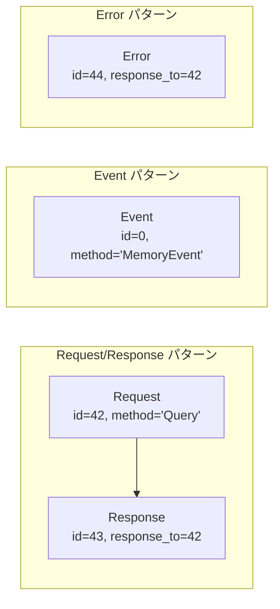
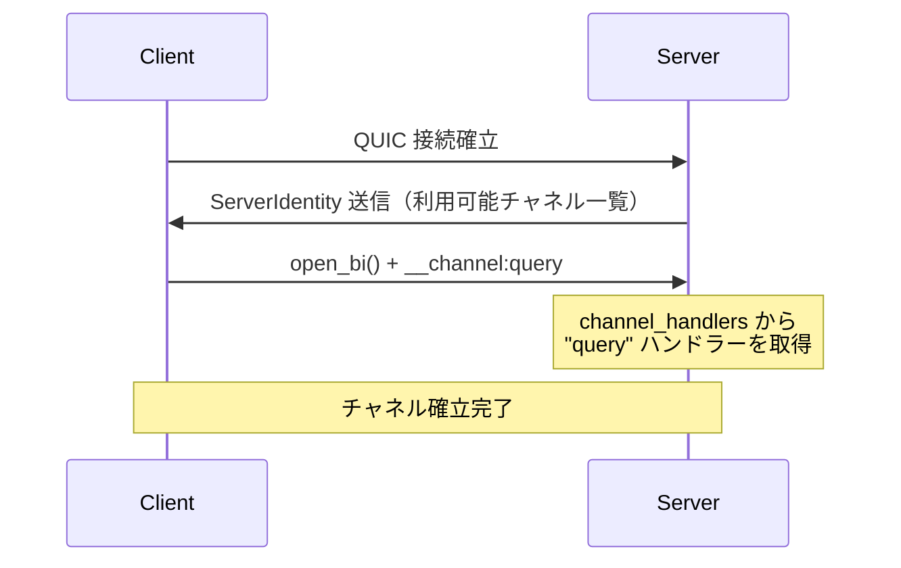
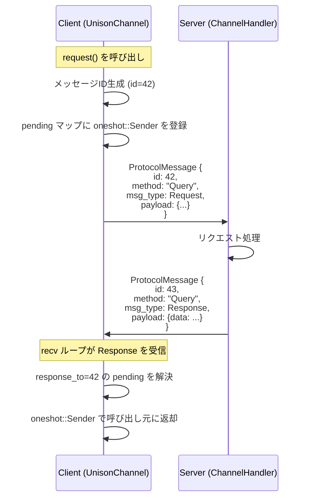
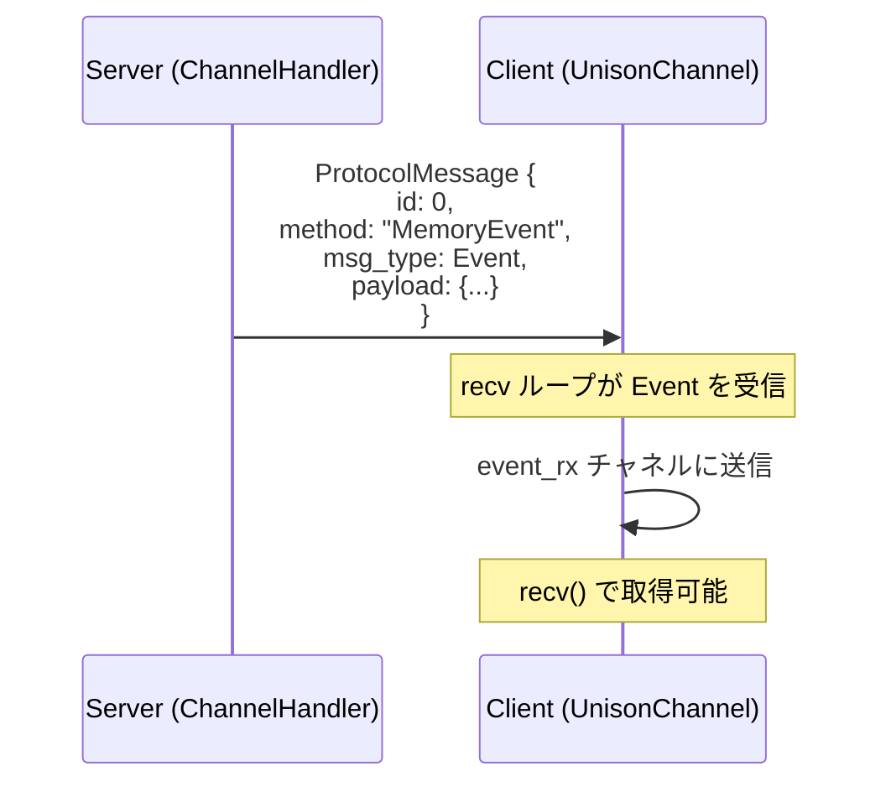
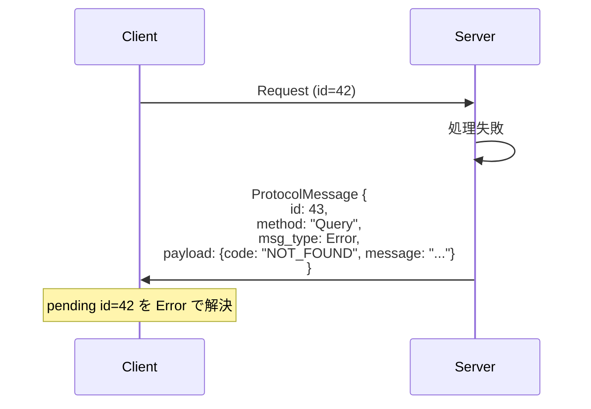

# spec/02: Unison Protocol - Unified Channel プロトコル仕様

**バージョン**: 2.0.0-draft
**最終更新**: 2026-02-16
**ステータス**: Draft

---

## 目次

1. [概要](#1-概要)
2. [設計思想](#2-設計思想)
3. [コアメッセージ型](#3-コアメッセージ型)
4. [KDL スキーマ定義言語](#4-kdl-スキーマ定義言語)
5. [メッセージフロー](#5-メッセージフロー)
6. [コード生成](#6-コード生成)
7. [セキュリティ](#7-セキュリティ)
8. [パフォーマンス](#8-パフォーマンス)
9. [バージョニングと互換性](#9-バージョニングと互換性)
10. [今後の拡張](#10-今後の拡張)
11. [関連ドキュメント](#11-関連ドキュメント)

---

## 1. 概要

Unison Protocol の通信層は、**Unified Channel** アーキテクチャに基づく。全ての通信は**チャネル**を通じて行われ、各チャネルは `request`（応答を期待する問い合わせ）と `event`（一方向プッシュ）の2つのメッセージパターンをサポートする。

従来の RPC（`service` / `method`）とストリームチャネル（`channel` / `send` / `recv`）の二重構造を廃止し、チャネル一本に統一することで、プロトコルの複雑さを大幅に削減する。

### 1.1 旧アーキテクチャからの変更点

| 項目 | 旧（v1.x） | 新（v2.0） |
|------|-----------|-----------|
| 通信パターン | RPC (`service`/`method`) + Channel (`send`/`recv`) | **Channel のみ** (`request`/`event`) |
| MessageType | 10 バリアント | **4 バリアント** (Request/Response/Event/Error) |
| ハンドラー登録 | `call_handlers` + `stream_handlers` + `channel_handlers` | **`channel_handlers` のみ** |
| 型生成 | Service trait + `QuicBackedChannel<S,R>` | **`UnisonChannel` のみ** |

---

## 2. 設計思想

### 2.1 目標

- **型安全性**: コンパイル時・実行時の型チェック保証
- **開発者体験**: シンプルで直感的な API
- **多言語サポート**: Rust、TypeScript 等への自動コード生成
- **リアルタイム通信**: 低レイテンシー双方向通信
- **拡張性**: 新しいチャネル、メッセージ型の簡単な追加

### 2.2 設計原則

- **スキーマファースト**: KDL プロトコル定義駆動開発
- **非同期優先**: async/await パターンを基盤
- **チャネル統一**: 全通信パターンをチャネルで表現
- **エラー耐性**: 包括的なエラーハンドリングと回復メカニズム
- **トランスポート非依存**: QUIC、WebSocket、TCP 等に対応

---

## 3. コアメッセージ型

### 3.1 MessageType

全てのメッセージは 4 つの型に分類される。

```rust
pub enum MessageType {
    Request,    // 応答を期待するメッセージ（メッセージIDで紐付け）
    Response,   // Request に対する応答
    Event,      // 一方向プッシュ（応答不要）
    Error,      // エラー
}
```



### 3.2 ProtocolMessage

全てのプロトコル通信における標準メッセージ形式:

```rust
pub struct ProtocolMessage {
    pub id: u64,               // メッセージID（Requestは一意、Eventは0可）
    pub method: String,        // メソッド名（例: "Query", "MemoryEvent"）
    pub msg_type: MessageType, // メッセージ種別
    pub payload: String,       // JSON 形式のペイロード
}
```

### 3.3 Request/Response 相関

メッセージの相関は `id` フィールドで行う。

| 送信側 | id | response_to | 意味 |
|--------|-----|-------------|------|
| Request | > 0 | 0 | 応答を期待するリクエスト |
| Response | > 0 | > 0 | リクエストに対する応答 |
| Event | 0 | 0 | 一方向メッセージ（応答不要） |
| Error | > 0 | > 0 | リクエストに対するエラー応答 |

`response_to` フィールドは `UnisonPacketHeader` の一部であり、Response/Error は元の Request の `message_id` を `response_to` に設定する。

---

## 4. KDL スキーマ定義言語

### 4.1 基本型

| 型 | 説明 | Rust マッピング | TypeScript マッピング |
|------|-------------|--------------|---------------------|
| `string` | UTF-8 テキスト | `String` | `string` |
| `number` | 数値 | `f64` | `number` |
| `int` | 整数 | `i64` | `number` |
| `bool` | 真偽値 | `bool` | `boolean` |
| `timestamp` | ISO-8601 日時 | `DateTime<Utc>` | `string` |
| `json` | 任意の JSON | `serde_json::Value` | `any` |
| `array` | アイテムのリスト | `Vec<T>` | `T[]` |

### 4.2 フィールド修飾子

- `required=#true`: フィールドが必須（デフォルト: false）
- `default=value`: オプションフィールドのデフォルト値
- `description="text"`: フィールドドキュメンテーション

### 4.3 プロトコル構造

```
Protocol（プロトコル）
├── Metadata（メタデータ） (name, version, namespace, description)
├── Messages（メッセージ） (構造化データ定義)
└── Channels（チャネル）
    ├── request（リクエスト/レスポンス）
    │   └── returns（レスポンス型）
    └── event（一方向イベント）
```

### 4.4 Channel 定義構文

#### 新構文: `request` / `event`

```kdl
channel "<name>" from="<direction>" lifetime="<lifetime>" {
    // Request/Response パターン
    request "<RequestName>" {
        field "<name>" type="<type>" [required=#true]

        returns "<ResponseName>" {
            field "<name>" type="<type>"
        }
    }

    // 一方向イベント
    event "<EventName>" {
        field "<name>" type="<type>" [required=#true]
    }
}
```

#### 属性

| 属性 | 値 | 説明 |
|------|-----|------|
| `from` | `"client"` | クライアントが送信を開始する |
| `from` | `"server"` | サーバーが送信を開始する |
| `from` | `"either"` | 双方が送信可能 |
| `lifetime` | `"persistent"` | 接続中ずっと維持される |
| `lifetime` | `"transient"` | リクエスト単位で開閉される |

#### メッセージブロック

| ブロック | 説明 |
|---------|------|
| `request` | Request/Response パターン。応答を期待するメッセージ |
| `returns` | `request` 内にネストし、レスポンス型を定義 |
| `event` | 一方向プッシュメッセージ。応答不要 |

#### スキーマ例

```kdl
protocol "creo-sync" version="2.0.0" {
    namespace "club.chronista.sync"

    // Query チャネル: Request/Response + Event
    channel "query" from="client" lifetime="persistent" {
        request "Query" {
            field "method" type="string" required=#true
            field "params" type="json"

            returns "Result" {
                field "data" type="json"
            }
        }

        event "QueryError" {
            field "code" type="string"
            field "message" type="string"
        }
    }

    // Events チャネル: イベント配信のみ
    channel "events" from="server" lifetime="persistent" {
        event "MemoryEvent" {
            field "event_type" type="string" required=#true
            field "memory_id" type="string" required=#true
            field "category" type="string"
            field "from" type="string"
            field "timestamp" type="string"
        }
    }
}
```

### 4.5 旧構文との互換性（非推奨）

旧 `send`/`recv`/`error` 構文は後方互換として認識されるが、新規スキーマでは非推奨とする。

| 旧構文 | 新構文への変換 |
|--------|-------------|
| `send` + `recv` | `request` + `returns` |
| `send` のみ | `event` |
| `error` | `event`（エラー型として） |

---

## 5. メッセージフロー

### 5.1 チャネル確立



### 5.2 Request/Response フロー

チャネル内での Request/Response は、メッセージ ID で紐付けられる。



### 5.3 Event フロー

Event は一方向プッシュであり、応答を期待しない。



### 5.4 エラーハンドリング

#### チャネルレベルエラー

| エラー | 原因 | 処理 |
|--------|------|------|
| `HandlerNotFound` | 未登録チャネル名 | Error メッセージを返却 |
| `Protocol` | 不正なメッセージ形式 | Error メッセージを返却 |
| `Timeout` | 応答タイムアウト | pending を Error で解決 |
| `Connection` | QUIC 接続断 | 全 pending を Error で解決 |

#### Request エラー応答



---

## 6. コード生成

### 6.1 Rust コード生成

KDL スキーマから以下の Rust コードが生成される:

#### メッセージ構造体

`request` と `event` の各フィールドから Serde 注釈付き構造体を生成。

```rust
// request "Query" から生成
#[derive(Debug, Clone, Serialize, Deserialize)]
pub struct Query {
    pub method: String,
    #[serde(skip_serializing_if = "Option::is_none")]
    pub params: Option<serde_json::Value>,
}

// returns "Result" から生成
#[derive(Debug, Clone, Serialize, Deserialize)]
pub struct QueryResult {
    #[serde(skip_serializing_if = "Option::is_none")]
    pub data: Option<serde_json::Value>,
}

// event "QueryError" から生成
#[derive(Debug, Clone, Serialize, Deserialize)]
pub struct QueryError {
    pub code: String,
    pub message: String,
}

// event "MemoryEvent" から生成
#[derive(Debug, Clone, Serialize, Deserialize)]
pub struct MemoryEvent {
    pub event_type: String,
    pub memory_id: String,
    #[serde(skip_serializing_if = "Option::is_none")]
    pub category: Option<String>,
    #[serde(skip_serializing_if = "Option::is_none")]
    pub from: Option<String>,
    #[serde(skip_serializing_if = "Option::is_none")]
    pub timestamp: Option<String>,
}
```

#### Connection 構造体

プロトコル内の全チャネルを `UnisonChannel` としてまとめた接続構造体を生成。

```rust
/// コード生成で自動生成される接続構造体
pub struct CreoSyncConnection {
    pub query: UnisonChannel,
    pub events: UnisonChannel,
    pub control: UnisonChannel,
    pub messaging: UnisonChannel,
    pub urgent: UnisonChannel,
}

/// ConnectionBuilder トレイト
#[async_trait]
pub trait CreoSyncConnectionBuilder {
    async fn build(client: &ProtocolClient) -> Result<CreoSyncConnection, NetworkError>;
}
```

### 6.2 TypeScript コード生成（計画中）

- **インターフェース定義**: 全型の TypeScript インターフェース
- **クライアントクラス**: Promise ベースのクライアント実装
- **型ガード**: 実行時型検証

---

## 7. セキュリティ

### 7.1 認証と認可

- プロトコルレベルの認証は未指定（トランスポートレイヤーの責任）
- チャネルレベルの認可はハンドラー実装で対応
- セッション管理はアプリケーション固有トークンで実現

### 7.2 入力検証

- 必須フィールドの自動検証
- 全パラメータの型チェック
- カスタム検証はハンドラー実装で対応

### 7.3 トランスポートセキュリティ

- 本番使用には TLS（QUIC、WSS）を推奨
- 証明書検証とピン留め
- 接続暗号化と完全性

---

## 8. パフォーマンス

### 8.1 メッセージサイズ

- JSON ベースのシリアライゼーション
- 典型的なメッセージオーバーヘッド: 100-200 バイト
- 2KB 以上のペイロードは zstd で自動圧縮

### 8.2 レイテンシー

- サブミリ秒のプロトコルオーバーヘッド
- Request/Response はメッセージ ID ベースの即座の相関
- チャネル内 HoL Blocking は許容（シンプルさ優先）

### 8.3 スループット

- チャネル間の独立性により並行処理を最大化
- 非同期ランタイム (tokio) を通じた同時リクエストハンドリング

---

## 9. バージョニングと互換性

### 9.1 プロトコルバージョニング

- セマンティックバージョニング（MAJOR.MINOR.PATCH）
- v2.0.0: Unified Channel への移行（破壊的変更）

### 9.2 後方互換性

- 旧 `send`/`recv` KDL 構文はパーサーが認識し、内部で `request`/`event` に変換
- 旧 `service`/`method` 構文は非推奨警告を出力
- 新しいオプションフィールドの追加: 互換
- 新しい `request`/`event` の追加: 互換

### 9.3 前方互換性

- デシリアライゼーション時に不明フィールドは無視
- 不明メソッドは `Error` メッセージで応答
- バージョン不整合ハンドリング

---

## 10. 今後の拡張

### 10.1 計画中の機能

- **スキーマ進化**: 実行時スキーマ更新とマイグレーション
- **バッチ操作**: 単一チャネルでの複数リクエスト並行実行
- **チャネルメトリクス**: スループット、レイテンシー、エラー率の自動計測

### 10.2 言語サポート拡張

- TypeScript クライアント・サーバー生成の完成
- Python、Go 等への展開

---

## 11. 関連ドキュメント

### 仕様書

- [spec/01: コアコンセプト](../01-core-concept/SPEC.md) - トランスポート層（QUIC）
- [spec/03: チャネル仕様](../03-stream-channels/SPEC.md) - UnisonChannel 仕様

### 設計ドキュメント

- [KDL スキーマ例](../../schemas/) - 実際のスキーマ定義

### 参考資料

- [KDL 仕様](https://kdl.dev/)
- [JSON スキーマ](https://json-schema.org/)

---

**仕様バージョン**: 2.0.0-draft
**最終更新**: 2026-02-16
**ステータス**: Draft
