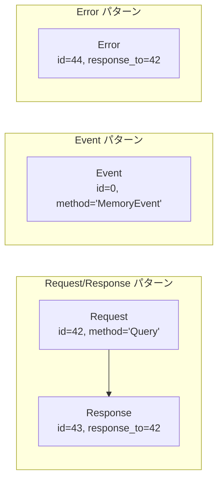
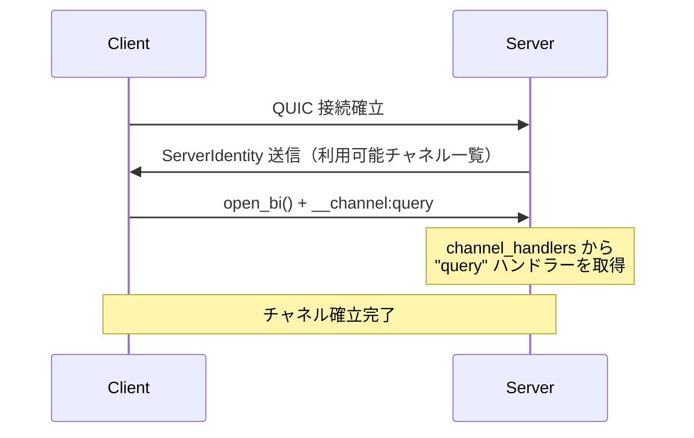
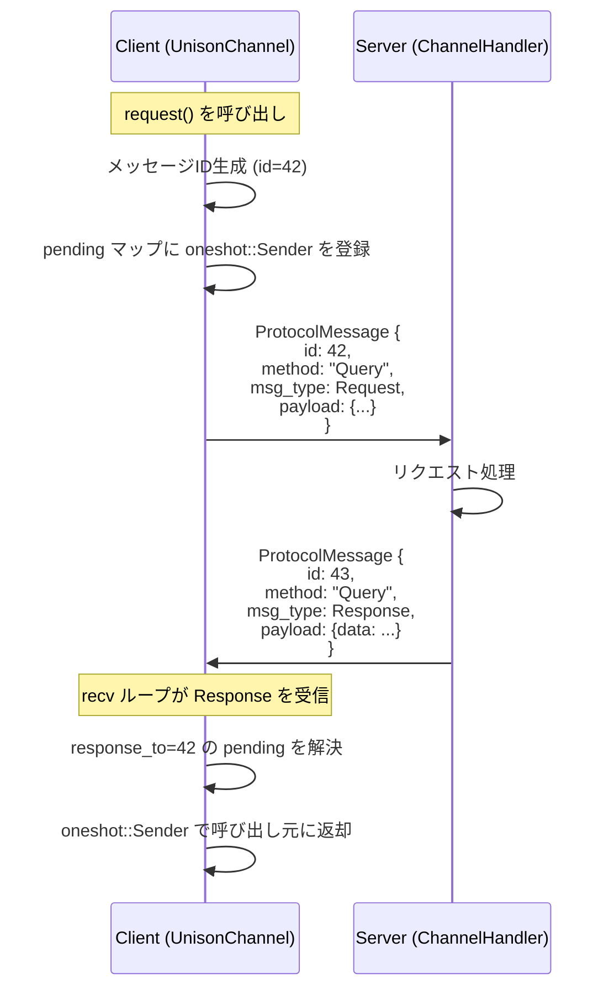
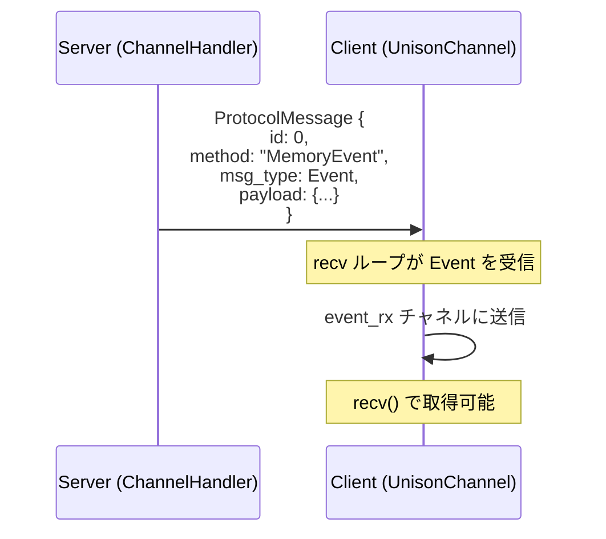
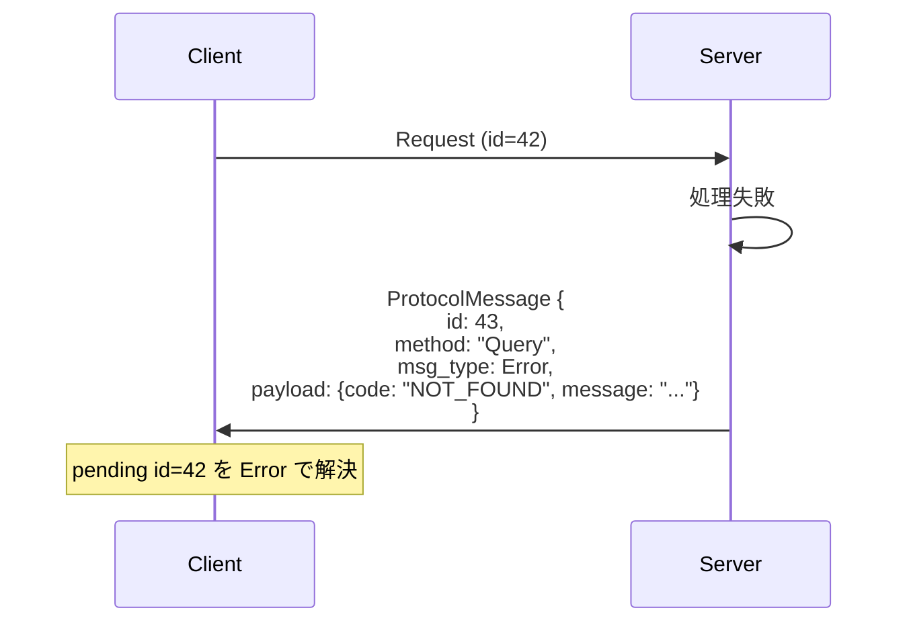

# spec/02: Unison Protocol - Unified Channel プロトコル仕様

**バージョン**: 2.1.0-draft (v0.10.0 で `backend` / `channel_id` 属性追加)
**最終更新**: 2026-05-15
**ステータス**: Stable (v0.9.0 で 2.0.0 確定)、 v0.10.0 で datagram channel narrative を additive 拡張中

---

## 目次

1. [概要](#1-概要)
2. [設計思想](#2-設計思想)
3. [コアメッセージ型](#3-コアメッセージ型)
4. [KDL スキーマ定義言語](#4-kdl-スキーマ定義言語)
5. [メッセージフロー](#5-メッセージフロー)
6. [コード生成](#6-コード生成)
7. [セキュリティ](#7-セキュリティ)
8. [パフォーマンス](#8-パフォーマンス)
9. [バージョニングと互換性](#9-バージョニングと互換性)
10. [今後の拡張](#10-今後の拡張)
11. [関連ドキュメント](#11-関連ドキュメント)

---

## 1. 概要

Unison Protocol の通信層は、**Unified Channel** アーキテクチャに基づく。全ての通信は**チャネル**を通じて行われ、各チャネルは `request`（応答を期待する問い合わせ）と `event`（一方向プッシュ）の2つのメッセージパターンをサポートする。

従来の RPC（`service` / `method`）とストリームチャネル（`channel` / `send` / `recv`）の二重構造を廃止し、チャネル一本に統一することで、プロトコルの複雑さを大幅に削減する。

### 1.1 旧アーキテクチャからの変更点

| 項目 | 旧（v1.x） | 新（v2.0） |
|------|-----------|-----------|
| 通信パターン | RPC (`service`/`method`) + Channel (`send`/`recv`) | **Channel のみ** (`request`/`event`) |
| MessageType | 10 バリアント | **4 バリアント** (Request/Response/Event/Error) |
| ハンドラー登録 | `call_handlers` + `stream_handlers` + `channel_handlers` | **`channel_handlers` のみ** |
| 型生成 | Service trait + `QuicBackedChannel<S,R>` | **`UnisonChannel` のみ** |

---

## 2. 設計思想

### 2.1 目標

- **型安全性**: コンパイル時・実行時の型チェック保証
- **開発者体験**: シンプルで直感的な API
- **多言語サポート**: Rust、TypeScript 等への自動コード生成
- **リアルタイム通信**: 低レイテンシー双方向通信
- **拡張性**: 新しいチャネル、メッセージ型の簡単な追加

### 2.2 設計原則

- **スキーマファースト**: KDL プロトコル定義駆動開発
- **非同期優先**: async/await パターンを基盤
- **チャネル統一**: 全通信パターンをチャネルで表現
- **エラー耐性**: 包括的なエラーハンドリングと回復メカニズム
- **トランスポート非依存**: QUIC、WebSocket、TCP 等に対応

---

## 3. コアメッセージ型

### 3.1 MessageType

全てのメッセージは 4 つの型に分類される。

```rust
pub enum MessageType {
    Request,    // 応答を期待するメッセージ（メッセージIDで紐付け）
    Response,   // Request に対する応答
    Event,      // 一方向プッシュ（応答不要）
    Error,      // エラー
}
```



### 3.2 ProtocolMessage

全てのプロトコル通信における標準メッセージ形式:

```rust
pub struct ProtocolMessage {
    pub id: u64,               // メッセージID（Requestは一意、Eventは0可）
    pub method: String,        // メソッド名（例: "Query", "MemoryEvent"）
    pub msg_type: MessageType, // メッセージ種別
    pub payload: Vec<u8>,      // Codec (JsonCodec / ProtoCodec 等) でエンコードされたペイロード
}
```

v0.9.0 buffa pivot 後、 `ProtocolMessage` は wire 上で buffa-encoded `proto::ProtocolMessage`
(= `proto/protocol.proto` で定義) として運ばれる。 `payload` は caller が任意の
codec で encode した raw bytes (= JsonCodec → JSON 文字列の bytes、 ProtoCodec →
buffa-encoded bytes)。

### 3.3 Request/Response 相関

メッセージの相関は `id` フィールドで行う。

| 送信側 | id | response_to | 意味 |
|--------|-----|-------------|------|
| Request | > 0 | 0 | 応答を期待するリクエスト |
| Response | > 0 | > 0 | リクエストに対する応答 |
| Event | 0 | 0 | 一方向メッセージ（応答不要） |
| Error | > 0 | > 0 | リクエストに対するエラー応答 |

`response_to` フィールドは `UnisonPacketHeader` の一部であり、Response/Error は元の Request の `message_id` を `response_to` に設定する。

---

## 4. KDL スキーマ定義言語

### 4.1 基本型

| 型 | 説明 | Rust マッピング | TypeScript マッピング |
|------|-------------|--------------|---------------------|
| `string` | UTF-8 テキスト | `String` | `string` |
| `number` | 数値 | `f64` | `number` |
| `int` | 整数 | `i64` | `number` |
| `bool` | 真偽値 | `bool` | `boolean` |
| `timestamp` | ISO-8601 日時 | `DateTime<Utc>` | `string` |
| `json` | 任意の JSON | `serde_json::Value` | `any` |
| `array` | アイテムのリスト | `Vec<T>` | `T[]` |

### 4.2 フィールド修飾子

- `required=#true`: フィールドが必須（デフォルト: false）
- `default=value`: オプションフィールドのデフォルト値
- `description="text"`: フィールドドキュメンテーション

### 4.3 プロトコル構造

```
Protocol（プロトコル）
├── Metadata（メタデータ） (name, version, namespace, description)
├── Messages（メッセージ） (構造化データ定義)
└── Channels（チャネル）
    ├── request（リクエスト/レスポンス）
    │   └── returns（レスポンス型）
    └── event（一方向イベント）
```

### 4.4 Channel 定義構文

#### 新構文: `request` / `event`

```kdl
channel "<name>" from="<direction>" lifetime="<lifetime>" {
    // Request/Response パターン
    request "<RequestName>" {
        field "<name>" type="<type>" [required=#true]

        returns "<ResponseName>" {
            field "<name>" type="<type>"
        }
    }

    // 一方向イベント
    event "<EventName>" {
        field "<name>" type="<type>" [required=#true]
    }
}
```

#### 属性

| 属性 | 値 | 説明 |
|------|-----|------|
| `from` | `"client"` | クライアントが送信を開始する |
| `from` | `"server"` | サーバーが送信を開始する |
| `from` | `"either"` | 双方が送信可能 |
| `lifetime` | `"persistent"` | 接続中ずっと維持される |
| `lifetime` | `"transient"` | リクエスト単位で開閉される |
| `backend` | `"stream"` | QUIC bidi stream を使う (= default、 ordered + reliable) |
| `backend` | `"datagram"` | QUIC datagram を使う (= unordered + unreliable + ≤MTU)、 `channel_id` 必須 |
| `channel_id` | `1..` | `backend="datagram"` 時の demux 識別子 (= varint encoded prefix)、 author が明示割り当て (= proto3 field number 哲学) |

`backend` のメンタルモデル:

- **1 channel = 1 (virtual) stream**: stream channel は QUIC bidi stream に直接対応、 datagram channel は connection 内の共有 datagram path 上に `channel_id` で識別される **virtual stream** として存在。
- **1 channel = 1 backend (strict)**: 1 channel block 内の event は全て同じ backend に従う。 stream/datagram event の mixed channel は v0.10.0 では disallow (= forward-compatible、 将来許容化可)。
- **互換性**: `backend` 属性なしの v0.9.0 schema は default `"stream"` 解釈で動作、 v0.9.0 caller は無改修。

#### メッセージブロック

| ブロック | 説明 |
|---------|------|
| `request` | Request/Response パターン。応答を期待するメッセージ |
| `returns` | `request` 内にネストし、レスポンス型を定義 |
| `event` | 一方向プッシュメッセージ。応答不要 |

#### スキーマ例

```kdl
protocol "creo-sync" version="2.0.0" {
    namespace "club.chronista.sync"

    // Query チャネル: Request/Response + Event
    channel "query" from="client" lifetime="persistent" {
        request "Query" {
            field "method" type="string" required=#true
            field "params" type="json"

            returns "Result" {
                field "data" type="json"
            }
        }

        event "QueryError" {
            field "code" type="string"
            field "message" type="string"
        }
    }

    // Events チャネル: イベント配信のみ
    channel "events" from="server" lifetime="persistent" {
        event "MemoryEvent" {
            field "event_type" type="string" required=#true
            field "memory_id" type="string" required=#true
            field "category" type="string"
            field "from" type="string"
            field "timestamp" type="string"
        }
    }
}
```

### 4.5 旧構文との互換性（非推奨）

旧 `send`/`recv`/`error` 構文は後方互換として認識されるが、新規スキーマでは非推奨とする。

| 旧構文 | 新構文への変換 |
|--------|-------------|
| `send` + `recv` | `request` + `returns` |
| `send` のみ | `event` |
| `error` | `event`（エラー型として） |

---

## 5. メッセージフロー

### 5.1 チャネル確立



### 5.2 Request/Response フロー

チャネル内での Request/Response は、メッセージ ID で紐付けられる。



### 5.3 Event フロー

Event は一方向プッシュであり、応答を期待しない。



### 5.4 エラーハンドリング

#### チャネルレベルエラー

| エラー | 原因 | 処理 |
|--------|------|------|
| `HandlerNotFound` | 未登録チャネル名 | Error メッセージを返却 |
| `Protocol` | 不正なメッセージ形式 | Error メッセージを返却 |
| `Timeout` | 応答タイムアウト | pending を Error で解決 |
| `Connection` | QUIC 接続断 | 全 pending を Error で解決 |

#### Request エラー応答



---

## 6. コード生成

### 6.1 Rust コード生成

KDL スキーマから以下の Rust コードが生成される:

#### メッセージ構造体

`request` と `event` の各フィールドから Serde 注釈付き構造体を生成。

```rust
// request "Query" から生成
#[derive(Debug, Clone, Serialize, Deserialize)]
pub struct Query {
    pub method: String,
    #[serde(skip_serializing_if = "Option::is_none")]
    pub params: Option<serde_json::Value>,
}

// returns "Result" から生成
#[derive(Debug, Clone, Serialize, Deserialize)]
pub struct QueryResult {
    #[serde(skip_serializing_if = "Option::is_none")]
    pub data: Option<serde_json::Value>,
}

// event "QueryError" から生成
#[derive(Debug, Clone, Serialize, Deserialize)]
pub struct QueryError {
    pub code: String,
    pub message: String,
}

// event "MemoryEvent" から生成
#[derive(Debug, Clone, Serialize, Deserialize)]
pub struct MemoryEvent {
    pub event_type: String,
    pub memory_id: String,
    #[serde(skip_serializing_if = "Option::is_none")]
    pub category: Option<String>,
    #[serde(skip_serializing_if = "Option::is_none")]
    pub from: Option<String>,
    #[serde(skip_serializing_if = "Option::is_none")]
    pub timestamp: Option<String>,
}
```

#### Connection 構造体

プロトコル内の全チャネルを `UnisonChannel` としてまとめた接続構造体を生成。

```rust
/// コード生成で自動生成される接続構造体
pub struct CreoSyncConnection {
    pub query: UnisonChannel,
    pub events: UnisonChannel,
    pub control: UnisonChannel,
    pub messaging: UnisonChannel,
    pub urgent: UnisonChannel,
}

/// ConnectionBuilder トレイト
#[async_trait]
pub trait CreoSyncConnectionBuilder {
    async fn build(client: &ProtocolClient) -> Result<CreoSyncConnection, NetworkError>;
}
```

### 6.2 TypeScript コード生成（計画中）

- **インターフェース定義**: 全型の TypeScript インターフェース
- **クライアントクラス**: Promise ベースのクライアント実装
- **型ガード**: 実行時型検証

---

## 7. セキュリティ

### 7.1 認証と認可

- プロトコルレベルの認証は未指定（トランスポートレイヤーの責任）
- チャネルレベルの認可はハンドラー実装で対応
- セッション管理はアプリケーション固有トークンで実現

### 7.2 入力検証

- 必須フィールドの自動検証
- 全パラメータの型チェック
- カスタム検証はハンドラー実装で対応

### 7.3 トランスポートセキュリティ

- 本番使用には TLS（QUIC、WSS）を推奨
- 証明書検証とピン留め
- 接続暗号化と完全性

v0.7.0 以降、 TLS の cert / trust 戦略は **明示選択 API** (`CertSource` / `TrustAnchors`) で表現する。 v0.8.0 で **Builder API** (`QuicServer::builder()` / `QuicClient::builder()`) が推奨形となり、 v0.9.0 で旧 `configure_server()` / `configure_client()` の暗黙 default は削除された。 詳細は [`crate::network::cert`](../../crates/unison-protocol/src/network/cert.rs) / [`crate::network::trust`](../../crates/unison-protocol/src/network/trust.rs) と [`examples/builder_api.rs`](../../crates/unison-protocol/examples/builder_api.rs) 参照。

---

## 8. パフォーマンス

### 8.1 メッセージサイズ

- JSON ベースのシリアライゼーション
- 典型的なメッセージオーバーヘッド: 100-200 バイト
- 2KB 以上のペイロードは zstd で自動圧縮

### 8.2 レイテンシー

- サブミリ秒のプロトコルオーバーヘッド
- Request/Response はメッセージ ID ベースの即座の相関
- チャネル内 HoL Blocking は許容（シンプルさ優先）

### 8.3 スループット

- チャネル間の独立性により並行処理を最大化
- 非同期ランタイム (tokio) を通じた同時リクエストハンドリング

### 8.4 Wire format (v0.9.0 で buffa pivot 完了、 trait 抽象は v0.10+ 拡張用 hook)

v0.9.0 で wire format を **rkyv 0.7 archive** から **buffa (Anthropic 製 Protocol
Buffers)** に切り替えた (= breaking change、 詳細は [`CHANGELOG.md`](../../CHANGELOG.md))。
理由:

- **polyglot 親和性**: rkyv は Rust 固有、 buffa は protobuf wire format で多言語 SDK 化が容易
- **schema evolution**: protobuf の field number 互換性で前方/後方互換が取れる
- **Anthropic ecosystem alignment**: buffa は Anthropic 製 protobuf、 club-unison が
  Claude / Anthropic 周辺 tool との接続を取りやすい

#### Wire format 概要

```text
[u32 BE header_len] [buffa-encoded PacketHeader] [payload bytes (may be zstd compressed)]
```

- 先頭 4 byte は header bytes 長 (big-endian u32)
- header 部は [`proto::PacketHeader`](../../crates/unison-protocol/proto/protocol.proto)
  を buffa でエンコードした可変長
- payload 部の長さと圧縮状態は header の `payload_length` / `compressed_length` で表現
- `compressed_length > 0` かつ `flags::COMPRESSED` 立ちで zstd 圧縮されているとみなす
  (= 2KB 以上の payload は自動圧縮)

旧 v0.8 系の rkyv 56-byte fixed header は v0.9.0 で **完全削除** された。

#### `crate::wire::WireFormat` trait (拡張 hook)

`crate::wire::WireFormat` trait は将来 (v0.10+) で **buffa 以外の wire format** を
pluggable に追加する余地を確保するための表明。 v0.9.0 では具体実装は買わず、
default の packet 経路 (= buffa direct) のみが稼働する。

| 実装 | format | 想定用途 |
|------|--------|---------|
| (default) | buffa Protocol Buffers | v0.9.0+ の唯一の実装、 polyglot + schema evolution |
| `MessagePackWire` (v0.10+) | MessagePack ([`zerompk`](https://crates.io/crates/zerompk) 等) | コンパクトな polyglot wire |
| `CborWire` (v0.10+) | CBOR (`ciborium` 等) | IETF 標準互換 |

設計詳細は [`design/wire-format.md`](../../design/wire-format.md) 参照。

### 8.5 Datagram channel (v0.10.0 で channel API 統合完了)

v0.10.0 で datagram を **channel API narrative に統合** した。 v0.9.0 で導入された
connection-level MVP API (`QuicClient::send_datagram` / `recv_datagram`) は escape
hatch として残存するが、 推奨は KDL schema 経由の datagram channel。

#### Mental model

| | Stream channel | Datagram channel |
|---|---|---|
| **対応 QUIC primitive** | bidi stream | virtual stream (= channel_id で識別、 connection の共有 datagram path) |
| **配送保証** | Ordered + Reliable | Unordered + Unreliable + ≤MTU |
| **HoL blocking** | Channel 内で blocking 許容 | なし (= UDP-like) |
| **MessageType 適合** | Request / Response / Event / Error | **Event** のみ (= 1 方向) |
| **Use case** | RPC、 大規模 stream、 制御フロー | 3DCG transform 大量配信、 heartbeat、 presence |

1 channel = 1 stream のメンタルモデルは backend を超えて維持される: datagram channel は
「`channel_id` で identified された virtual stream」 として concept 上 1 stream に対応。

#### KDL schema

```kdl
channel "position" from="server" lifetime="persistent" backend="datagram" channel_id=1 {
    event "Transform" {
        field "id" type="string"
        field "pos" type="json"   // [x, y, z]
        field "rot" type="json"   // [x, y, z, w]
    }
}
```

- `backend="datagram"` を channel block に指定 (= 全 event が datagram backend)
- `channel_id` を author が **明示割り当て** (= proto3 field number 哲学、 1.. の正整数)
- 1 channel = 1 backend (strict)、 stream/datagram event の mixed channel は v0.10.0 disallow

#### Wire format

```text
[varint channel_id] [buffa-encoded event payload]
```

- payload 先頭 1-2 byte に varint encoded `channel_id` を埋め込み、 受信側で demux
- 残りは buffa (protobuf) で encoded された event message
- 1 datagram = 1 event message、 chunking / fragmentation 不可 (= MTU 超過は send 失敗)

MTU 安全値 **≤1300B** (= IP MTU 1500 - IP/UDP/QUIC header)。 超過すると `SendDatagramError::TooLarge`。

#### API surface

**Server side**:
- `register_channel_datagram(name, channel_id, handler)` — datagram channel handler 登録 (= `channel_id` は KDL schema 由来の varint identifier)
- channel handler 内 `chan.send_event::<T>(event)` で per-connection 送信
- `server.broadcast(channel_name, event)` で全 connected client へ broadcast

**Client side**:
- `client.open_datagram_channel(name, channel_id) -> DatagramChannel<JsonCodec>` — datagram channel open (default codec = JsonCodec)
- `client.open_datagram_channel_with::<C>(name, channel_id) -> DatagramChannel<C>` — 任意 codec 指定版
- `chan.send_event::<T>(event)` — server へ event 送信 (= from="either" / from="client" 時)
- `chan.recv_event::<T>() -> Result<T>` — datagram event 受信

型: `DatagramChannel<C>` は `UnisonChannel<C>` と別型分離、 stream channel と datagram channel は型レベルで区別される (= compile-time safety)。 `channel_id` は KDL schema の `channel_id=N` 属性と同値、 codegen が `(name, channel_id)` を build call に埋め込む。

#### HoL blocking (§8.2 の補足)

§8.2 の「チャネル内 HoL Blocking 許容」 は **stream channel** 前提。 datagram channel は
HoL blocking なし (= UDP-like)、 「stream channel = HoL 許容、 datagram channel = HoL なし」
が spec/02 の規約。

#### Migration: v0.9.0 connection-level API → v0.10.0 channel API

v0.9.0 で導入された `QuicClient::send_datagram` / `recv_datagram` は **escape hatch** として
v0.10.0 でも残存 (= channel API の制約に当てはまらない caller のための低レベル access)。
ただし下記の理由で **新規 caller は datagram channel API を推奨**:

| 観点 | connection-level (v0.9.0) | datagram channel (v0.10.0+) |
|------|---------------------------|------------------------------|
| Demux | caller が payload header で実装 | library が `channel_id` varint prefix で自動 |
| 型 safety | raw `Bytes` | buffa-encoded typed `T` |
| Server-side handler | accept loop 自前 | `register_channel_datagram` で declarative |
| Broadcast | per-connection iterate | `server.broadcast(name, event)` 1 行 |

#### benchmark baseline

`benches/datagram.rs` で `payload {64, 1300} × burst {100, 1000}` の 4 ケース計測。
`benches/RESULTS.md` 参照。 v0.10.0 で channel API 経由の bench 追加予定 (= demux overhead 計測)。

#### v0.11+ 拡張

- 同一 KDL channel 内の mixed backend (= stream + datagram event 共存) を許容化検討
- Datagram channel に subscription model 導入 (= server-side filter)
- buffa 以外の wire format (= MessagePack / CBOR) backend pluggable

---

## 9. バージョニングと互換性

### 9.1 プロトコルバージョニング

- セマンティックバージョニング（MAJOR.MINOR.PATCH）
- v2.0.0: Unified Channel への移行（破壊的変更）

### 9.2 後方互換性

- 旧 `send`/`recv` KDL 構文はパーサーが認識し、内部で `request`/`event` に変換
- 旧 `service`/`method` 構文は非推奨警告を出力
- 新しいオプションフィールドの追加: 互換
- 新しい `request`/`event` の追加: 互換

### 9.3 前方互換性

- デシリアライゼーション時に不明フィールドは無視
- 不明メソッドは `Error` メッセージで応答
- バージョン不整合ハンドリング

---

## 10. 今後の拡張

### 10.1 計画中の機能

- **スキーマ進化**: 実行時スキーマ更新とマイグレーション
- **バッチ操作**: 単一チャネルでの複数リクエスト並行実行
- **チャネルメトリクス**: スループット、レイテンシー、エラー率の自動計測

### 10.2 言語サポート拡張

- TypeScript クライアント・サーバー生成の完成
- Python、Go 等への展開

---

## 11. 関連ドキュメント

### 仕様書

- [spec/01: コアコンセプト](../01-core-concept/SPEC.md) - トランスポート層（QUIC）
- [spec/03: チャネル仕様](../03-stream-channels/SPEC.md) - UnisonChannel 仕様

### 設計ドキュメント

- [KDL スキーマ例](../../schemas/) - 実際のスキーマ定義

### 参考資料

- [KDL 仕様](https://kdl.dev/)
- [JSON スキーマ](https://json-schema.org/)

---

**仕様バージョン**: 2.0.0-draft
**最終更新**: 2026-02-16
**ステータス**: Draft
