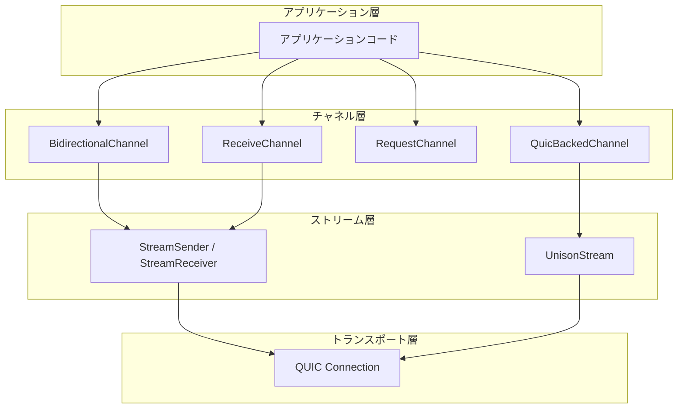
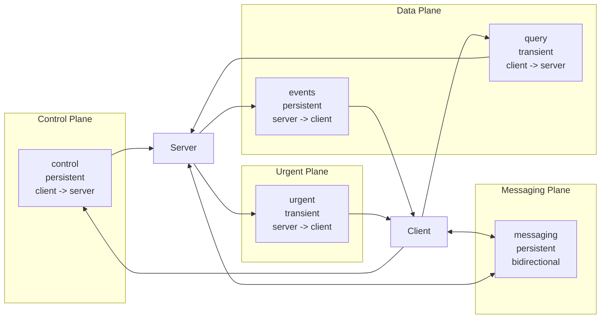
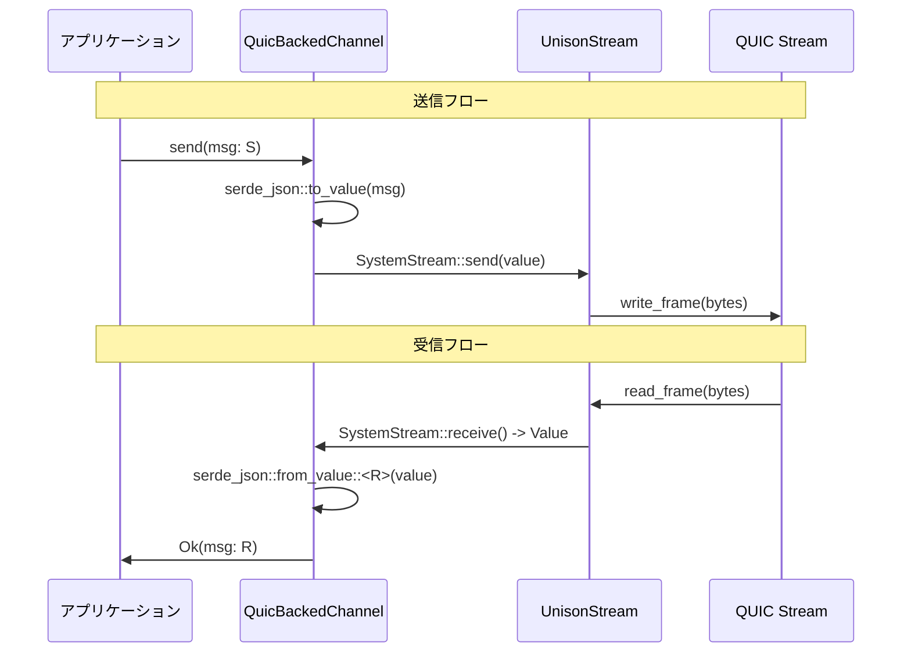
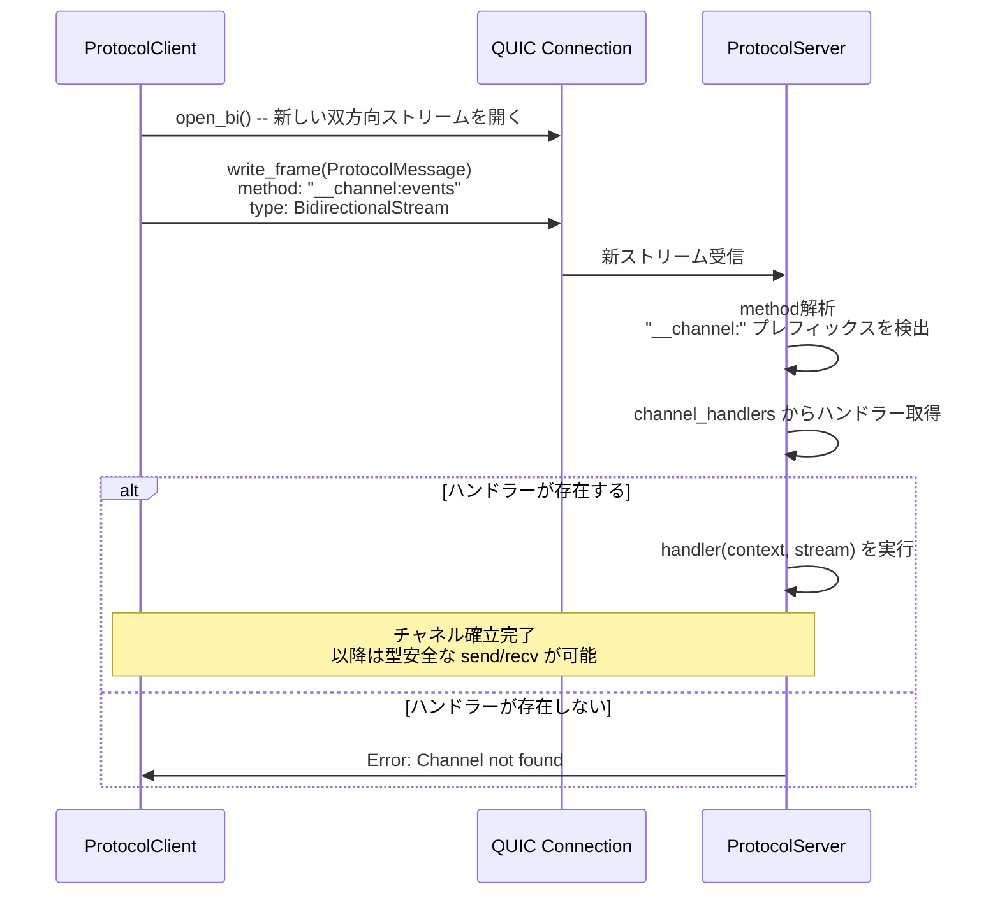
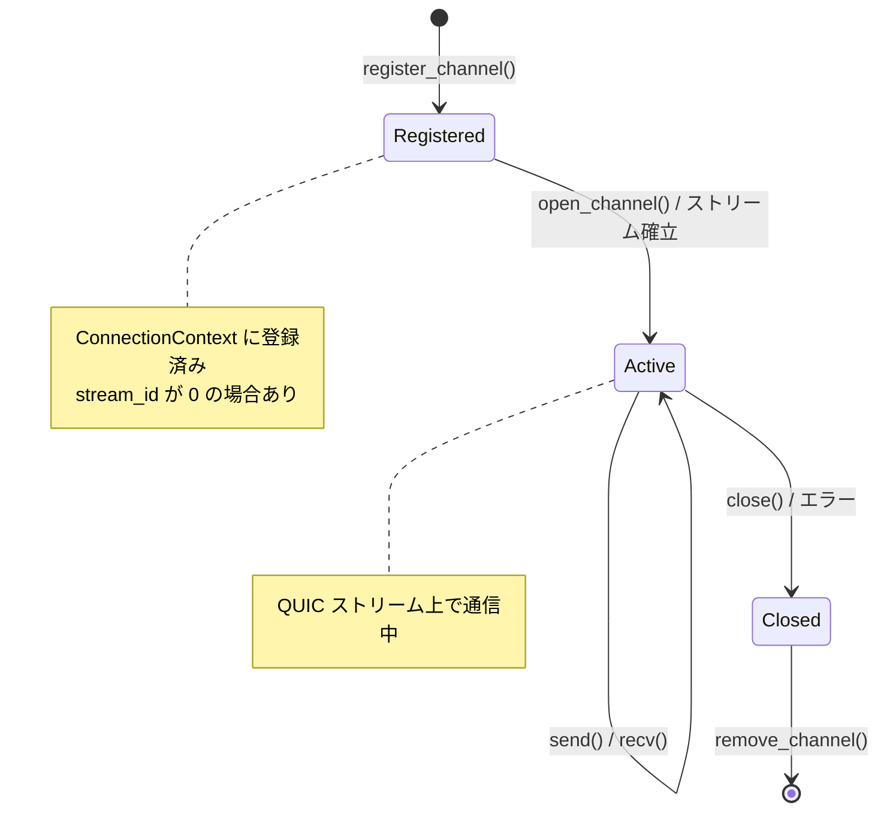
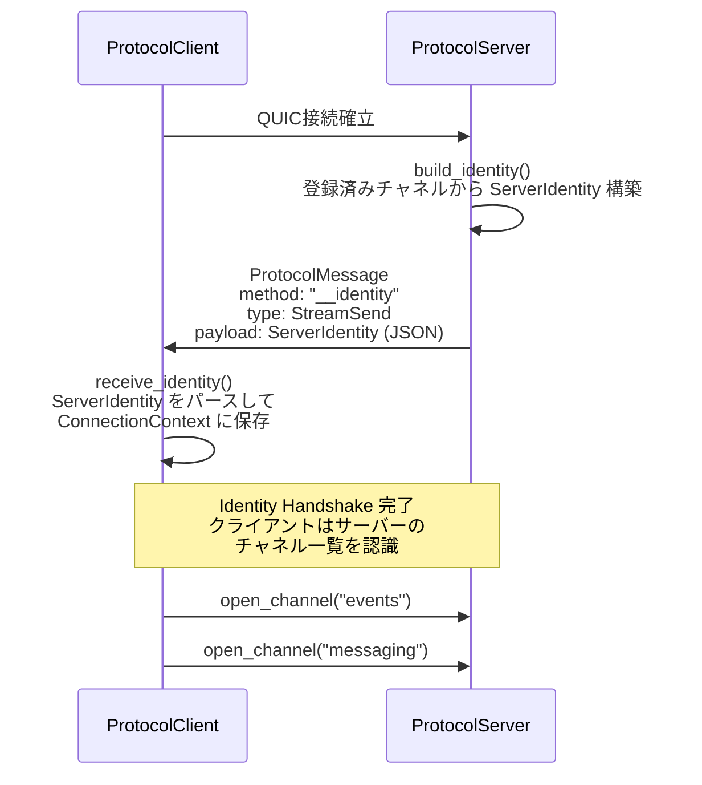

# spec/03: Unison Protocol - Stream Channel 仕様

**バージョン**: 0.1.0-draft
**最終更新**: 2026-02-16
**ステータス**: Draft

---

## 目次

1. [概要](#1-概要)
2. [チャネル型一覧](#2-チャネル型一覧)
3. [KDL スキーマ構文](#3-kdl-スキーマ構文)
4. [スキーマ例: creo_sync.kdl](#4-スキーマ例-creo_synckdl)
5. [QuicBackedChannel 仕様](#5-quicbackedchannel-仕様)
6. [チャネルルーティングプロトコル](#6-チャネルルーティングプロトコル)
7. [ConnectionContext とチャネル管理](#7-connectioncontext-とチャネル管理)
8. [Identity Handshake](#8-identity-handshake)
9. [今後の拡張](#9-今後の拡張)
10. [関連ドキュメント](#10-関連ドキュメント)

---

## 1. 概要

Stream Channel は Unison Protocol の **Stream-First API** における通信プリミティブである。各チャネルは独立した QUIC ストリームにマッピングされ、Head-of-Line Blocking を回避しつつ、型安全なメッセージ送受信を実現する。

### 1.1 設計目標

- **型安全性**: 送信型 `S` と受信型 `R` をジェネリクスで保証
- **独立性**: チャネルごとに独立した QUIC ストリームを使用し、HoL Blocking を排除
- **KDL 駆動**: スキーマ定義からチャネル型を自動生成
- **ライフサイクル管理**: persistent / transient の 2 種類のライフタイムをサポート

### 1.2 アーキテクチャ上の位置づけ



インメモリチャネル (`BidirectionalChannel`, `ReceiveChannel`, `RequestChannel`) は `tokio::sync::mpsc` を使用し、プロセス内通信に適する。ネットワーク越しの通信には `QuicBackedChannel` を使用し、実際の QUIC ストリーム上で動作する。

---

## 2. チャネル型一覧

### 2.1 BidirectionalChannel<S, R>

双方向チャネル。送信型 `S` と受信型 `R` を独立して指定できる。

```rust
pub struct BidirectionalChannel<S, R> {
    pub sender: StreamSender<S>,
    pub receiver: StreamReceiver<R>,
}
```

**用途**: クライアントとサーバー双方がメッセージを送受信するケース（例: messaging チャネル）

**KDL での `from` 属性**: `"either"`

### 2.2 ReceiveChannel<T>

受信専用チャネル。サーバーからのプッシュ通知やイベント配信に使用する。

```rust
pub struct ReceiveChannel<T> {
    pub receiver: StreamReceiver<T>,
}
```

**用途**: サーバーからクライアントへの一方向データ配信（例: events チャネル、urgent チャネル）

**KDL での `from` 属性**: `"server"`

### 2.3 RequestChannel<Req, Res>

リクエスト-レスポンスチャネル。transient な RPC パターンに使用する。内部的に `oneshot::Sender` でレスポンスを返す。

```rust
pub struct RequestChannel<Req, Res> {
    _req: PhantomData<Req>,
    _res: PhantomData<Res>,
    pub tx: mpsc::Sender<(Req, tokio::sync::oneshot::Sender<Res>)>,
}
```

**用途**: 短命なリクエスト-レスポンス通信（例: query チャネル）

**KDL での `lifetime` 属性**: `"transient"`

### 2.4 StreamSender<T> / StreamReceiver<T>

低レベルの送信・受信ハンドル。`tokio::sync::mpsc` をラップし、インメモリチャネルの基盤となる。

```rust
pub struct StreamSender<T> {
    tx: mpsc::Sender<T>,
}

impl<T> StreamSender<T> {
    pub async fn send(&self, msg: T) -> Result<(), mpsc::error::SendError<T>>;
    pub fn is_closed(&self) -> bool;
}

pub struct StreamReceiver<T> {
    rx: mpsc::Receiver<T>,
}

impl<T> StreamReceiver<T> {
    pub async fn recv(&mut self) -> Option<T>;
}
```

**用途**: `BidirectionalChannel` と `ReceiveChannel` の内部構成要素

### 2.5 型の選択基準

| 条件 | 推奨チャネル型 |
|------|---------------|
| 双方向 + インメモリ | `BidirectionalChannel<S, R>` |
| 受信専用 + インメモリ | `ReceiveChannel<T>` |
| リクエスト-レスポンス + インメモリ | `RequestChannel<Req, Res>` |
| ネットワーク越し + 型安全 | `QuicBackedChannel<S, R>` |

---

## 3. KDL スキーマ構文

### 3.1 channel キーワード

チャネルは KDL スキーマ内で `channel` キーワードを使って定義する。

```kdl
channel "<name>" from="<direction>" lifetime="<lifetime>" {
    send "<MessageType>" {
        field "<name>" type="<type>" [required=#true]
    }
    recv "<MessageType>" {
        field "<name>" type="<type>" [required=#true]
    }
    error "<ErrorType>" {
        field "<name>" type="<type>"
    }
}
```

### 3.2 属性

| 属性 | 値 | 説明 |
|------|-----|------|
| `from` | `"client"` | クライアントが送信を開始する |
| `from` | `"server"` | サーバーが送信を開始する |
| `from` | `"either"` | 双方が送信可能 |
| `lifetime` | `"persistent"` | 接続中ずっと維持される |
| `lifetime` | `"transient"` | リクエスト単位で開閉される |

### 3.3 メッセージブロック

- **`send`**: このチャネルで送信されるメッセージ型を定義
- **`recv`**: このチャネルで受信されるメッセージ型を定義
- **`error`**: このチャネル固有のエラー型を定義

`send` のみの場合は一方向チャネル、`send` + `recv` の場合は双方向チャネルとなる。

### 3.4 from 属性と Rust 型のマッピング

| `from` | `lifetime` | 生成される Rust 型 |
|--------|------------|-------------------|
| `"client"` | `"persistent"` | `BidirectionalChannel<Send, Recv>` |
| `"server"` | `"persistent"` | `ReceiveChannel<Send>` |
| `"either"` | `"persistent"` | `BidirectionalChannel<Send, Recv>` |
| `"client"` | `"transient"` | `RequestChannel<Send, Recv>` |
| `"server"` | `"transient"` | `ReceiveChannel<Send>` |
| ネットワーク越し | 任意 | `QuicBackedChannel<Send, Recv>` |

---

## 4. スキーマ例: creo_sync.kdl

以下は Creo Sync プロトコルの完全なチャネル定義である。5 つのチャネルが 3 つのプレーン（Control / Data / Messaging）に分かれている。

### 4.1 全体構造

```kdl
protocol "creo-sync" version="1.0.0" {
    namespace "club.chronista.sync"

    // === Control Plane ===
    channel "control" from="client" lifetime="persistent" { ... }

    // === Data Plane ===
    channel "events" from="server" lifetime="persistent" { ... }
    channel "query" from="client" lifetime="transient" { ... }

    // === Messaging Plane ===
    channel "messaging" from="either" lifetime="persistent" { ... }

    // === Urgent Plane ===
    channel "urgent" from="server" lifetime="transient" { ... }
}
```

### 4.2 各チャネル解説

#### control チャネル

```kdl
channel "control" from="client" lifetime="persistent" {
    send "Subscribe" {
        field "category" type="string"
        field "tags" type="string"
    }
    recv "Ack" {
        field "status" type="string"
        field "channel_ref" type="string"
    }
}
```

- **方向**: クライアント -> サーバー（send）、サーバー -> クライアント（recv）
- **ライフタイム**: persistent -- 接続中ずっと維持
- **用途**: クライアントがサブスクリプションを登録し、サーバーが確認応答を返す制御プレーン
- **生成型**: `QuicBackedChannel<Subscribe, Ack>`

#### events チャネル

```kdl
channel "events" from="server" lifetime="persistent" {
    send "MemoryEvent" {
        field "event_type" type="string" required=#true
        field "memory_id" type="string" required=#true
        field "category" type="string"
        field "from" type="string"
        field "timestamp" type="string"
    }
}
```

- **方向**: サーバー -> クライアント（send のみ）
- **ライフタイム**: persistent
- **用途**: サーバーがメモリイベントをリアルタイムにプッシュ配信するデータプレーン
- **生成型**: `QuicBackedChannel<MemoryEvent, ()>` (受信側から見ると `ReceiveChannel<MemoryEvent>`)

#### query チャネル

```kdl
channel "query" from="client" lifetime="transient" {
    send "Query" {
        field "method" type="string" required=#true
        field "params" type="json"
    }
    recv "Result" {
        field "data" type="json"
    }
    error "QueryError" {
        field "code" type="string"
        field "message" type="string"
    }
}
```

- **方向**: クライアント -> サーバー（send）、サーバー -> クライアント（recv）
- **ライフタイム**: transient -- リクエストごとに開閉
- **用途**: クエリ実行と結果取得。エラー型 `QueryError` を持つ
- **生成型**: `QuicBackedChannel<Query, Result>` + エラー型 `QueryError`

#### messaging チャネル

```kdl
channel "messaging" from="either" lifetime="persistent" {
    send "CCMessage" {
        field "from" type="string" required=#true
        field "to" type="string"
        field "content" type="string" required=#true
        field "thread" type="string"
    }
    recv "CCMessage"
}
```

- **方向**: 双方向（`from="either"`）
- **ライフタイム**: persistent
- **用途**: クライアント・サーバー双方が同一の `CCMessage` 型を送受信するメッセージングプレーン
- **生成型**: `QuicBackedChannel<CCMessage, CCMessage>`

#### urgent チャネル

```kdl
channel "urgent" from="server" lifetime="transient" {
    send "Alert" {
        field "level" type="string" required=#true
        field "title" type="string" required=#true
        field "body" type="string"
    }
}
```

- **方向**: サーバー -> クライアント（send のみ）
- **ライフタイム**: transient -- アラートごとに開閉
- **用途**: 緊急通知の配信
- **生成型**: `QuicBackedChannel<Alert, ()>`

### 4.3 プレーン構成図



---

## 5. QuicBackedChannel 仕様

### 5.1 構造

`QuicBackedChannel<S, R>` は実際の QUIC ストリームをラップし、`Serialize` / `DeserializeOwned` のトレイト境界で型安全性を保証する。

```rust
pub struct QuicBackedChannel<S, R> {
    stream: Arc<Mutex<UnisonStream>>,
    _send: PhantomData<S>,
    _recv: PhantomData<R>,
}
```

**型パラメータ**:
- `S: Serialize + Send` -- 送信メッセージ型
- `R: DeserializeOwned + Send` -- 受信メッセージ型

### 5.2 API

```rust
impl<S, R> QuicBackedChannel<S, R>
where
    S: Serialize + Send,
    R: DeserializeOwned + Send,
{
    /// UnisonStream からチャネルを作成
    pub fn new(stream: UnisonStream) -> Self;

    /// 型安全なメッセージ送信
    /// 内部で serde_json::to_value -> SystemStream::send を実行
    pub async fn send(&self, msg: S) -> Result<(), NetworkError>;

    /// 型安全なメッセージ受信
    /// 内部で SystemStream::receive -> serde_json::from_value を実行
    pub async fn recv(&self) -> Result<R, NetworkError>;

    /// チャネルを閉じる
    pub async fn close(&self) -> Result<(), NetworkError>;

    /// チャネルがアクティブか確認
    pub fn is_active(&self) -> bool;
}
```

### 5.3 シリアライゼーションフロー



### 5.4 並行アクセス

`QuicBackedChannel` は内部で `Arc<Mutex<UnisonStream>>` を使用しているため、複数のタスクから安全にアクセス可能である。ただし、`send` と `recv` は排他ロックを取得するため、高頻度の並行アクセスではボトルネックとなる可能性がある。

---

## 6. チャネルルーティングプロトコル

### 6.1 チャネル識別メソッド

チャネルの開設には `__channel:{name}` 形式のメソッド名を使用する。これは通常の RPC メソッドとは異なる予約済みプレフィックスである。

```
__channel:control
__channel:events
__channel:query
__channel:messaging
__channel:urgent
```

### 6.2 チャネル開設シーケンス



### 6.3 サーバー側のチャネル登録

サーバーは `register_channel` メソッドでチャネルハンドラーを登録する。

```rust
pub type ChannelHandler = Arc<
    dyn Fn(
            Arc<ConnectionContext>,
            UnisonStream,
        ) -> Pin<Box<dyn Future<Output = Result<(), NetworkError>> + Send>>
        + Send
        + Sync,
>;

impl ProtocolServer {
    pub async fn register_channel<F, Fut>(&self, name: &str, handler: F)
    where
        F: Fn(Arc<ConnectionContext>, UnisonStream) -> Fut
            + Send + Sync + 'static,
        Fut: Future<Output = Result<(), NetworkError>> + Send + 'static;
}
```

ハンドラーは `ConnectionContext`（接続状態）と `UnisonStream`（QUIC ストリーム）を受け取り、チャネル固有のロジックを実行する。

### 6.4 クライアント側のチャネル開設

クライアントは `open_channel` メソッドでチャネルを開く。型パラメータで送受信メッセージの型を指定する。

```rust
impl ProtocolClient {
    pub async fn open_channel<S, R>(
        &self,
        channel_name: &str,
    ) -> Result<QuicBackedChannel<S, R>, NetworkError>
    where
        S: Serialize + Send,
        R: DeserializeOwned + Send;
}
```

内部処理:

1. QUIC コネクション上で新しい双方向ストリームを開く (`open_bi()`)
2. `__channel:{name}` メソッドでチャネル識別メッセージを送信
3. `UnisonStream` を作成し `QuicBackedChannel` でラップ
4. `ConnectionContext` にチャネルを登録

---

## 7. ConnectionContext とチャネル管理

### 7.1 ConnectionContext

各 QUIC 接続に対して `ConnectionContext` が 1 つ作成され、Identity 情報とアクティブチャネルを追跡する。

```rust
pub struct ConnectionContext {
    pub connection_id: Uuid,
    identity: Arc<RwLock<Option<ServerIdentity>>>,
    channels: Arc<RwLock<HashMap<String, ChannelHandle>>>,
}

pub struct ChannelHandle {
    pub channel_name: String,
    pub stream_id: u64,
    pub direction: ChannelDirection,
}

pub enum ChannelDirection {
    Send,
    Receive,
    Bidirectional,
}
```

### 7.2 チャネルライフサイクル



---

## 8. Identity Handshake

### 8.1 ServerIdentity

サーバーは接続時に `ServerIdentity` を送信し、利用可能なチャネルの一覧を通知する。

```rust
pub struct ServerIdentity {
    pub name: String,
    pub version: String,
    pub namespace: String,
    pub channels: Vec<ChannelInfo>,
    pub metadata: serde_json::Value,
}

pub struct ChannelInfo {
    pub name: String,
    pub direction: ChannelDirection,
    pub lifetime: String,
    pub status: ChannelStatus,
}
```

### 8.2 ChannelDirection

```rust
pub enum ChannelDirection {
    ServerToClient,
    ClientToServer,
    Bidirectional,
}
```

### 8.3 ChannelStatus

```rust
pub enum ChannelStatus {
    Available,    // 利用可能
    Busy,         // 処理中（新規接続を受け付けない）
    Unavailable,  // 利用不可
}
```

### 8.4 ChannelUpdate

チャネルの動的な追加・削除・状態変更をリアルタイムに通知する。

```rust
pub enum ChannelUpdate {
    Added(ChannelInfo),
    Removed(String),
    StatusChanged { name: String, status: ChannelStatus },
}
```

### 8.5 Identity Handshake シーケンス



---

## 9. 今後の拡張

### 9.1 計画中の機能

- **バックプレッシャー制御**: チャネルごとのフロー制御メカニズム
- **チャネルグループ**: 複数チャネルの一括管理とトランザクション
- **暗号化チャネル**: チャネルレベルでの追加暗号化
- **チャネルメトリクス**: スループット、レイテンシー、エラー率の自動計測

### 9.2 WASM 対応

WebAssembly 環境では QUIC が利用できないため、WebSocket / WebTransport をフォールバックトランスポートとして検討中。チャネル API は同一のまま、トランスポート層のみ差し替え可能な設計とする。

---

## 10. 関連ドキュメント

### 仕様書

- [spec/01: コアネットワーク](../01-core-concept/SPEC.md) - トランスポート層（QUIC）
- [spec/02: RPC プロトコル](../02-protocol-rpc/SPEC.md) - KDL ベース RPC 層

### 設計ドキュメント

- [アーキテクチャ設計](../../design/architecture.md) - 全体アーキテクチャ
- [QUIC ランタイム設計](../../design/quic-runtime.md) - QUIC ランタイム実装詳細

### 実装ガイド

- [チャネルガイド](../../guides/channel-guide.md) - チャネルの使い方

### KDL スキーマ

- [creo_sync.kdl](../../schemas/creo_sync.kdl) - Creo Sync プロトコルのスキーマ定義

### 実装

- [channel.rs](../../crates/unison-protocol/src/network/channel.rs) - チャネル型の実装
- [identity.rs](../../crates/unison-protocol/src/network/identity.rs) - Identity 関連型
- [context.rs](../../crates/unison-protocol/src/network/context.rs) - ConnectionContext
- [client.rs](../../crates/unison-protocol/src/network/client.rs) - open_channel 実装
- [server.rs](../../crates/unison-protocol/src/network/server.rs) - register_channel 実装

---

**仕様バージョン**: 0.1.0-draft
**最終更新**: 2026-02-16
**ステータス**: Draft
