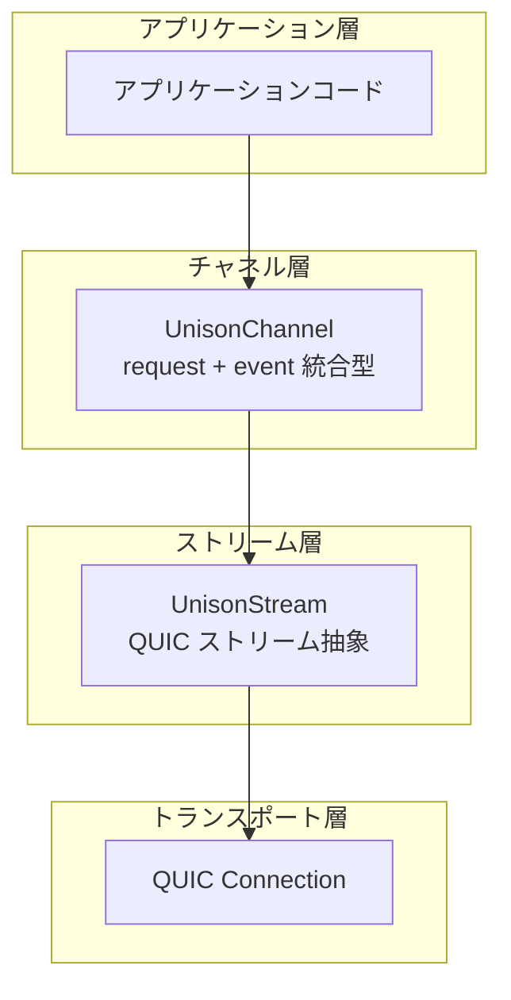
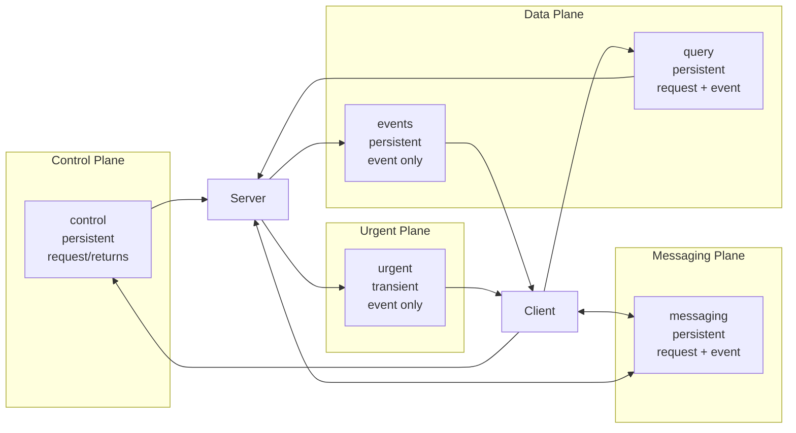
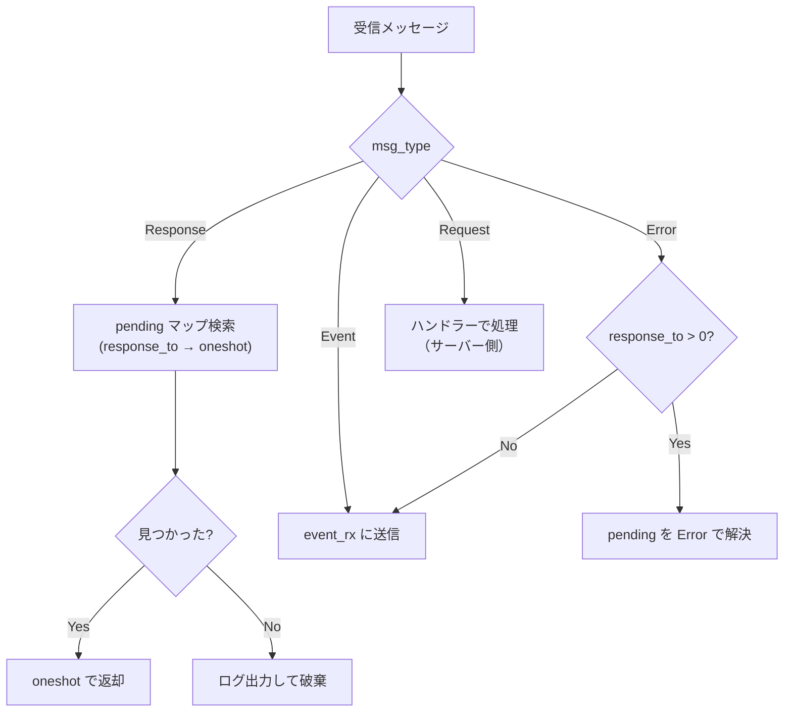
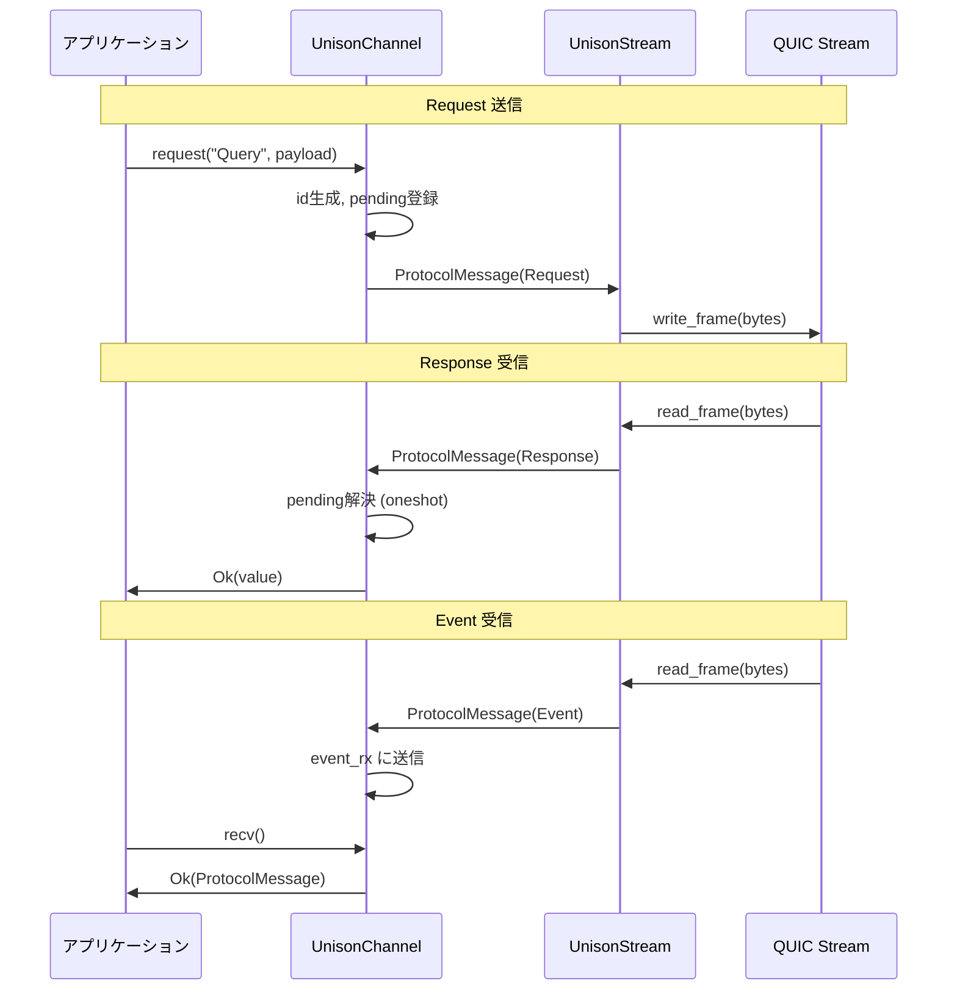
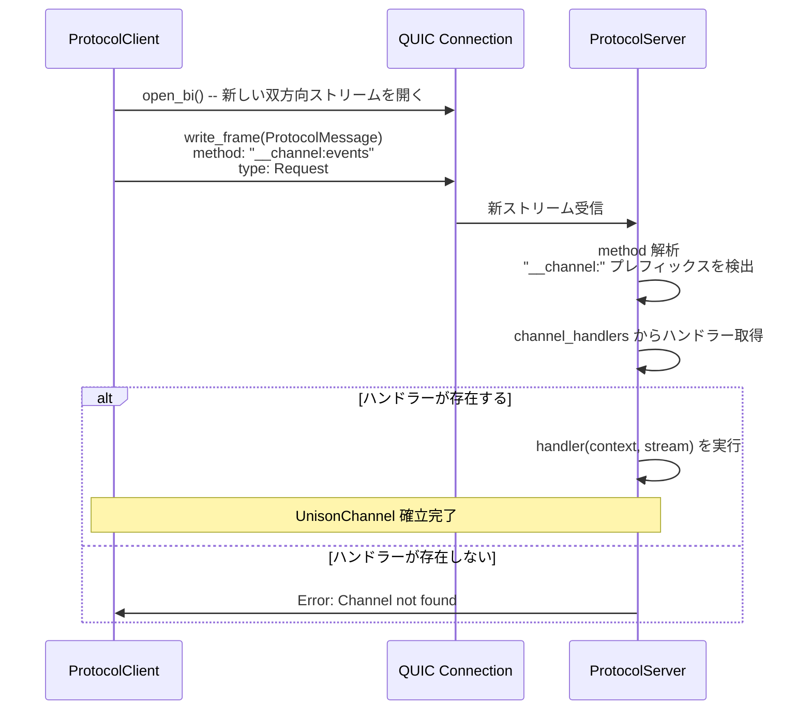
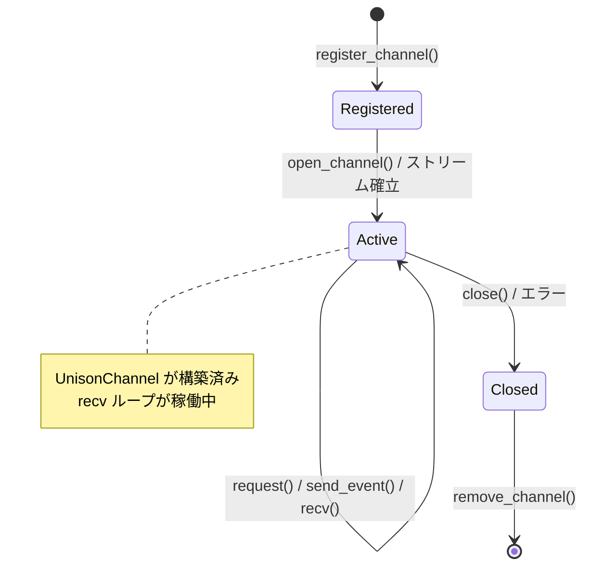
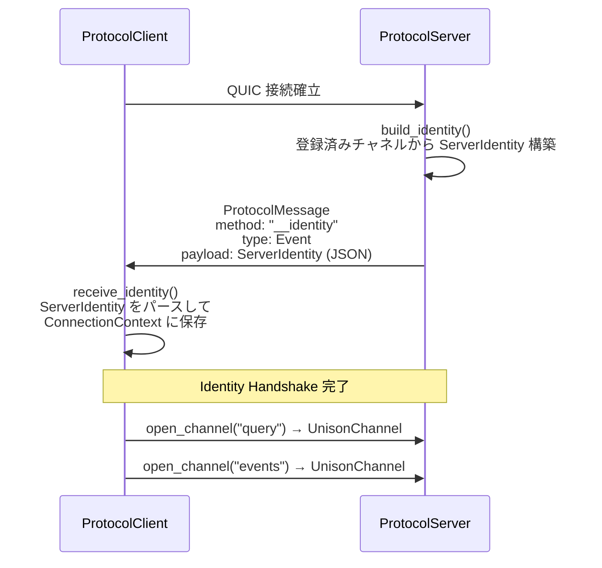

# spec/03: Unison Protocol - Unified Channel 仕様

**バージョン**: 1.0.0-draft
**最終更新**: 2026-02-16
**ステータス**: Draft

---

## 目次

1. [概要](#1-概要)
2. [UnisonChannel](#2-unisonchannelチャネル統合型)
3. [KDL スキーマ構文](#3-kdl-スキーマ構文)
4. [スキーマ例: creo_sync.kdl](#4-スキーマ例-creo_synckdl)
5. [チャネル内部プロトコル](#5-チャネル内部プロトコル)
6. [チャネルルーティングプロトコル](#6-チャネルルーティングプロトコル)
7. [ConnectionContext とチャネル管理](#7-connectioncontext-とチャネル管理)
8. [Identity Handshake](#8-identity-handshake)
9. [旧構文との互換性](#9-旧構文との互換性)
10. [今後の拡張](#10-今後の拡張)
11. [関連ドキュメント](#11-関連ドキュメント)

---

## 1. 概要

Unified Channel は Unison Protocol の通信プリミティブである。全ての通信（Request/Response、Event Push）がチャネル上で行われ、各チャネルは独立した QUIC ストリームにマッピングされることで Head-of-Line Blocking を回避する。

### 1.1 設計目標

- **統一性**: Request/Response と Event Push を単一のチャネル型で表現
- **独立性**: チャネルごとに独立した QUIC ストリームを使用し、チャネル間 HoL Blocking を排除
- **チャネル内シンプルさ**: 1チャネル内では多重化を許容し、過度な複雑さを避ける
- **KDL 駆動**: スキーマ定義からチャネル型と構造体を自動生成
- **ライフサイクル管理**: persistent / transient の 2 種類のライフタイムをサポート

### 1.2 アーキテクチャ上の位置づけ



旧アーキテクチャでは `BidirectionalChannel`, `ReceiveChannel`, `RequestChannel`, `QuicBackedChannel` の4型が存在したが、`UnisonChannel` に統一される。

---

## 2. UnisonChannel（チャネル統合型）

### 2.1 構造

`UnisonChannel` は Request/Response と Event の両パターンをサポートする統合チャネル型である。

```rust
pub struct UnisonChannel {
    /// QUIC ストリームへの参照
    stream: Arc<Mutex<UnisonStream>>,
    /// 応答待ちの Request を管理（id → oneshot::Sender）
    pending: Arc<Mutex<HashMap<u64, oneshot::Sender<ProtocolMessage>>>>,
    /// Event 受信キュー
    event_rx: mpsc::Receiver<ProtocolMessage>,
    /// バックグラウンド受信タスク
    recv_task: JoinHandle<()>,
}
```

### 2.2 API

```rust
impl UnisonChannel {
    /// Request/Response パターン
    /// メッセージ ID を自動生成し、pending マップに登録。
    /// Response が返るまで await する。
    pub async fn request(
        &self,
        method: &str,
        payload: Value,
    ) -> Result<Value, NetworkError>;

    /// 一方向 Event 送信（応答不要）
    pub async fn send_event(
        &self,
        method: &str,
        payload: Value,
    ) -> Result<(), NetworkError>;

    /// Event 受信（サーバーからのプッシュ、またはその他の非 Response メッセージ）
    pub async fn recv(&mut self) -> Result<ProtocolMessage, NetworkError>;

    /// チャネルを閉じる
    pub async fn close(&mut self) -> Result<(), NetworkError>;
}
```

### 2.3 内部 recv ループ

`UnisonChannel` は構築時にバックグラウンドタスクを起動し、受信メッセージを振り分ける。

```mermaid
flowchart TD
    START[recv ループ開始] --> READ[stream.receive()]
    READ --> CHECK{msg_type?}
    CHECK -->|Response| PENDING[pending マップから<br/>oneshot::Sender を取得]
    PENDING --> RESOLVE[oneshot で送信]
    RESOLVE --> READ
    CHECK -->|Event| EVENT[event_rx に送信]
    EVENT --> READ
    CHECK -->|Error| ERROR_CHECK{response_to > 0?}
    ERROR_CHECK -->|Yes| PENDING_ERR[pending マップの<br/>対応する Request を<br/>Error で解決]
    PENDING_ERR --> READ
    ERROR_CHECK -->|No| EVENT
    CHECK -->|接続断| END[ループ終了<br/>全 pending を Error で解決]
```

### 2.4 旧型との対応表

| 旧チャネル型 | UnisonChannel での代替 |
|------------|----------------------|
| `QuicBackedChannel<S, R>` | `UnisonChannel` + `request()` |
| `BidirectionalChannel<S, R>` | `UnisonChannel` + `send_event()` / `recv()` |
| `ReceiveChannel<T>` | `UnisonChannel` + `recv()` |
| `RequestChannel<Req, Res>` | `UnisonChannel` + `request()` |

---

## 3. KDL スキーマ構文

### 3.1 新構文: `request` / `event`

```kdl
channel "<name>" from="<direction>" lifetime="<lifetime>" {
    // Request/Response パターン
    request "<RequestName>" {
        field "<name>" type="<type>" [required=#true]

        returns "<ResponseName>" {
            field "<name>" type="<type>"
        }
    }

    // 一方向イベント
    event "<EventName>" {
        field "<name>" type="<type>" [required=#true]
    }
}
```

### 3.2 属性

| 属性 | 値 | 説明 |
|------|-----|------|
| `from` | `"client"` | クライアントが送信を開始する |
| `from` | `"server"` | サーバーが送信を開始する |
| `from` | `"either"` | 双方が送信可能 |
| `lifetime` | `"persistent"` | 接続中ずっと維持される |
| `lifetime` | `"transient"` | リクエスト単位で開閉される |

### 3.3 メッセージブロック

| ブロック | ネスト | 説明 |
|---------|-------|------|
| `request` | トップレベル | Request/Response パターン定義 |
| `returns` | `request` 内 | レスポンス型定義 |
| `event` | トップレベル | 一方向イベント定義 |

### 3.4 チャネルパターンの設計指針

| パターン | 推奨構文 | 例 |
|---------|---------|-----|
| クエリ（応答あり） | `request` + `returns` | DB クエリ、API 呼び出し |
| 通知（応答なし） | `event` | ログ配信、アラート |
| エラー通知 | `event`（エラー型として） | 非同期エラー報告 |
| 双方向メッセージング | `request` + `event` の組み合わせ | チャット、制御 |

---

## 4. スキーマ例: creo_sync.kdl

### 4.1 全体構造

```kdl
protocol "creo-sync" version="2.0.0" {
    namespace "club.chronista.sync"

    // === Control Plane ===
    channel "control" from="client" lifetime="persistent" {
        request "Subscribe" {
            field "category" type="string"
            field "tags" type="string"

            returns "Ack" {
                field "status" type="string"
                field "channel_ref" type="string"
            }
        }
    }

    // === Data Plane ===
    channel "events" from="server" lifetime="persistent" {
        event "MemoryEvent" {
            field "event_type" type="string" required=#true
            field "memory_id" type="string" required=#true
            field "category" type="string"
            field "from" type="string"
            field "timestamp" type="string"
        }
    }

    channel "query" from="client" lifetime="persistent" {
        request "Query" {
            field "method" type="string" required=#true
            field "params" type="json"

            returns "Result" {
                field "data" type="json"
            }
        }

        event "QueryError" {
            field "code" type="string"
            field "message" type="string"
        }
    }

    // === Messaging Plane ===
    channel "messaging" from="either" lifetime="persistent" {
        request "SendMessage" {
            field "from" type="string" required=#true
            field "to" type="string"
            field "content" type="string" required=#true
            field "thread" type="string"

            returns "MessageAck" {
                field "status" type="string"
            }
        }

        event "CCMessage" {
            field "from" type="string" required=#true
            field "to" type="string"
            field "content" type="string" required=#true
            field "thread" type="string"
        }
    }

    // === Urgent Plane ===
    channel "urgent" from="server" lifetime="transient" {
        event "Alert" {
            field "level" type="string" required=#true
            field "title" type="string" required=#true
            field "body" type="string"
        }
    }
}
```

### 4.2 各チャネル解説

#### control チャネル

- **方向**: クライアント -> サーバー
- **ライフタイム**: persistent
- **パターン**: `request` Subscribe → `returns` Ack
- **用途**: サブスクリプション管理。クライアントがカテゴリ/タグを登録し、サーバーが確認応答を返す

#### events チャネル

- **方向**: サーバー -> クライアント
- **ライフタイム**: persistent
- **パターン**: `event` MemoryEvent
- **用途**: メモリイベントのリアルタイムプッシュ配信

#### query チャネル

- **方向**: クライアント -> サーバー
- **ライフタイム**: persistent
- **パターン**: `request` Query → `returns` Result + `event` QueryError
- **用途**: クエリ実行と結果取得。非同期エラーは Event で通知

#### messaging チャネル

- **方向**: 双方向
- **ライフタイム**: persistent
- **パターン**: `request` SendMessage → `returns` MessageAck + `event` CCMessage
- **用途**: メッセージ送信（確認応答あり）とメッセージ受信（プッシュ）

#### urgent チャネル

- **方向**: サーバー -> クライアント
- **ライフタイム**: transient
- **パターン**: `event` Alert
- **用途**: 緊急アラートの配信

### 4.3 プレーン構成図



---

## 5. チャネル内部プロトコル

### 5.1 メッセージ振り分け

`UnisonChannel` 内の recv ループは、受信メッセージを `msg_type` に基づいて振り分ける。



### 5.2 Pending Request マップ

Request/Response の相関に使用する内部データ構造。

```rust
/// key: メッセージ ID, value: レスポンスの送信先
pending: Arc<Mutex<HashMap<u64, oneshot::Sender<ProtocolMessage>>>>
```

**ライフサイクル**:
1. `request()` 呼び出し時に `(id, oneshot::Sender)` を登録
2. recv ループが対応する Response を受信したら、`oneshot::Sender` でレスポンスを送信
3. タイムアウトまたは接続断の場合、残存する全 pending を Error で解決

### 5.3 Event キュー

Event メッセージは `mpsc::Receiver` 経由でアプリケーションに配信される。

```rust
/// バッファ付き Event キュー
event_tx: mpsc::Sender<ProtocolMessage>,   // recv ループ内で使用
event_rx: mpsc::Receiver<ProtocolMessage>, // recv() メソッドで消費
```

### 5.4 シリアライゼーションフロー



---

## 6. チャネルルーティングプロトコル

### 6.1 チャネル識別メソッド

チャネルの開設には `__channel:{name}` 形式のメソッド名を使用する。

```
__channel:control
__channel:events
__channel:query
__channel:messaging
__channel:urgent
```

### 6.2 チャネル開設シーケンス



### 6.3 サーバー側のチャネル登録

```rust
pub type ChannelHandler = Arc<
    dyn Fn(
            Arc<ConnectionContext>,
            UnisonStream,
        ) -> Pin<Box<dyn Future<Output = Result<(), NetworkError>> + Send>>
        + Send
        + Sync,
>;

impl ProtocolServer {
    pub async fn register_channel<F, Fut>(&self, name: &str, handler: F)
    where
        F: Fn(Arc<ConnectionContext>, UnisonStream) -> Fut
            + Send + Sync + 'static,
        Fut: Future<Output = Result<(), NetworkError>> + Send + 'static;
}
```

### 6.4 クライアント側のチャネル開設

```rust
impl ProtocolClient {
    /// UnisonChannel を返す
    pub async fn open_channel(
        &self,
        channel_name: &str,
    ) -> Result<UnisonChannel, NetworkError>;
}
```

内部処理:
1. QUIC コネクション上で新しい双方向ストリームを開く (`open_bi()`)
2. `__channel:{name}` メソッドでチャネル識別メッセージを送信
3. `UnisonStream` を作成
4. `UnisonChannel` を構築（recv ループを起動）
5. `ConnectionContext` にチャネルを登録

---

## 7. ConnectionContext とチャネル管理

### 7.1 ConnectionContext

```rust
pub struct ConnectionContext {
    pub connection_id: Uuid,
    identity: Arc<RwLock<Option<ServerIdentity>>>,
    channels: Arc<RwLock<HashMap<String, ChannelHandle>>>,
}

pub struct ChannelHandle {
    pub channel_name: String,
    pub stream_id: u64,
    pub direction: ChannelDirection,
}

pub enum ChannelDirection {
    Send,
    Receive,
    Bidirectional,
}
```

### 7.2 チャネルライフサイクル



---

## 8. Identity Handshake

### 8.1 ServerIdentity

```rust
pub struct ServerIdentity {
    pub name: String,
    pub version: String,
    pub namespace: String,
    pub channels: Vec<ChannelInfo>,
    pub metadata: serde_json::Value,
}

pub struct ChannelInfo {
    pub name: String,
    pub direction: ChannelDirection,
    pub lifetime: String,
    pub status: ChannelStatus,
}
```

### 8.2 Handshake シーケンス



---

## 9. 旧構文との互換性

### 9.1 KDL 構文マッピング

旧 `send`/`recv`/`error` 構文は後方互換のためパーサーが認識するが、新規スキーマでは非推奨。

| 旧構文 | 新構文 | 変換ルール |
|--------|--------|-----------|
| `send "X" { ... }` + `recv "Y" { ... }` | `request "X" { ... returns "Y" { ... } }` | send を request に、recv を returns に |
| `send "X" { ... }` のみ | `event "X" { ... }` | 一方向メッセージは event に |
| `error "E" { ... }` | `event "E" { ... }` | エラー型も event として扱う |

### 9.2 Rust 型マッピング

| 旧型 | 新型 | 備考 |
|------|------|------|
| `QuicBackedChannel<S, R>` | `UnisonChannel` | ジェネリクス不要に |
| `BidirectionalChannel<S, R>` | `UnisonChannel` | インメモリ用途も統一 |
| `ReceiveChannel<T>` | `UnisonChannel` | recv() のみ使用 |
| `RequestChannel<Req, Res>` | `UnisonChannel` | request() を使用 |

### 9.3 API マッピング

| 旧 API | 新 API | 備考 |
|--------|--------|------|
| `channel.send(msg)` | `channel.send_event(method, payload)` | JSON Value ベースに |
| `channel.recv()` | `channel.recv()` | ProtocolMessage を返す |
| `client.call(method, params)` | `channel.request(method, payload)` | チャネル経由に |
| `client.stream(method, params)` | `channel.recv()` ループ | Event として受信 |

---

## 10. 今後の拡張

### 10.1 計画中の機能

- **バックプレッシャー制御**: チャネルごとのフロー制御メカニズム
- **チャネルグループ**: 複数チャネルの一括管理とトランザクション
- **暗号化チャネル**: チャネルレベルでの追加暗号化
- **チャネルメトリクス**: スループット、レイテンシー、エラー率の自動計測

### 10.2 WASM 対応

WebAssembly 環境では QUIC が利用できないため、WebSocket / WebTransport をフォールバックトランスポートとして検討中。UnisonChannel API は同一のまま、トランスポート層のみ差し替え可能な設計とする。

---

## 11. 関連ドキュメント

### 仕様書

- [spec/01: コアコンセプト](../01-core-concept/SPEC.md) - トランスポート層（QUIC）
- [spec/02: Unified Channel プロトコル](../02-protocol-rpc/SPEC.md) - KDL スキーマとメッセージフロー

### 設計ドキュメント

- [アーキテクチャ設計](../../design/architecture.md) - 全体アーキテクチャ
- [QUIC ランタイム設計](../../design/quic-runtime.md) - QUIC ランタイム実装詳細

### 実装ガイド

- [チャネルガイド](../../guides/channel-guide.md) - チャネルの使い方

### KDL スキーマ

- [creo_sync.kdl](../../schemas/creo_sync.kdl) - Creo Sync プロトコルのスキーマ定義

### 実装

- [channel.rs](../../crates/unison-protocol/src/network/channel.rs) - UnisonChannel 実装
- [identity.rs](../../crates/unison-protocol/src/network/identity.rs) - Identity 関連型
- [context.rs](../../crates/unison-protocol/src/network/context.rs) - ConnectionContext
- [client.rs](../../crates/unison-protocol/src/network/client.rs) - open_channel 実装
- [server.rs](../../crates/unison-protocol/src/network/server.rs) - register_channel 実装

---

**仕様バージョン**: 1.0.0-draft
**最終更新**: 2026-02-16
**ステータス**: Draft
